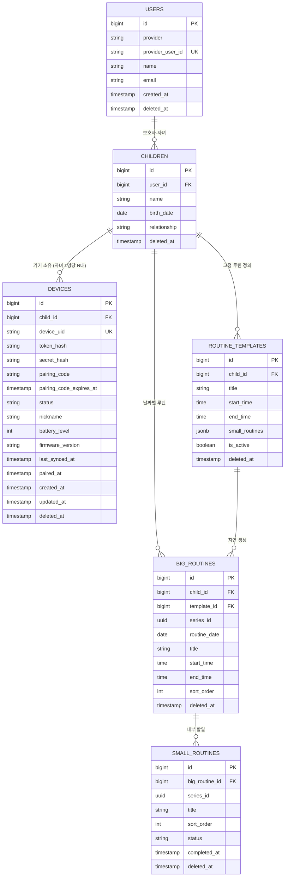
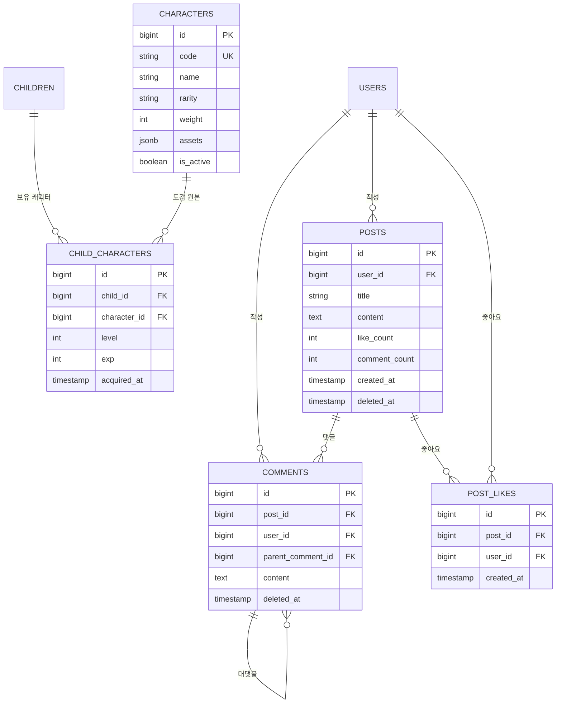

# 예소 ERD 초안

> 출처: Notion `예소 개발자용 > ERD초안` (핵심 도메인 / 캐릭터·커뮤니티)
> DBMS: PostgreSQL 17 (`jsonb` 사용으로 인해 선택)
> — 이 버전은 문구가 아니라 테스트로 강제됩니다. 테스트용 컨테이너 이미지가 `postgres:17` 로 고정되어 있고,
>   `PostgreSqlVersionIntegrationTest` 가 실제로 뜬 DB 의 메이저 버전을 확인합니다. (ROADMAP 0-A T-2)
> 최종 수정: 2026-09-04 — 날짜 동기화만 수행. **ROADMAP 의 테스트 환경(T-1 ~ T-5) 확정은 스키마·제약조건에 영향 없음.** 다만 T-2 확정(실제 PostgreSQL 을 Testcontainers 로 사용)으로 이 문서 4장의 제약조건·인덱스를 테스트로 검증할 수 있게 되었습니다.
> (직전 수정: 2026-08-30 — req/res 명세 초안 작성 중 드러난 ERD 이슈 반영)

## 목차

1. [핵심 도메인 — 계정 · 기기 · 루틴](#1-핵심-도메인--계정--기기--루틴)
2. [캐릭터 · 커뮤니티](#2-캐릭터--커뮤니티)
3. [전체 테이블 요약](#3-전체-테이블-요약)
4. [제약조건 · 인덱스 정리](#4-제약조건--인덱스-정리)
5. [API 명세와 대조하며 드러난 이슈](#5-api-명세와-대조하며-드러난-이슈)
6. [미확정 항목](#6-미확정-항목)

---

## 1. 핵심 도메인 — 계정 · 기기 · 루틴

### 설계 노트

- **USERS** — `provider`, `provider_user_id`는 각각 소셜 로그인 제공자와 소셜 로그인 uid.
- **DEVICES** — `device_uid`는 앱-기기 연결 uid로 **기기에서 생성해 전달**. `secret_hash`는 기기 비밀값으로, 재페어링 없이 토큰을 복구하는 유일한 경로(`/device-api/v1/token/refresh`)이므로 **필요하다고 확정**됨.
- **ROUTINE_TEMPLATES** — 빅루틴 자동 생성(고정 반복 기능)을 위한 템플릿. 자동 생성된 빅루틴을 수정해도, 이후 자동 생성은 계속 해당 템플릿을 기준으로 이루어짐.
- **series_id (BIG_ROUTINES / SMALL_ROUTINES)** — **동일성 표시 목적**. "이 행들(루틴들)이 원래 같은 미션인가"를 파악하기 위한 값이며, 추후 데이터 분석 대시보드에서 활용.

### [기획 변경] 자녀 1명당 기기 N대

`CHILDREN : DEVICES`를 **1:1 → 1:N**으로 변경했습니다. 테이블·컬럼 추가 없이 **제약조건만 조정**하면 됩니다.

- `unique(device_uid) where deleted_at is null` — 해제 후 재페어링 시 과거 행과의 충돌 방지
- `unique(pairing_code) where status = 'PENDING'` — claim이 코드로 단일 행을 특정해야 함
- `child_id` 단독 유니크 제약이 걸려 있다면 **제거**

정책 측면에서는 자녀당 PENDING 행이 동시에 여러 개 생길 수 있으므로, **만료 PENDING 정리**와 **자녀당 최대 기기 수 검증**이 필요합니다.

---

## 2. 캐릭터 · 커뮤니티

### 설계 노트

- **CHARACTERS.assets** — S3 Key를 저장. 캐릭터 이미지 로드 시 런타임에 URL을 조립.
- **CHARACTERS.rarity / weight** — 캐릭터 획득 희귀도와 획득 가중치. ⚠️ **필요한지 논의 필요.**
- **COMMENTS** — `parent_comment_id`로 자기 참조하는 1단계 대댓글 구조.
- **POSTS.like_count / comment_count** — 비정규화 카운터 컬럼. 갱신 시점(트리거 vs 애플리케이션)을 정해야 함.

---

## 3. 전체 테이블 요약

| 테이블 | 도메인 | 역할 | soft delete |
|---|---|---|---|
| `USERS` | 계정 | 보호자 계정, 소셜 로그인 식별자 | ✅ |
| `CHILDREN` | 계정 | 자녀 프로필, 보호자와의 관계 | ✅ |
| `DEVICES` | 기기 | 페어링 상태·토큰·배터리·펌웨어 | ✅ |
| `ROUTINE_TEMPLATES` | 루틴 | 고정 반복 루틴 정의 (지연 생성 원본) | ✅ |
| `BIG_ROUTINES` | 루틴 | 날짜별 루틴 인스턴스 | ✅ |
| `SMALL_ROUTINES` | 루틴 | 빅루틴 내부 할 일, 완료 상태 | ✅ |
| `CHARACTERS` | 캐릭터 | 캐릭터 마스터(도감) | `is_active` |
| `CHILD_CHARACTERS` | 캐릭터 | 자녀 보유 캐릭터, 레벨·경험치 | - |
| `POSTS` | 커뮤니티 | 게시글 | ✅ |
| `COMMENTS` | 커뮤니티 | 댓글·대댓글 | ✅ |
| `POST_LIKES` | 커뮤니티 | 게시글 좋아요 | - |

## 4. 제약조건 · 인덱스 정리

| 대상 | 제약조건 / 인덱스 | 근거 |
|---|---|---|
| `DEVICES` | `unique(device_uid) where deleted_at is null` | 해제 후 재페어링 시 과거 행과 충돌 방지 |
| `DEVICES` | `unique(pairing_code) where status = 'PENDING'` | claim이 코드로 단일 행을 특정해야 함 |
| `DEVICES` | `child_id` 단독 유니크 제약 **제거** | 1:N 전환 |
| `DEVICES` | `index(child_id, deleted_at)` | 자녀 기기 목록 조회 |
| `POST_LIKES` | `unique(post_id, user_id)` | 좋아요 중복 방지 |
| `BIG_ROUTINES` | `index(child_id, routine_date)` | 날짜별·캘린더 조회 |
| `BIG_ROUTINES` | `unique(template_id, routine_date) where deleted_at is null` | **지연 생성 동시성 방어.** 3개 트리거 지점(routines·calendar·sync)이 동시에 호출되면 같은 날짜 루틴이 중복 생성될 수 있음 |
| `BIG_ROUTINES` / `SMALL_ROUTINES` | `index(series_id)` | 미션별 이행률 집계 |
| `SMALL_ROUTINES` | `index(big_routine_id, sort_order)` | 순서 정렬 조회 |
| `USERS` | `unique(provider, provider_user_id)` | 소셜 계정 중복 가입 방지 |

## 5. API 명세와 대조하며 드러난 이슈

req/res 스키마 초안을 작성하면서 확인된 항목들과, 각 항목에 대한 **결정 사항**입니다.

### 5-1. ROUTINE_TEMPLATES 반복 요일 — ❌ 개발 제외

현재 스키마 그대로 **매일 반복만 지원**합니다. "평일만", "주말만" 같은 요일별 반복 기능은 **구현 범위에서 제외**하기로 결정했습니다. `repeat_days` / `repeat_rule` 컬럼 추가는 하지 않습니다.

### 5-2. `time` 타입 타임존 — ✅ 결정 (표준 방식)

**표준적인 방식으로 처리**합니다. 서버는 **UTC를 기준**으로 저장하고(`timestamp` 계열은 `timestamptz` 사용), 앱·기기가 표시·입력 시점에 로컬 타임존(KST)으로 변환합니다. `time` 컬럼은 **로컬(KST) 벽시계 시각**으로 해석하며, 기기 RTC 보정(`serverTime`)과의 비교도 UTC 기준으로 맞춥니다.

### 5-3. `CHILDREN.relationship` 타입 — ✅ enum 확정 (값 정의 대기)

`string` → **enum으로 고정**하기로 결정했습니다. 다만 **구체적인 enum 값은 회의에서 정의 예정**이므로, 값 목록이 확정될 때까지 대기합니다.

> ⏳ **대기: 회의에서 enum 값 목록 확정 필요** (예: MOTHER / FATHER / GRANDPARENT / TEACHER / ETC 등)

### 5-4. `CHILD_CHARACTERS` 진화 규칙 — ✅ 결정 (int 고정)

레벨업/경험치 임계값은 **미션(루틴) N개 수행 후 캐릭터가 진화하는 방식**으로 정하고, 진화 임계값 N을 **`int` 상수로 고정**합니다. 즉 누적 미션 완료 수가 임계값에 도달하면 진화합니다. (실수·확률 기반이 아닌 고정 정수 카운트 방식)

### 5-5 / 5-6. 커뮤니티 (댓글 삭제 표현 · 카운터 갱신) — ❌ 구현 제외

커뮤니티 도메인(`POSTS` / `COMMENTS` / `POST_LIKES`)은 **구현 범위에서 제외**하기로 결정했습니다. 이에 따라 댓글 삭제 표현 방식(5-5), 좋아요/댓글 카운터 갱신 시점(5-6) 이슈도 함께 종료합니다.

## 6. 미확정 항목

| 영역 | 내용 | 시한 |
|---|---|---|
| 루틴 | 지연 생성 동시성 방어 제약조건 적용 여부 | Phase 3 |
| 자녀 | `relationship` enum **값 목록** 확정 (5-3, enum 사용은 확정) | 회의 |
| 기기 | 자녀당 최대 기기 수, 만료 PENDING 행 정리 배치 주기 | 회의 |
| 유저 | 회원 탈퇴 시 `CHILDREN` / `DEVICES` / 루틴 cascade 처리 정책 | Phase 2 |
| 캐릭터 | `rarity` / `weight` 필요 여부, 획득 시나리오 (진화 규칙은 5-4에서 int 고정으로 확정) | 회의 |

> **종료된 항목** — 타임존 정책(5-2, 표준 UTC 방식 확정), 템플릿 반복 요일(5-1, 개발 제외), 커뮤니티 관련 미확정 항목(5-5·5-6, 구현 제외)은 목록에서 제거되었습니다.

## 7. 타겟 확장 시 예상 변경

타겟이 "일반학교 특수학급"으로 이동할 경우의 영향입니다. 결론이 **Phase 3 착수 전**에 나와야 재작업을 피할 수 있습니다.

| 변경 | 내용 |
|---|---|
| 관계 구조 | 보호자 1 : 자녀 N → 교사 1 : 학생 N. 기존 `USERS ||--o{ CHILDREN` 구조로 수용 가능 |
| 신규 테이블 | 학급(그룹) 개념, 보호자와 교사의 공동 접근 권한을 위한 매핑 테이블 |
| 컬럼 추가 | `CHILDREN.relationship`에 교사 관련 값, 또는 역할 구분 컬럼 |
| API 확장 | 일일보고서 출력을 위한 통계 API 확장 |
