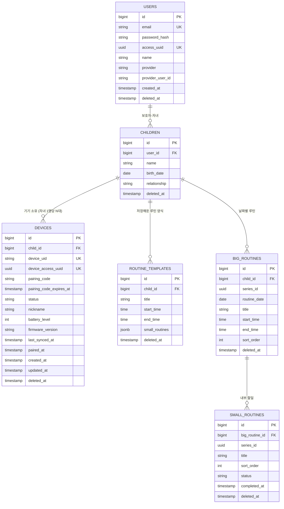
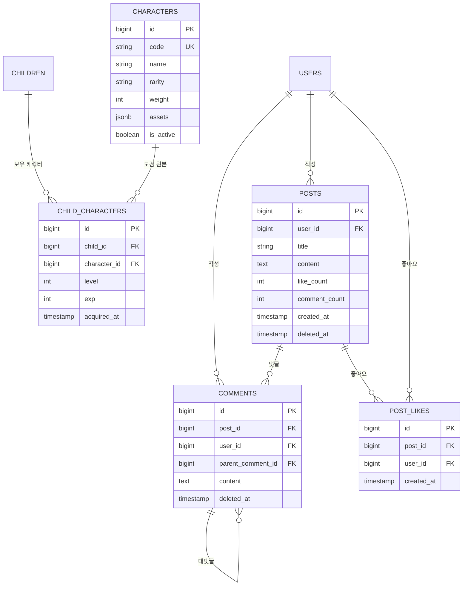

# 예소 ERD 초안

> 출처: Notion `예소 개발자용 > ERD초안` (핵심 도메인 / 캐릭터·커뮤니티)
> DBMS: PostgreSQL 17 (`jsonb` 사용으로 인해 선택)
> — 이 버전은 문구가 아니라 테스트로 강제됩니다. 테스트용 컨테이너 이미지가 `postgres:17` 로 고정되어 있고,
>   `PostgreSqlVersionIntegrationTest` 가 실제로 뜬 DB 의 메이저 버전을 확인합니다. (ROADMAP 0-A T-2)
> 최종 수정: 2026-09-09 — **로그인 방식 전환**(소셜 → 이메일·비밀번호, JWT 제거)과 **루틴 반복 구조 확정**(빅루틴 즉시 생성, 템플릿은 저장해둔 양식으로 재정의)을 반영했습니다. `USERS` · `DEVICES` · `ROUTINE_TEMPLATES` · `BIG_ROUTINES` 네 테이블의 컬럼이 바뀌었고 4장 제약조건도 함께 고쳤습니다.
> **문서 동기화**: `API.md`(인증 · 루틴 · 템플릿 · 기기 엔드포인트), `ROADMAP.md`(Phase 범위와 블로커 목록) 모두 **영향 있음**이며 같은 날짜로 함께 갱신했습니다.
> (직전 수정: 2026-09-04 — 날짜 동기화. 그 전: 2026-08-30 — req/res 명세 초안 작성 중 드러난 ERD 이슈 반영)

## 목차

1. [핵심 도메인 — 계정 · 기기 · 루틴](#1-핵심-도메인--계정--기기--루틴)
2. [캐릭터 · 커뮤니티](#2-캐릭터--커뮤니티)
3. [전체 테이블 요약](#3-전체-테이블-요약)
4. [제약조건 · 인덱스 정리](#4-제약조건--인덱스-정리)
5. [API 명세와 대조하며 드러난 이슈](#5-api-명세와-대조하며-드러난-이슈)
6. [미확정 항목](#6-미확정-항목)

---

## 1. 핵심 도메인 — 계정 · 기기 · 루틴

### 설계 노트

- **USERS** — **이메일 · 비밀번호 로그인**입니다(2026-09-09 확정). `email` 이 로그인 식별자이므로 `not null` 이고 유니크 제약이 붙습니다. `password_hash` 는 비밀번호를 되돌릴 수 없는 형태로 바꿔 저장한 값이며 평문은 어디에도 남기지 않습니다.
  `access_uuid` 는 로그인에 성공하면 서버가 발급하는 임의의 값으로, 앱이 이후 요청마다 헤더에 담아 보냅니다. 이 값으로 "요청한 사람이 누구인가" 를 판정합니다. JWT 를 쓰지 않기로 했기 때문에 서명 검증도 만료 처리도 없고, DB 에서 이 값을 찾아 유저를 특정하는 것이 전부입니다.
  `provider`, `provider_user_id` 는 소셜 로그인 시절의 컬럼입니다. **지우지 않고 nullable 로 남깁니다.** 지금은 아무 값도 들어가지 않지만, 나중에 소셜 로그인을 붙일 때 이미 쌓인 데이터를 옮기지 않아도 되기 때문입니다. 같은 이유로 `unique(provider, provider_user_id)` 도 유지합니다. PostgreSQL 의 유니크 제약은 NULL 을 서로 다른 값으로 보므로, 두 컬럼이 모두 비어 있는 행이 여러 개 있어도 충돌하지 않습니다.

- **CHILDREN.relationship** — 값은 `PARENT`(부모)와 `ADMIN`(관리자) **두 개**입니다(2026-09-04 임시 확정).
  **DB `check` 제약은 걸지 않습니다.** 타겟이 특수학급으로 확장되면 교사 관련 값이 늘어날 수 있는데(7장),
  값을 늘릴 때마다 마이그레이션으로 제약을 고쳐야 하는 비용이 얻는 것보다 큽니다. 값 검증은 애플리케이션의 열거형이 합니다.
- **DEVICES** — `device_uid` 는 앱-기기 연결 uid 로 **기기에서 생성해 전달**하며, 페어링이 끝나기 전까지 기기를 가리키는 값입니다.
  `device_access_uuid` 는 페어링이 완료되는 순간 **서버가 발급**해 기기에 내려주는 값이고, 기기는 이후 요청마다 이 값을 헤더에 담습니다. `device_uid` 를 그대로 신분증으로 쓰지 않는 이유는 그것이 기기가 만든 값이라 다른 값을 추측하거나 지어낼 여지가 있기 때문입니다. 서버가 만든 임의의 값이어야 그 여지가 없습니다.
  기존 `token_hash` 와 `secret_hash` 는 **삭제**했습니다. 기기용 토큰 체계를 없애기로 하면서 저장할 대상 자체가 사라졌고, 함께 `/device-api/v1/token/refresh` 도 없어졌습니다.

- **ROUTINE_TEMPLATES** — **저장해둔 루틴 양식**입니다(2026-09-09 재정의). 자주 쓰는 루틴을 한 번 만들어 두고, 나중에 루틴 만들 때 꺼내 쓰는 용도입니다.
  **자동으로 빅루틴을 만들지 않습니다.** 예전에는 이 테이블이 "고정 반복 루틴의 원본" 이었고 조회 시점에 빅루틴을 만들어내는 구조였는데, 그 역할은 없어졌습니다. 반복 생성은 빅루틴 쪽이 직접 처리합니다(5-1).
  그래서 `is_active` 를 **삭제**했습니다. 그 컬럼은 "자동 생성을 중단한다" 는 뜻이었는데 자동 생성 자체가 없어져 의미가 남지 않습니다. 양식을 더 안 쓰겠다는 표시는 `deleted_at` 하나로 충분합니다.
  **양식을 고쳐도 이미 만들어진 빅루틴은 바뀌지 않습니다.** 꺼내 쓰는 순간 값이 복사되고 둘의 관계는 거기서 끝나기 때문입니다. 그래서 `BIG_ROUTINES.template_id` 도 삭제했습니다. 어느 양식에서 나왔는지 기억할 이유가 없습니다.

- **series_id (BIG_ROUTINES / SMALL_ROUTINES)** — 반복으로 만들어진 루틴들을 하나로 묶는 값입니다. 예전에는 통계 집계용 표시였지만, 이제 **수정 · 삭제 범위를 정하는 실제 기준**으로도 쓰입니다(5-1).
  "월 · 수 · 금 아침 준비" 를 만들면 날짜별 행이 여러 개 생기는데 `series_id` 는 전부 같습니다. 그중 하나의 제목을 고치면 같은 `series_id` 를 가진 다른 행들도 함께 바뀝니다. 사용자 눈에는 루틴 하나를 고친 것이므로 월요일만 바뀌고 수 · 금이 그대로면 이상하기 때문입니다.
  다만 **오늘보다 이전 날짜의 행은 바꾸지 않습니다.** 지난 기록은 그때 실제로 무엇을 하기로 했었는지를 담고 있어야 합니다.

### [기획 변경] 자녀 1명당 기기 N대

`CHILDREN : DEVICES`를 **1:1 → 1:N**으로 변경했습니다. 테이블·컬럼 추가 없이 **제약조건만 조정**하면 됩니다.

- `unique(device_uid) where deleted_at is null` — 해제 후 재페어링 시 과거 행과의 충돌 방지
- `unique(pairing_code) where status = 'PENDING'` — claim이 코드로 단일 행을 특정해야 함
- `child_id` 단독 유니크 제약이 걸려 있다면 **제거**

정책 측면에서는 자녀당 PENDING 행이 동시에 여러 개 생길 수 있으므로, **만료 PENDING 정리**와 **자녀당 최대 기기 수 검증**이 필요합니다.

---

## 2. 캐릭터 · 커뮤니티

### 설계 노트

- **CHARACTERS.assets** — S3 Key를 저장. 캐릭터 이미지 로드 시 런타임에 URL을 조립.
- **CHARACTERS.rarity / weight** — 캐릭터 획득 희귀도와 획득 가중치. ⚠️ **필요한지 논의 필요.**
- **COMMENTS** — `parent_comment_id`로 자기 참조하는 1단계 대댓글 구조.
- **POSTS.like_count / comment_count** — 비정규화 카운터 컬럼. 갱신 시점(트리거 vs 애플리케이션)을 정해야 함.

---

## 3. 전체 테이블 요약

| 테이블 | 도메인 | 역할 | soft delete |
|---|---|---|---|
| `USERS` | 계정 | 보호자 계정, 이메일·비밀번호 로그인, 앱 인증용 `access_uuid` | ✅ |
| `CHILDREN` | 계정 | 자녀 프로필, 보호자와의 관계 | ✅ |
| `DEVICES` | 기기 | 페어링 상태·기기 인증용 `device_access_uuid`·배터리·펌웨어 | ✅ |
| `ROUTINE_TEMPLATES` | 루틴 | 저장해둔 루틴 양식. 꺼내 쓰면 값이 복사됨 (자동 생성 없음) | ✅ |
| `BIG_ROUTINES` | 루틴 | 날짜별 루틴. 반복 생성 시 `series_id` 로 묶임 | ✅ |
| `SMALL_ROUTINES` | 루틴 | 빅루틴 내부 할 일, 완료 상태 | ✅ |
| `CHARACTERS` | 캐릭터 | 캐릭터 마스터(도감) | `is_active` |
| `CHILD_CHARACTERS` | 캐릭터 | 자녀 보유 캐릭터, 레벨·경험치 | - |
| `POSTS` | 커뮤니티 | 게시글 | ✅ |
| `COMMENTS` | 커뮤니티 | 댓글·대댓글 | ✅ |
| `POST_LIKES` | 커뮤니티 | 게시글 좋아요 | - |

## 4. 제약조건 · 인덱스 정리

| 대상 | 제약조건 / 인덱스 | 근거 |
|---|---|---|
| `DEVICES` | `unique(device_uid) where deleted_at is null` | 해제 후 재페어링 시 과거 행과 충돌 방지 |
| `DEVICES` | `unique(pairing_code) where status = 'PENDING'` | claim이 코드로 단일 행을 특정해야 함 |
| `DEVICES` | `child_id` 단독 유니크 제약 **제거** | 1:N 전환 |
| `DEVICES` | `index(child_id, deleted_at)` | 자녀 기기 목록 조회 |
| `POST_LIKES` | `unique(post_id, user_id)` | 좋아요 중복 방지 |
| `BIG_ROUTINES` | `index(child_id, routine_date)` | 날짜별·캘린더 조회 |
| `BIG_ROUTINES` / `SMALL_ROUTINES` | `index(series_id)` | 미션별 이행률 집계 |
| `SMALL_ROUTINES` | `index(big_routine_id, sort_order)` | 순서 정렬 조회 |
| `USERS` | `unique(email) where deleted_at is null` | **이메일이 로그인 식별자.** 없으면 같은 이메일로 계정이 여러 개 생겨 로그인 시 누구인지 특정할 수 없음 |
| `USERS` | `unique(access_uuid)` | 이 값 하나로 유저를 특정하므로 겹치면 안 됨 |
| `USERS` | `index(access_uuid)` | **모든 인증 요청이 이 컬럼으로 조회.** 가장 자주 타는 인덱스 |
| `USERS` | `unique(provider, provider_user_id)` | 소셜 로그인 재도입 대비로 유지. 현재는 두 컬럼 모두 비어 있음 |
| `DEVICES` | `unique(device_access_uuid) where deleted_at is null` | 기기 인증의 식별자 |

## 5. API 명세와 대조하며 드러난 이슈

req/res 스키마 초안을 작성하면서 확인된 항목들과, 각 항목에 대한 **결정 사항**입니다.

### 5-1. 루틴 반복 생성 — ✅ 구현 (2026-09-09 결정 번복)

**이전 결정을 뒤집었습니다.** 직전까지 이 항목은 "❌ 개발 제외 — 매일 반복만 지원, `repeat_days` / `repeat_rule` 컬럼 추가 안 함" 이었습니다. 기획에서 반복 생성이 필요하다고 정리되어 구현 범위에 넣습니다. 뒤집은 사실을 지우지 않고 남겨 두는 이유는, 나중에 "왜 제외였던 게 들어와 있지" 를 다시 따지지 않기 위해서입니다.

**반복은 빅루틴이 처리합니다. 템플릿이 아닙니다.** 반복 모드는 세 가지이고 **서로 배타적**입니다. 한 번에 하나만 고릅니다.

| 모드 | 뜻 | 예 |
|---|---|---|
| `RANGE` | 기간 안의 매일 | 9월 10일 ~ 9월 15일 |
| `WEEKLY` | 지정한 요일마다 | 매주 월 · 수 · 금 |
| `DATES` | 지정한 날짜들만 | 9월 10일, 12일, 17일 |

**컬럼은 하나도 늘지 않습니다.** 반복 모드는 요청을 받을 때만 쓰이고 저장되지 않기 때문입니다. 요청이 들어오면 서버가 그 자리에서 날짜 목록으로 펼쳐 행을 만들고, 같은 `series_id` 를 붙입니다. 행이 다 만들어진 뒤에는 그것이 `WEEKLY` 였는지 `DATES` 였는지 알 필요가 없습니다. 남는 것은 "이 행들은 한 덩어리다" 라는 사실뿐이고 그것은 `series_id` 가 표현합니다.

**전부 즉시 생성입니다.** 조회 시점에 만들어내는 "지연 생성" 은 없어졌습니다. 그 구조는 종료일 없는 무한 반복 때문에 필요했는데, 반복이 항상 끝을 가지므로 요청을 받는 순간 만들 행이 전부 정해집니다. 이에 따라 `unique(template_id, routine_date)` 제약, 배치 스케줄러, 조회 3개 지점(routines · calendar · sync)의 동시 생성 방어가 **모두 불필요해졌습니다.**

**상한**

- `DATES` 의 날짜 개수: **12개**
- `RANGE` 의 기간 길이: 🔺 미확정. 상한이 없으면 한 번의 요청으로 몇 년치 행이 생길 수 있어 **설정값으로 빼 둡니다.**

**수정 · 삭제 범위** — 같은 `series_id` 를 가진 행 전체에 적용하되, **오늘보다 이전 날짜는 제외**합니다.

| 대상 | 범위 |
|---|---|
| `title`, `start_time`, `end_time` 수정 | 오늘 이후 시리즈 전체 |
| 스몰루틴 추가 · 삭제 | 오늘 이후 시리즈 전체 |
| 삭제 | `scope` 로 선택 (`single` / `series`), 기본 `single` |

과거를 제외하는 이유는 지난 기록이 그때 실제로 무엇을 하기로 했었는지를 담고 있어야 하기 때문입니다. 특히 스몰루틴을 과거에까지 추가하면 그 날의 할 일 개수가 늘어나 **이미 지나간 날의 이행률이 떨어집니다.** 아이가 아무것도 하지 않았는데 지난주 성적이 나빠지는 셈입니다.

### 5-2. `time` 타입 타임존 — ✅ 결정 (표준 방식)

**표준적인 방식으로 처리**합니다. 서버는 **UTC를 기준**으로 저장하고(`timestamp` 계열은 `timestamptz` 사용), 앱·기기가 표시·입력 시점에 로컬 타임존(KST)으로 변환합니다. `time` 컬럼은 **로컬(KST) 벽시계 시각**으로 해석하며, 기기 RTC 보정(`serverTime`)과의 비교도 UTC 기준으로 맞춥니다.

### 5-3. `CHILDREN.relationship` 타입 — ✅ enum 확정, 값 목록도 확정 (2026-09-04)

`string` → **애플리케이션 열거형으로 고정**합니다. 값은 `PARENT`(부모)와 `ADMIN`(관리자) **두 개**이며 임시 확정입니다. 타겟이 특수학급으로 확장되면 교사 관련 값이 늘어날 수 있습니다(7장).

**DB `check` 제약은 걸지 않습니다.** 값이 늘 때마다 마이그레이션으로 제약을 고치는 비용이 얻는 것보다 크기 때문입니다.

### 5-4. `CHILD_CHARACTERS` 진화 규칙 — ✅ 결정 (int 고정)

레벨업/경험치 임계값은 **미션(루틴) N개 수행 후 캐릭터가 진화하는 방식**으로 정하고, 진화 임계값 N을 **`int` 상수로 고정**합니다. 즉 누적 미션 완료 수가 임계값에 도달하면 진화합니다. (실수·확률 기반이 아닌 고정 정수 카운트 방식)

### 5-5 / 5-6. 커뮤니티 (댓글 삭제 표현 · 카운터 갱신) — ❌ 구현 제외

커뮤니티 도메인(`POSTS` / `COMMENTS` / `POST_LIKES`)은 **구현 범위에서 제외**하기로 결정했습니다. 이에 따라 댓글 삭제 표현 방식(5-5), 좋아요/댓글 카운터 갱신 시점(5-6) 이슈도 함께 종료합니다.

## 6. 미확정 항목

| 영역 | 내용 | 시한 |
|---|---|---|
| 루틴 | `RANGE` 모드의 **기간 길이 상한**. 확정 전까지 설정값으로 주입 | Phase 3 |
| 기기 | `pairing_code` **자릿수 · 문자 구성** | 회의 |
| 기기 | 만료 PENDING 행 **정리 배치 주기** (얼마나 자주 도는지) | 회의 |
| 기기 | 페어링 완료 **폴링 주기** (몇 초마다 호출할지). 타임아웃 10분은 확정 | 회의 |
| 유저 | 회원 탈퇴 시 `CHILDREN` / `DEVICES` / 루틴 cascade 처리 정책 | Phase 2 |
| 유저 | 비밀번호 **해시 방식**과 **최소 길이 · 문자 조합 정책** | Phase 1 |
| 캐릭터 | `rarity` / `weight` 필요 여부, 획득 시나리오 (진화 규칙은 5-4에서 int 고정으로 확정) | 회의 |
| 기기 API | 기기 API 공통 응답 envelope 적용 여부 | 회의 |

> **2026-09-09 로그인 방식 변경으로 종료된 항목** — JWT 서명 알고리즘 · 키 관리, 토큰 만료 · rotation 정책, 기기 `token` · `secret` 해시 방식. 셋 다 JWT 와 기기 토큰 체계를 없애면서 결정할 대상 자체가 사라졌습니다.
>
> **2026-09-09 루틴 구조 변경으로 종료된 항목** — 지연 생성 동시성 방어 제약조건. 즉시 생성으로 바뀌어 동시 생성이 일어날 자리가 없어졌습니다.
>
> **그 밖에 종료된 항목** — 타임존 정책(5-2, 표준 UTC 방식 확정), 커뮤니티 관련(5-5 · 5-6, 구현 제외), `relationship` 값 목록(`PARENT`/`ADMIN`), 보호자당 자녀 10명, 자녀당 기기 10대, 페어링 폴링 타임아웃 10분.
>
> ⚠️ **비밀번호 찾기와 이메일 인증은 구현하지 않습니다.** 메일 발송 인프라가 로드맵에 없기 때문입니다. 이메일은 **형식 검사만** 하며 실제로 도달하는 주소인지 확인하지 않습니다. 그 결과 **비밀번호를 잊은 사용자는 스스로 계정을 되찾을 수 없습니다.** 알고 내린 결정입니다.

## 7. 타겟 확장 시 예상 변경

타겟이 "일반학교 특수학급"으로 이동할 경우의 영향입니다. 결론이 **Phase 3 착수 전**에 나와야 재작업을 피할 수 있습니다.

| 변경 | 내용 |
|---|---|
| 관계 구조 | 보호자 1 : 자녀 N → 교사 1 : 학생 N. 기존 `USERS ||--o{ CHILDREN` 구조로 수용 가능 |
| 신규 테이블 | 학급(그룹) 개념, 보호자와 교사의 공동 접근 권한을 위한 매핑 테이블 |
| 컬럼 추가 | `CHILDREN.relationship`에 교사 관련 값, 또는 역할 구분 컬럼 |
| API 확장 | 일일보고서 출력을 위한 통계 API 확장 |
