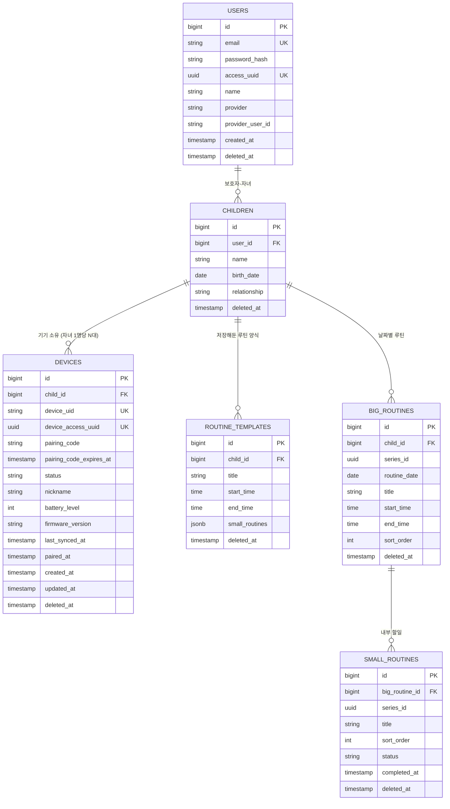
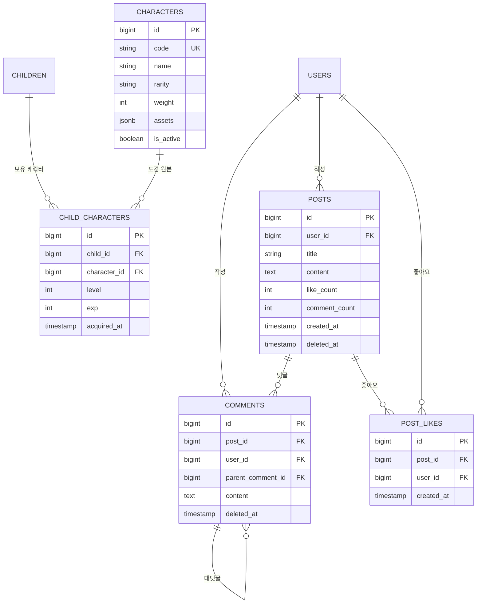

# 예소 ERD 초안

> 출처: Notion `예소 개발자용 > ERD초안` (핵심 도메인 / 캐릭터·커뮤니티)
> DBMS: PostgreSQL 17 (`jsonb` 사용으로 인해 선택)
> — 이 버전은 문구가 아니라 테스트로 강제됩니다. 테스트용 컨테이너 이미지가 `postgres:17` 로 고정되어 있고,
>   `PostgreSqlVersionIntegrationTest` 가 실제로 뜬 DB 의 메이저 버전을 확인합니다. (ROADMAP 0-A T-2)
> 최종 수정: 2026-09-10 — **병합 전 점검 반영 + 미확정 3건 확정.** 확정한 셋(순서 변경 요청 형태, 이미 사용된 페어링 코드의 응답, 자녀 응답의 `createdAt`)은 **전부 이 문서에 영향이 없습니다.** 앞의 둘은 API 형태만의 문제이고, 셋째는 `CHILDREN` 에 `created_at` 을 **넣지 않는 것으로 확정**해 지금 상태가 그대로 답입니다(H-004 에서 뺀 컬럼을 되살리지 않습니다). 테이블 · 컬럼 · 제약조건은 **하나도 바뀌지 않았고**, 같은 행에 동시에 들어온 요청을 어떻게 다루는지(4장 아래 "행 잠금") 와 날짜 경계 판정(5-2)만 적었습니다. 마이그레이션 추가 없음.
> (같은 날 앞선 수정: **미확정 2건 확정**(회원 탈퇴 cascade, 캐릭터 획득·진화 규칙). 테이블·컬럼은 바뀌지 않았고 5장 이슈와 6장 미확정 목록만 갱신했습니다. 같은 날 확정한 이행률 분모 규칙은 이 문서에 이미 반영돼 있어 **영향 없음**입니다.)
> **문서 동기화**: `API.md`(`DELETE /users/me` 와 12장 캐릭터), `ROADMAP.md`(Phase 0 블로커 · 6-1 · 6-2 · 보류 목록) 모두 **영향 있음**이며 같은 날짜로 함께 갱신했습니다.
> (직전 수정: 2026-09-09 — 로그인 방식 전환(소셜 → 이메일·비밀번호, JWT 제거)과 루틴 반복 구조 확정(빅루틴 즉시 생성, 템플릿은 저장해둔 양식으로 재정의). `USERS` · `DEVICES` · `ROUTINE_TEMPLATES` · `BIG_ROUTINES` 네 테이블의 컬럼과 4장 제약조건을 고쳤습니다. 그 전: 2026-09-04 — 날짜 동기화)

## 목차

1. [핵심 도메인 — 계정 · 기기 · 루틴](#1-핵심-도메인--계정--기기--루틴)
2. [캐릭터 · 커뮤니티](#2-캐릭터--커뮤니티)
3. [전체 테이블 요약](#3-전체-테이블-요약)
4. [제약조건 · 인덱스 정리](#4-제약조건--인덱스-정리)
5. [API 명세와 대조하며 드러난 이슈](#5-api-명세와-대조하며-드러난-이슈)
6. [미확정 항목](#6-미확정-항목)

---

## 1. 핵심 도메인 — 계정 · 기기 · 루틴

### 설계 노트

- **USERS** — **이메일 · 비밀번호 로그인**입니다(2026-09-09 확정). `email` 이 로그인 식별자이므로 `not null` 이고 유니크 제약이 붙습니다. `password_hash` 는 비밀번호를 되돌릴 수 없는 형태로 바꿔 저장한 값이며 평문은 어디에도 남기지 않습니다. **bcrypt** 를 씁니다(2026-09-09 확정). bcrypt 는 같은 비밀번호를 넣어도 매번 다른 결과가 나오는데, 무작위 값(salt) 을 섞어 결과 문자열 안에 함께 담기 때문입니다. 그래서 별도의 salt 컬럼이 필요 없고, 이 컬럼 하나면 됩니다.
  `access_uuid` 는 로그인에 성공하면 서버가 발급하는 임의의 값으로, 앱이 이후 요청마다 헤더에 담아 보냅니다. 이 값으로 "요청한 사람이 누구인가" 를 판정합니다. JWT 를 쓰지 않기로 했기 때문에 서명 검증도 만료 처리도 없고, DB 에서 이 값을 찾아 유저를 특정하는 것이 전부입니다.
  `provider`, `provider_user_id` 는 소셜 로그인 시절의 컬럼입니다. **지우지 않고 nullable 로 남깁니다.** 지금은 아무 값도 들어가지 않지만, 나중에 소셜 로그인을 붙일 때 이미 쌓인 데이터를 옮기지 않아도 되기 때문입니다. 같은 이유로 `unique(provider, provider_user_id)` 도 유지합니다. PostgreSQL 의 유니크 제약은 NULL 을 서로 다른 값으로 보므로, 두 컬럼이 모두 비어 있는 행이 여러 개 있어도 충돌하지 않습니다.

- **CHILDREN.relationship** — 값은 `PARENT`(부모)와 `ADMIN`(관리자) **두 개**입니다(2026-09-04 임시 확정).
  **DB `check` 제약은 걸지 않습니다.** 타겟이 특수학급으로 확장되면 교사 관련 값이 늘어날 수 있는데(7장),
  값을 늘릴 때마다 마이그레이션으로 제약을 고쳐야 하는 비용이 얻는 것보다 큽니다. 값 검증은 애플리케이션의 열거형이 합니다.
- **DEVICES.pairing_code** — **숫자 10자리**입니다(2026-09-09 확정). `varchar` 로 두는 이유는 **앞자리 0 을 지키기 위해서**입니다. 정수로 저장하면 `0000000023` 이 `23` 이 되어 자릿수가 흔들리고, 기기 쪽에서 길이로 검사하는 순간 어긋납니다.
  `unique(pairing_code) where status = 'PENDING'` 제약이 이미 있어 같은 코드가 동시에 두 개 살아 있을 수 없습니다. 100억 조합이라 충돌은 드물지만 0 은 아니므로, 만드는 쪽은 제약 위반을 받으면 새 코드로 다시 시도합니다.
- **DEVICES** — `device_uid` 는 앱-기기 연결 uid 로 **기기에서 생성해 전달**하며, 페어링이 끝나기 전까지 기기를 가리키는 값입니다.
  `device_access_uuid` 는 페어링이 완료되는 순간 **서버가 발급**해 기기에 내려주는 값이고, 기기는 이후 요청마다 이 값을 헤더에 담습니다. `device_uid` 를 그대로 신분증으로 쓰지 않는 이유는 그것이 기기가 만든 값이라 다른 값을 추측하거나 지어낼 여지가 있기 때문입니다. 서버가 만든 임의의 값이어야 그 여지가 없습니다.
  기존 `token_hash` 와 `secret_hash` 는 **삭제**했습니다. 기기용 토큰 체계를 없애기로 하면서 저장할 대상 자체가 사라졌고, 함께 `/device-api/v1/token/refresh` 도 없어졌습니다.

- **ROUTINE_TEMPLATES** — **저장해둔 루틴 양식**입니다(2026-09-09 재정의). 자주 쓰는 루틴을 한 번 만들어 두고, 나중에 루틴 만들 때 꺼내 쓰는 용도입니다.
  **자동으로 빅루틴을 만들지 않습니다.** 예전에는 이 테이블이 "고정 반복 루틴의 원본" 이었고 조회 시점에 빅루틴을 만들어내는 구조였는데, 그 역할은 없어졌습니다. 반복 생성은 빅루틴 쪽이 직접 처리합니다(5-1).
  그래서 `is_active` 를 **삭제**했습니다. 그 컬럼은 "자동 생성을 중단한다" 는 뜻이었는데 자동 생성 자체가 없어져 의미가 남지 않습니다. 양식을 더 안 쓰겠다는 표시는 `deleted_at` 하나로 충분합니다.
  **양식을 고쳐도 이미 만들어진 빅루틴은 바뀌지 않습니다.** 꺼내 쓰는 순간 값이 복사되고 둘의 관계는 거기서 끝나기 때문입니다. 그래서 `BIG_ROUTINES.template_id` 도 삭제했습니다. 어느 양식에서 나왔는지 기억할 이유가 없습니다.

- **이행률 집계** — 집계 테이블을 두지 않고 `SMALL_ROUTINES` 를 그때그때 셉니다(2026-09-09 확정). 통계가 하루 · 일주일 · 한달 세 구간뿐이고 자녀 한 명의 한 달치 할 일이 많아야 수백 행이라, 미리 계산해 둘 이유가 없습니다. 집계 테이블은 원본과 어긋날 수 있다는 위험이 늘 따라붙습니다.
  **분모에서 지운 할 일을 뺍니다.** `deleted_at is null` 조건을 겁니다. 지운 할 일이 계속 이행률을 깎으면 보호자가 "왜 점수가 안 오르지" 하게 되고, 다른 모든 조회가 같은 조건을 거는 것과도 어긋납니다("API.md" 11-1).
  기간 필터는 `big_routines_child_id_and_routine_date_index`, 미션별 묶음은 `small_routines_series_id_index` 를 탑니다. 둘 다 이미 있어 새 인덱스가 필요 없습니다.
- **series_id (BIG_ROUTINES / SMALL_ROUTINES)** — 반복으로 만들어진 루틴들을 하나로 묶는 값입니다. 예전에는 통계 집계용 표시였지만, 이제 **수정 · 삭제 범위를 정하는 실제 기준**으로도 쓰입니다(5-1).
  "월 · 수 · 금 아침 준비" 를 만들면 날짜별 행이 여러 개 생기는데 `series_id` 는 전부 같습니다. 그중 하나의 제목을 고치면 같은 `series_id` 를 가진 다른 행들도 함께 바뀝니다. 사용자 눈에는 루틴 하나를 고친 것이므로 월요일만 바뀌고 수 · 금이 그대로면 이상하기 때문입니다.
  다만 **오늘보다 이전 날짜의 행은 바꾸지 않습니다.** 지난 기록은 그때 실제로 무엇을 하기로 했었는지를 담고 있어야 합니다.

  **스몰루틴의 `series_id` 는 "빅루틴 시리즈 + 순서" 로 계산합니다.** 그래서 `sort_order` 는 **한 시리즈 안에서 다시 쓰지 않습니다**(2026-09-10 확정). 할 일을 지운 뒤 새로 더할 때 지운 자리의 번호를 다시 쓰면, 그 자리에 있던 미션과 같은 `series_id` 가 만들어져 미션별 통계가 한 줄로 합쳐집니다. 새 번호는 **시리즈 전체에서(지운 행까지 포함해) 가장 큰 값 + 1** 로 정합니다. 한 날짜만 보고 정하면 안 되는데, 할 일 삭제가 그 날짜 하나만 지워서 날짜마다 살아 있는 개수가 다르기 때문입니다.

- **BIG_ROUTINES.sort_order** — **컬럼에 값을 넣지 않습니다**(2026-09-10 확정). 하루 안에서 어떤 루틴을 먼저 보여줄지는 **조회할 때 `start_time` 오름차순으로 계산**해 응답에만 담습니다(비어 있으면 뒤, 같으면 먼저 만든 것이 앞).
  저장해 두지 않는 이유는 시각을 고쳤을 때 순서가 시각과 어긋나기 때문입니다. 맞추려면 같은 날짜의 다른 행까지 함께 고쳐야 하는데, 하루에 빅루틴은 많아야 몇 개라 셀 때 계산하는 편이 훨씬 쌉니다. 컬럼은 **지우지 않고 남깁니다** — 나중에 사용자가 직접 순서를 끌어 옮기는 기능이 생기면 그때 채우면 되고, 비어 있어도 아무 동작에 영향이 없습니다.

- **SMALL_ROUTINES.sort_order** — 이쪽은 **저장합니다.** 요청이나 양식에 적힌 `order` 대로 줄 세운 뒤 1, 2, 3 을 다시 매겨 넣습니다. 요청의 숫자를 그대로 쓰지 않는 이유는 1, 5, 9 처럼 구멍이 뚫린 값이 저장되면 미션 식별자 계산에서 나중에 겹칠 여지가 생기기 때문입니다.

- **SMALL_ROUTINES.status** — 값은 `PENDING` 과 `DONE` **두 개**입니다. `relationship` 과 같은 이유로 DB `check` 제약은 걸지 않고 애플리케이션이 검증합니다. 다만 **기기 동기화가 보내는 값은 반드시 검사합니다**(2026-09-10 확정). 모르는 값을 받아 넘기면 "DONE 이 아니면 PENDING" 규칙에 걸려 아이가 한 일이 조용히 지워지기 때문입니다.

### [기획 변경] 자녀 1명당 기기 N대

`CHILDREN : DEVICES`를 **1:1 → 1:N**으로 변경했습니다. 테이블·컬럼 추가 없이 **제약조건만 조정**하면 됩니다.

- `unique(device_uid) where deleted_at is null` — 해제 후 재페어링 시 과거 행과의 충돌 방지
- `unique(pairing_code) where status = 'PENDING'` — claim이 코드로 단일 행을 특정해야 함
- `child_id` 단독 유니크 제약이 걸려 있다면 **제거**

정책 측면에서는 자녀당 PENDING 행이 동시에 여러 개 생길 수 있으므로, **만료 PENDING 정리**와 **자녀당 최대 기기 수 검증**이 필요합니다.

---

## 2. 캐릭터 · 커뮤니티

### 설계 노트

- **CHARACTERS.assets** — S3 Key를 저장. 캐릭터 이미지 로드 시 런타임에 URL을 조립.
- **CHARACTERS.rarity / weight** — 캐릭터 획득 희귀도와 획득 가중치. ✅ **둘 다 사용하지 않기로 확정 (2026-09-10).** 획득이 확률 추첨이 아니라 도감 순서 지급이라 가중치를 쓸 자리가 없습니다(5-4). 컬럼은 **지우지 않고 남겨둡니다** — 나중에 추첨 방식으로 바꿀 때 마이그레이션이 필요 없고, 값이 비어 있어도 아무 동작에 영향이 없기 때문입니다. `rarity` 는 도감 화면 표시용으로 응답에 담고, `weight` 는 **응답에 담지 않습니다.**
- **COMMENTS** — `parent_comment_id`로 자기 참조하는 1단계 대댓글 구조.
- **POSTS.like_count / comment_count** — 비정규화 카운터 컬럼. 갱신 시점(트리거 vs 애플리케이션)을 정해야 함.

---

## 3. 전체 테이블 요약

| 테이블 | 도메인 | 역할 | soft delete |
|---|---|---|---|
| `USERS` | 계정 | 보호자 계정, 이메일·비밀번호 로그인, 앱 인증용 `access_uuid` | ✅ |
| `CHILDREN` | 계정 | 자녀 프로필, 보호자와의 관계 | ✅ |
| `DEVICES` | 기기 | 페어링 상태·기기 인증용 `device_access_uuid`·배터리·펌웨어 | ✅ |
| `ROUTINE_TEMPLATES` | 루틴 | 저장해둔 루틴 양식. 꺼내 쓰면 값이 복사됨 (자동 생성 없음) | ✅ |
| `BIG_ROUTINES` | 루틴 | 날짜별 루틴. 반복 생성 시 `series_id` 로 묶임 | ✅ |
| `SMALL_ROUTINES` | 루틴 | 빅루틴 내부 할 일, 완료 상태 | ✅ |
| `CHARACTERS` | 캐릭터 | 캐릭터 마스터(도감) | `is_active` |
| `CHILD_CHARACTERS` | 캐릭터 | 자녀 보유 캐릭터, 레벨·경험치 | - |
| `POSTS` | 커뮤니티 | 게시글 | ✅ |
| `COMMENTS` | 커뮤니티 | 댓글·대댓글 | ✅ |
| `POST_LIKES` | 커뮤니티 | 게시글 좋아요 | - |

## 4. 제약조건 · 인덱스 정리

| 대상 | 제약조건 / 인덱스 | 근거 |
|---|---|---|
| `DEVICES` | `unique(device_uid) where deleted_at is null` | 해제 후 재페어링 시 과거 행과 충돌 방지 |
| `DEVICES` | `unique(pairing_code) where status = 'PENDING'` | claim이 코드로 단일 행을 특정해야 함 |
| `DEVICES` | `child_id` 단독 유니크 제약 **제거** | 1:N 전환 |
| `DEVICES` | `index(child_id, deleted_at)` | 자녀 기기 목록 조회 |
| `POST_LIKES` | `unique(post_id, user_id)` | 좋아요 중복 방지 |
| `BIG_ROUTINES` | `index(child_id, routine_date)` | 날짜별·캘린더 조회 |
| `BIG_ROUTINES` / `SMALL_ROUTINES` | `index(series_id)` | 미션별 이행률 집계 |
| `SMALL_ROUTINES` | `index(big_routine_id, sort_order)` | 순서 정렬 조회 |
| `USERS` | `unique(email) where deleted_at is null` | **이메일이 로그인 식별자.** 없으면 같은 이메일로 계정이 여러 개 생겨 로그인 시 누구인지 특정할 수 없음 |
| `USERS` | `unique(access_uuid)` | 이 값 하나로 유저를 특정하므로 겹치면 안 됨 |
| `USERS` | `index(access_uuid)` | **모든 인증 요청이 이 컬럼으로 조회.** 가장 자주 타는 인덱스 |
| `USERS` | `unique(provider, provider_user_id)` | 소셜 로그인 재도입 대비로 유지. 현재는 두 컬럼 모두 비어 있음 |
| `DEVICES` | `unique(device_access_uuid) where deleted_at is null` | 기기 인증의 식별자 |

### 행 잠금 — ✅ 확정 (2026-09-10)

유니크 제약이 막아주지 못하는 것이 하나 있습니다. **"세고 나서 넣는" 동작**입니다. 세는 것과 넣는 것 사이에 다른 요청이 끼어들면 둘 다 통과합니다. 제약조건으로는 막을 수 없는데, 넣는 값 자체는 중복이 아니기 때문입니다.

그래서 아래 네 곳은 **윗단 행을 잠그고**(다른 트랜잭션이 같은 행에 닿으면 앞의 것이 끝날 때까지 기다리게 하고) 일합니다. 새 컬럼도 새 제약도 필요 없습니다.

| 동작 | 잠그는 행 | 잠그지 않으면 |
|---|---|---|
| 기기 동기화 (`POST /device-api/v1/sync`) | `CHILDREN` | 같은 완료 기록을 두 요청이 각각 "새 완료" 로 세어 `exp` 가 두 번 오르고, 첫 캐릭터가 두 마리 지급됨 |
| 할 일 추가 · 순서 변경 | `CHILDREN` | 새 `sort_order` 를 둘 다 같은 값으로 잡아 서로 다른 할 일이 같은 `series_id` 를 갖게 됨 (미션별 통계가 한 줄로 합쳐짐) |
| 페어링 시작 (`POST /devices/pairing`) | `CHILDREN` | 자녀당 10대 상한을 둘 다 통과해 11대가 붙음 |
| 자녀 등록 (`POST /children`) | `USERS` | 보호자당 10명 상한을 둘 다 통과해 11명이 등록됨 |
| 기기 claim (`POST /device-api/v1/claim`) | `DEVICES` (코드로 찾은 행) | 두 기기가 같은 코드로 각각 신분증을 발급받고 나중 것만 저장됨 |

**잠그는 순서는 항상 "위에서 아래" 입니다.** `USERS` → `CHILDREN` → 그 아래(루틴 · 기기 · 캐릭터) 순이며, 회원 탈퇴처럼 여러 테이블을 한꺼번에 지우는 작업도 같은 순서를 지킵니다. 순서가 엇갈리면 두 작업이 서로가 쥔 행을 기다리며 멈추고(교착 상태), DB 가 한쪽을 강제로 끊어 사용자에게는 500 으로 보입니다.

## 5. API 명세와 대조하며 드러난 이슈

req/res 스키마 초안을 작성하면서 확인된 항목들과, 각 항목에 대한 **결정 사항**입니다.

### 5-1. 루틴 반복 생성 — ✅ 구현 (2026-09-09 결정 번복)

**이전 결정을 뒤집었습니다.** 직전까지 이 항목은 "❌ 개발 제외 — 매일 반복만 지원, `repeat_days` / `repeat_rule` 컬럼 추가 안 함" 이었습니다. 기획에서 반복 생성이 필요하다고 정리되어 구현 범위에 넣습니다. 뒤집은 사실을 지우지 않고 남겨 두는 이유는, 나중에 "왜 제외였던 게 들어와 있지" 를 다시 따지지 않기 위해서입니다.

**반복은 빅루틴이 처리합니다. 템플릿이 아닙니다.** 반복 모드는 세 가지이고 **서로 배타적**입니다. 한 번에 하나만 고릅니다.

| 모드 | 뜻 | 예 |
|---|---|---|
| `RANGE` | 기간 안의 매일 | 9월 10일 ~ 9월 15일 |
| `WEEKLY` | 지정한 요일마다 | 매주 월 · 수 · 금 |
| `DATES` | 지정한 날짜들만 | 9월 10일, 12일, 17일 |

**컬럼은 하나도 늘지 않습니다.** 반복 모드는 요청을 받을 때만 쓰이고 저장되지 않기 때문입니다. 요청이 들어오면 서버가 그 자리에서 날짜 목록으로 펼쳐 행을 만들고, 같은 `series_id` 를 붙입니다. 행이 다 만들어진 뒤에는 그것이 `WEEKLY` 였는지 `DATES` 였는지 알 필요가 없습니다. 남는 것은 "이 행들은 한 덩어리다" 라는 사실뿐이고 그것은 `series_id` 가 표현합니다.

**전부 즉시 생성입니다.** 조회 시점에 만들어내는 "지연 생성" 은 없어졌습니다. 그 구조는 종료일 없는 무한 반복 때문에 필요했는데, 반복이 항상 끝을 가지므로 요청을 받는 순간 만들 행이 전부 정해집니다. 이에 따라 `unique(template_id, routine_date)` 제약, 배치 스케줄러, 조회 3개 지점(routines · calendar · sync)의 동시 생성 방어가 **모두 불필요해졌습니다.**

**상한**

- `DATES` 의 날짜 개수: **12개**
- `RANGE` 의 기간 길이: 🔺 미확정. 상한이 없으면 한 번의 요청으로 몇 년치 행이 생길 수 있어 **설정값으로 빼 둡니다.**

**수정 · 삭제 범위** — 같은 `series_id` 를 가진 행 전체에 적용하되, **오늘보다 이전 날짜는 제외**합니다.

| 대상 | 범위 |
|---|---|
| `title`, `start_time`, `end_time` 수정 | 오늘 이후 시리즈 전체 |
| 스몰루틴 추가 · 삭제 | 오늘 이후 시리즈 전체 |
| 삭제 | `scope` 로 선택 (`single` / `series`), 기본 `single` |

과거를 제외하는 이유는 지난 기록이 그때 실제로 무엇을 하기로 했었는지를 담고 있어야 하기 때문입니다. 특히 스몰루틴을 과거에까지 추가하면 그 날의 할 일 개수가 늘어나 **이미 지나간 날의 이행률이 떨어집니다.** 아이가 아무것도 하지 않았는데 지난주 성적이 나빠지는 셈입니다.

### 5-2. `time` 타입 타임존 — ✅ 결정 (표준 방식)

> ⚠️ **"오늘" 을 따지는 모든 자리는 KST 로 계산합니다 (2026-09-10 재확인).** 서버 시계가 UTC 라서 `LocalDate.now(clock)` 을 그대로 쓰면 UTC 날짜가 나옵니다. 그 차이는 **한국 시각 00시부터 09시 사이에만** 드러나는데, 그 시간대에는 UTC 가 아직 어제라 사용자가 화면에서 고른 "오늘" 이 서버에게는 내일로 보입니다. 자녀 생년월일의 "미래 날짜 불가" 검사가 새벽에만 실패하고 아침이면 되는 식이라 재현이 매우 어렵습니다. 루틴 전파 범위와 통계 기간도 같은 규칙을 씁니다.

**표준적인 방식으로 처리**합니다. 서버는 **UTC를 기준**으로 저장하고(`timestamp` 계열은 `timestamptz` 사용), 앱·기기가 표시·입력 시점에 로컬 타임존(KST)으로 변환합니다. `time` 컬럼은 **로컬(KST) 벽시계 시각**으로 해석하며, 기기 RTC 보정(`serverTime`)과의 비교도 UTC 기준으로 맞춥니다.

### 5-3. `CHILDREN.relationship` 타입 — ✅ enum 확정, 값 목록도 확정 (2026-09-04)

`string` → **애플리케이션 열거형으로 고정**합니다. 값은 `PARENT`(부모)와 `ADMIN`(관리자) **두 개**이며 임시 확정입니다. 타겟이 특수학급으로 확장되면 교사 관련 값이 늘어날 수 있습니다(7장).

**DB `check` 제약은 걸지 않습니다.** 값이 늘 때마다 마이그레이션으로 제약을 고치는 비용이 얻는 것보다 크기 때문입니다.

### 5-4. `CHILD_CHARACTERS` 진화 규칙 — ✅ 결정 (int 고정), 획득 시나리오까지 확정 (2026-09-10)

레벨업/경험치 임계값은 **미션(루틴) N개 수행 후 캐릭터가 진화하는 방식**으로 정하고, 진화 임계값 N을 **`int` 상수로 고정**합니다. 즉 누적 미션 완료 수가 임계값에 도달하면 진화합니다. (실수·확률 기반이 아닌 고정 정수 카운트 방식)

**2026-09-10 에 나머지 세 가지가 확정됐습니다.** 언제 주는지, 무엇을 주는지, 얼마나 자라는지입니다.

| 항목 | 확정된 값 |
|---|---|
| 경험치를 주는 시점 | **기기 동기화(`POST /device-api/v1/sync`) 시점.** 앱에서 완료 표시를 해도 경험치는 움직이지 않습니다 |
| 경험치 양 | 동기화로 **새로 완료된 할 일 1개당 `exp` +1** |
| 진화 임계값 N | **10.** `exp` 가 10 쌓일 때마다 `level` +1 |
| 레벨 계산 | `level` = `exp` / 10 + 1, 최대 3. 즉 `exp` 0~9 는 1, 10~19 는 2, 20 이상은 3 |
| 한 마리를 다 키우는 데 드는 미션 | **30개.** `exp` 는 30에서 멈추고 더 쌓지 않습니다 |
| 새 캐릭터 획득 | 키우던 캐릭터가 `exp` 30 을 채운 뒤 경험치가 더 들어오면 **도감(`CHARACTERS`)의 `code` 오름차순으로 아직 없는 다음 캐릭터 1마리**를 지급합니다 |
| 첫 캐릭터 | 자녀가 한 마리도 없는 상태에서 첫 동기화가 들어오면 도감 첫 캐릭터를 먼저 지급하고 그 마리에 경험치를 넣습니다 |
| 도감이 비었거나 다 모았을 때 | **아무 일도 일어나지 않습니다.** 오류가 아니며, 남은 경험치는 버립니다 |

자녀는 언제나 **`exp` 가 30 미만인 캐릭터를 최대 한 마리만** 가집니다. 그 한 마리가 "지금 키우는 캐릭터"이고, 경험치는 항상 그 마리에만 들어갑니다. 여러 마리에 나눠 넣지 않는 이유는, 나눠 넣으면 "어느 마리가 자라는 중인지"를 따로 저장할 컬럼이 필요해지는데 `CHILD_CHARACTERS` 에 그런 컬럼이 없기 때문입니다. 지금 규칙은 `exp < 30` 인 행 하나를 찾는 것만으로 같은 답을 얻습니다.

**완료를 취소해도 `exp` 는 줄지 않습니다.** 아이가 눌렀다가 취소하는 일은 실제로 일어나고 기기는 그것을 `PENDING` 으로 올립니다. 그때 캐릭터가 뒷걸음질하면 아이가 이유를 알 수 없습니다. 경험치는 "완료가 새로 생긴 순간" 에만 움직입니다.

> 확률 추첨(`weight`)을 쓰지 않기로 한 것이 여기서 나옵니다. 순서가 정해져 있으면 같은 입력에 항상 같은 캐릭터가 나오므로, 테스트가 "무엇이 통과인지"를 한 줄로 적을 수 있습니다.

### 5-5 / 5-6. 커뮤니티 (댓글 삭제 표현 · 카운터 갱신) — ❌ 구현 제외

커뮤니티 도메인(`POSTS` / `COMMENTS` / `POST_LIKES`)은 **구현 범위에서 제외**하기로 결정했습니다. 이에 따라 댓글 삭제 표현 방식(5-5), 좋아요/댓글 카운터 갱신 시점(5-6) 이슈도 함께 종료합니다.

### 5-7. 회원 탈퇴 cascade — ✅ 결정 (2026-09-10)

보호자가 탈퇴하면 **그 보호자에게 딸린 것을 전부 함께 지웁니다.** 지우는 방법은 전부 soft delete(`deleted_at` 을 채워 지운 표시만 남기는 삭제)입니다.

| 대상 | 처리 |
|---|---|
| `USERS` | `deleted_at` 을 채우고 `access_uuid` 를 비웁니다. 앱 토큰이 즉시 못 쓰게 됩니다 |
| `CHILDREN` | 그 보호자의 자녀 전부 `deleted_at` |
| `DEVICES` | 자녀에 물려 있던 기기 전부 페어링 해제 + `device_access_uuid` 무효화 |
| `BIG_ROUTINES` · `SMALL_ROUTINES` | 자녀의 루틴 전부 `deleted_at` |
| `ROUTINE_TEMPLATES` | 자녀의 양식 전부 `deleted_at` |
| `CHILD_CHARACTERS` | **그대로 둡니다.** soft delete 컬럼이 없고, 자녀가 지워지면 조회 경로가 막혀 밖에서 보이지 않습니다 |
| `POSTS` · `COMMENTS` · `POST_LIKES` | 커뮤니티는 구현 제외라 대상이 없습니다 |

행을 실제로 지우지 않으므로 **되돌릴 수 있습니다.** 공모전 일정 안에서 정책이 바뀌더라도 `deleted_at` 을 되돌리면 복구되기 때문에, 지금은 가장 단순한 "다 같이 지운다" 로 갑니다.

## 6. 미확정 항목

| 영역 | 내용 | 시한 |
|---|---|---|
| 루틴 | `RANGE` 모드의 **기간 길이 상한**. 확정 전까지 설정값으로 주입 | Phase 3 |
| 기기 | 만료 PENDING 행 **정리 배치 주기** (얼마나 자주 도는지) | 회의 |
| 기기 | 페어링 완료 **폴링 주기** (몇 초마다 호출할지). 타임아웃 10분은 확정 | 회의 |

> **2026-09-10 에 종료된 항목** — 회원 탈퇴 cascade 정책(5-7, 자녀 · 기기 · 루틴 · 양식을 함께 soft delete), 캐릭터 획득 시나리오와 `rarity` / `weight` 사용 여부(5-4, 도감 순서 지급 · 둘 다 사용 안 함). 이로써 **6장에 남은 미확정은 조회·생성 기간 상한과 배치 · 폴링 주기 셋뿐입니다.**
>
> **2026-09-09 로그인 방식 변경으로 종료된 항목** — JWT 서명 알고리즘 · 키 관리, 토큰 만료 · rotation 정책, 기기 `token` · `secret` 해시 방식. 셋 다 JWT 와 기기 토큰 체계를 없애면서 결정할 대상 자체가 사라졌습니다.
>
> **2026-09-09 루틴 구조 변경으로 종료된 항목** — 지연 생성 동시성 방어 제약조건. 즉시 생성으로 바뀌어 동시 생성이 일어날 자리가 없어졌습니다.
>
> **그 밖에 종료된 항목** — 타임존 정책(5-2, 표준 UTC 방식 확정), 커뮤니티 관련(5-5 · 5-6, 구현 제외), `relationship` 값 목록(`PARENT`/`ADMIN`), 보호자당 자녀 10명, 자녀당 기기 10대, 페어링 폴링 타임아웃 10분.
>
> ⚠️ **비밀번호 찾기와 이메일 인증은 구현하지 않습니다.** 메일 발송 인프라가 로드맵에 없기 때문입니다. 이메일은 **형식 검사만** 하며 실제로 도달하는 주소인지 확인하지 않습니다. 그 결과 **비밀번호를 잊은 사용자는 스스로 계정을 되찾을 수 없습니다.** 알고 내린 결정입니다.

## 7. 타겟 확장 시 예상 변경

타겟이 "일반학교 특수학급"으로 이동할 경우의 영향입니다. 결론이 **Phase 3 착수 전**에 나와야 재작업을 피할 수 있습니다.

| 변경 | 내용 |
|---|---|
| 관계 구조 | 보호자 1 : 자녀 N → 교사 1 : 학생 N. 기존 `USERS ||--o{ CHILDREN` 구조로 수용 가능 |
| 신규 테이블 | 학급(그룹) 개념, 보호자와 교사의 공동 접근 권한을 위한 매핑 테이블 |
| 컬럼 추가 | `CHILDREN.relationship`에 교사 관련 값, 또는 역할 구분 컬럼 |
| API 확장 | 일일보고서 출력을 위한 통계 API 확장 |
