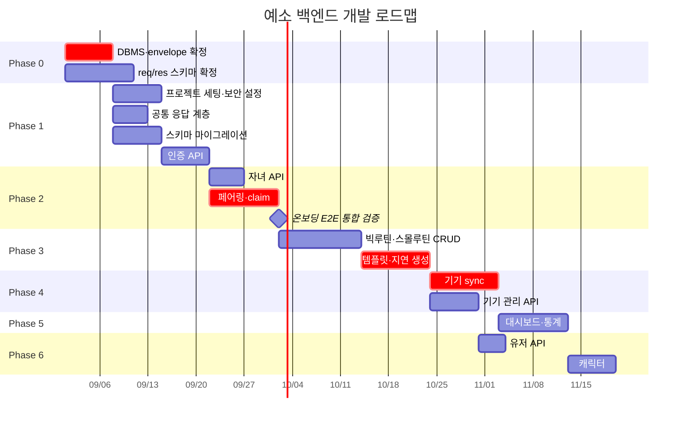

# 예소 백엔드 개발 로드맵

> 출처: Notion `예소 개발자용` 하위 문서 전체 (ERD초안 / API 기본 명세서 / API Req/Res 명세 초안 / 온보딩 & 페어링 전체 흐름 / 백엔드 초기세팅 / 칸반보드 / 타겟 변경 사전조사)
> 최종 수정: 2026-08-30

## 0. 현재 상태

| 항목 | 상태 |
|---|---|
| ERD 초안 | 핵심 도메인 + 캐릭터·커뮤니티 2장 완료. 5번 이슈 정리 완료 (타임존·enum·진화 규칙 확정, 반복 요일·커뮤니티 제외) |
| API 엔드포인트 정의 | 46개 완료 (앱 43 / 기기 3) |
| API req/res 스키마 | **초안 작성 완료, 미확정** — 엔드포인트 페이지의 Request/Response 템플릿은 아직 비어 있음 |
| 공통 응답 포맷 · 에러 코드 | 초안 작성 완료, 미확정 |
| 온보딩·페어링 흐름 | 0~4단계 시퀀스 확정 |
| 기술 스택 | Spring Boot 4.1.1 / Java 21 / Gradle 9.7.1 / PostgreSQL 17 |
| 칸반보드 9개 프로젝트 | **전부 "시작 전"** — 실제 구현은 아직 착수 전 |

ERD 5번 이슈를 정리하면서 **타임존 정책이 표준 UTC 방식으로 확정**되어 Phase 0 블로커에서 빠졌고, **템플릿 반복 요일**과 **커뮤니티**는 구현 범위에서 제외됐습니다. 남은 Phase 0 착수 전 블로커는 DBMS 확정과 기기 API envelope 2건입니다.

칸반보드 상 우선순위는 `인증 관련 API`·`기기 동기화 및 인증 API`가 **높음**, `자녀`·`루틴`·`디바이스`가 **보통**, `USER`·`대시보드`·`캐릭터`가 **낮음**으로 잡혀 있습니다. (`커뮤니티`는 구현 제외.) 아래 로드맵은 이 우선순위와 기술적 의존 관계를 함께 반영했습니다.

---

## Phase 0 — 착수 전 확정 (블로커)

구현을 시작하기 전에 팀 합의가 필요한 항목입니다. 이 중 첫 번째는 **다른 모든 작업을 막는 블로커**입니다.

| # | 항목 | 영향 범위 | 비고 |
|---|---|---|---|
| 0-1 | **기기 API 공통 envelope 적용 여부** | 디바이스 API 3종, 기기 펌웨어 | 펌웨어 JSON 파서 부담 vs 앱·기기 응답 처리 코드 일관성 |
| 0-2 | 자녀당 최대 기기 수 정책 | DEVICES 검증 로직 | N기기 전환에 따른 신규 정책 (회의) |
| 0-3 | 회원 탈퇴 시 자녀·기기·루틴 cascade 정책 | USERS, CHILDREN, DEVICES, 루틴 | `DELETE /users/me` 구현 전제 |
| 0-4 | `relationship` enum **값 목록** 확정 | CHILDREN, 자녀 API | enum 사용은 확정, 값만 회의 대기 |
| 0-5 | 캐릭터 획득 시나리오, `rarity`/`weight` 사용 여부 | CHARACTERS, 캐릭터 API | 진화 규칙(미션 N개 → 진화, int 고정)은 확정. 나머지는 회의 |

0-1 ~ 0-2는 **나중에 바꾸면 전 구간 재작업**이 되는 항목이라 착수 전에 결론이 필요합니다. 0-3 이후는 해당 Phase 직전까지 미룰 수 있습니다.

> ✅ **해소됨 (ERD 5번 정리)**
> - **타임존 정책** → 표준 UTC 방식 확정 (서버 UTC 저장, 앱·기기 KST 변환, `time`은 KST 벽시계 시각)
> - **캐릭터 진화 규칙** → 미션 N개 수행 시 진화, 임계값 N을 `int` 상수로 고정
> - **`relationship`** → enum 사용 확정 (값 목록만 회의 대기)
> - **템플릿 반복 요일** → 개발 제외 (매일 반복만 지원)
> - **커뮤니티** → 구현 제외 (스키마는 유지, 실구현 안 함)
> - 기기 `secret` → **필요**로 확정. `/device-api/v1/token/refresh`가 재페어링 없이 복구되는 유일한 경로이기 때문.

---

## Phase 1 — 기반 구축

**목표: 인증이 붙은 빈 서버가 뜨고, 스키마가 올라간다**

### 1-1. 프로젝트 초기 세팅 - 완료

- Spring Boot 4.1.1 / Java 21 / Gradle 9.7.1 / PostgreSQL 17
- 패키지 구조: `device` / `deviceapi` 패키지를 **분리** (인증 방식이 다름)
- 로컬 개발환경(Docker Compose + PostgreSQL), CI 파이프라인

### 1-2. 보안 설정

- **SecurityFilterChain 2개로 분리**
  - 앱용: 보호자 JWT (`/api/v1/**`)
  - 기기용: claim으로 받은 opaque 토큰 (`/device-api/v1/**`)
- 인증 불필요 경로 화이트리스트: `/auth/social-login`, `/auth/refresh`, `/device-api/v1/claim`, `/device-api/v1/token/refresh`
- 요청/응답 로깅

### 1-2-1. 공통 응답 계층

req/res 초안에서 정의한 규약을 코드로 옮기는 작업입니다. **개별 API 구현보다 먼저** 잡아야 나중에 46개를 다시 손대지 않습니다.

- 공통 응답 래퍼 (`success` / `data` / `error`)
- `ErrorCode` enum — 도메인별 6개 그룹, 코드 + HTTP status + message 매핑
- `@RestControllerAdvice` 전역 예외 처리, 검증 실패 시 `details` 필드별 오류 반환
- 날짜·시간 직렬화 포맷 고정 (표준 UTC 방식: 서버 UTC 저장 + `timestamptz`, `time`은 KST 벽시계 해석)
- 페이지네이션 응답 공통 클래스

### 1-3. 스키마 마이그레이션

- Flyway/Liquibase로 ERD 11개 테이블 생성
- N기기 제약조건 반영
  - `unique(device_uid) where deleted_at is null`
  - `unique(pairing_code) where status = 'PENDING'`
  - `child_id` 단독 유니크 제약 제거

### 1-4. 인증 API (칸반: 우선순위 **높음**)

`POST /auth/social-login` · `POST /auth/refresh` · `POST /auth/logout`

- 구글 idToken 검증, 최초 로그인 시 회원가입 처리
- 응답에 `isFirstLogin` 포함 → 앱 온보딩 분기의 시작점

---

## Phase 2 — 온보딩 & 페어링 (최우선 기능)

**목표: 앱에서 가입 → 자녀 등록 → 기기 페어링까지 end-to-end가 동작한다**

제품의 첫 관문이자 기기·앱·서버 3자가 모두 얽히는 구간이라 가장 먼저 통합 검증해야 합니다.

| 단계 | 엔드포인트 | 담당 |
|---|---|---|
| 온보딩 1차 | `PATCH /users/me` (보호자 성명) | 앱 |
| 온보딩 2차 | `POST /children`, `POST /devices/pairing` | 앱 |
| 온보딩 3차 | (핫스팟) 와이파이 + pairingCode 전달 | 앱 → 기기 |
| claim | `POST /device-api/v1/claim` | 기기 → 서버 |
| 완료 폴링 | `GET /devices/{deviceId}` (PENDING → ACTIVE) | 앱 |

### 구현 포인트

- `pairingCode`는 **일회용 + 유효시간 10분**, 사용 후 NULL 처리
- claim 시 `device_uid`·`token_hash`·`secret_hash`·`paired_at`을 채우고 `ACTIVE`로 전환, 응답으로 `token`·`secret` 발급
- 핫스팟 통신은 **앱 → 기기 단방향**이므로 서버가 기기 상태를 알 방법은 폴링뿐
- 자녀당 PENDING 행이 여러 개 생길 수 있어 `deviceId`로 특정 (N기기 대응)
- 만료 PENDING 정리 배치

### 함께 구현할 자녀 API (칸반: **보통**)

`POST /children` · `GET /children` · `GET /children/{childId}` · `PATCH` · `DELETE`

---

## Phase 3 — 루틴 도메인 (제품 핵심)

**목표: 보호자가 루틴을 만들고 캘린더에서 확인할 수 있다**

### 3-1. 빅루틴 / 스몰루틴 CRUD

- 빅루틴 생성 시 기간 배치 생성 + 동일 `series_id` 부여
- 삭제 `scope` 파라미터(`single` | `series`) 처리
- 스몰루틴 순서 일괄 재정렬(드래그 UI 대응)
- 모든 삭제는 soft delete — **이행률 통계 보존**

### 3-2. 고정 루틴 템플릿 + 지연 생성

가장 설계 난도가 높은 구간입니다. **지연 생성 트리거가 3곳**에 걸쳐 있습니다.

| 트리거 지점 | 엔드포인트 |
|---|---|
| 날짜별 루틴 조회 | `GET /children/{childId}/routines` |
| 캘린더 조회 | `GET /children/{childId}/calendar` |
| 기기 동기화 | `POST /device-api/v1/sync` |

- 동시 요청 시 중복 생성 방지 — `unique(template_id, routine_date) where deleted_at is null` + upsert
- 조회 기간 상한 필요: calendar 31일, stats 90일 제안 (지연 생성이 조회 기간 전체에 걸쳐 일어나기 때문)
- 템플릿 수정은 **이후 생성분부터** 적용, 비활성화는 자동 생성만 중단

> 참고: 템플릿은 **매일 반복만** 지원하며 요일 컬럼은 추가하지 않습니다.

### 3-3. series_id 규칙 검증

- 빅루틴 수정 → `series_id` 유지
- 스몰루틴 수정 → `series_id` 유지 (이름 변경)
- 스몰루틴 추가 → **새 `series_id`** (새로운 미션)

---

## Phase 4 — 기기 동기화 (칸반: 우선순위 **높음**)

**목표: 기기가 하루치 루틴을 받아오고 완료 기록을 올린다**

### 4-1. `POST /device-api/v1/sync`

- push(완료 기록·배터리·펌웨어) + pull(하루치 루틴)을 **한 번에** 처리
- 응답 `serverTime`으로 기기 RTC 보정
- UPDATE 기반 설계로 **멱등성 보장** — 네트워크 재시도 안전
- 오프라인 누적분 처리: `completions[]` 배열로 여러 건 일괄 반영
- 부분 실패 처리: 이미 삭제된 `smallRoutineId`가 섞여 있어도 **무시하고 나머지를 반영**하는 쪽 권장. 기기는 재시도 외에 할 수 있는 일이 없음
- `dates` 배열 최대 길이 제한 (3일 제안)

### 4-2. `POST /device-api/v1/token/refresh`

- `secret`으로 재페어링 없이 자체 복구
- 토큰은 시간 만료 없음, 재발급 시 `token_hash` 덮어쓰기 → 기존 토큰 자동 무효화

### 4-3. 기기 관리 API (칸반: **보통**)

- `GET /children/{childId}/devices` — N기기 대응 신설, 설정창 기기 관리 진입점
- `GET /devices/{deviceId}` · `PATCH` · `DELETE`

> 🔴 이 시점에 **대시보드 응답 스키마 breaking change**가 확정됩니다. `battery` 단일 필드 → `devices[]` 배열. 앱팀과 동시 배포 일정 조율 필요.

---

## Phase 5 — 대시보드 · 통계 (칸반: **낮음**)

**목표: 보호자가 이행률과 인사이트를 본다**

- `GET /children/{childId}/dashboard` — 이번주·어제 이행률 + 기기별 상태 통합
- `GET /stats` — 기간별 이행률, `small_routines` 직접 집계 (집계 테이블 없음)
- `GET /stats/missions` — `series_id` 기준 미션별 이행률, "OO 미션 이행률이 낮아요" 인사이트용
- 데이터 증가 시 집계 테이블 도입 여부를 이 시점에 재검토

---

## Phase 6 — 부가 기능

### 6-1. 유저 API (칸반: **낮음**)

`GET /users/me` · `PATCH /users/me` · `DELETE /users/me`
(회원 탈퇴는 Phase 0-3 정책 확정 이후)

### 6-2. 캐릭터 (칸반: **낮음**)

- `GET /characters` — S3 key만 반환, URL은 런타임 조립
- `GET /children/{childId}/characters`
- 진화 규칙은 **미션 N개 수행 시 진화**(임계값 N은 `int` 상수 고정)로 확정
- ⚠️ 획득 시나리오·`rarity`/`weight` 사용 여부 확정 전까지는 조회 API만 선구현

### 6-3. 커뮤니티 — ❌ 구현 제외

커뮤니티 도메인(게시글·좋아요·댓글, 11개 엔드포인트)은 **이번 구현 범위에서 제외**합니다(ERD 5-5·5-6). ERD 테이블·스키마(`POSTS`/`COMMENTS`/`POST_LIKES`)는 향후 확장을 위해 정의만 유지하고, 실제 API는 개발하지 않습니다.

---

## 일정 개요

> 커뮤니티는 구현 제외로 간트에서 제거했습니다.

> 기간은 의존 관계를 보여주기 위한 상대적 추정치입니다. 칸반보드에 시작일·종료일이 비어 있어, 팀 리소스 확정 후 실제 날짜로 대체해야 합니다.

---

## 리스크 관리

| 리스크 | 영향 | 대응 |
|---|---|---|
| DBMS 미확정 | ERD 전체 재작업 | Phase 0에서 최우선 결정 |
| req/res 스키마 미확정 | 앱·기기와의 인터페이스 재협의 | 초안을 각 엔드포인트 페이지 템플릿으로 옮겨 확정. Phase 1과 병행 |
| Boot 4 스타터 개명 | 초기 세팅 지연 | 초기세팅 문서 8장 대조표 사용, 블로그 자료 복붙 금지 |
| 핫스팟 단방향 통신 | 페어링 실패 시 원인 파악 어려움 | claim 실패 케이스별 기기 로그·앱 폴링 타임아웃 설계 |
| 지연 생성 동시성 | 루틴 중복 생성 | 유니크 제약 + upsert, 3개 트리거 지점 통합 테스트 |
| 대시보드 breaking change | 앱 배포 충돌 | Phase 4에서 앱팀과 동시 배포 조율, 필요 시 버전 분기 |
| 캐릭터 획득 시나리오 미정 | 캐릭터 API 후반부 재작업 | 진화 규칙은 확정. 획득 시나리오·rarity/weight만 회의에서 확정 |

> **해소된 리스크**: 타임존 정책(표준 UTC 확정), 템플릿 반복 요일(개발 제외), 커뮤니티 기획 미정(구현 제외)은 목록에서 제거되었습니다.

---

## 병행 트랙 — 타겟 검증

개발과 별개로 진행 중인 타겟 재정의 결과입니다. **제품 방향이 바뀌면 루틴 도메인의 요구사항이 확장될 수 있으므로**, Phase 3 착수 전까지 결론이 나야 합니다.

| 검증 항목 | 결과 |
|---|---|
| 교사 1인당 학생 수 사각지대 | ⚠️ 부분 검증 — 특수교사 1인당 4.27명(2024)으로 법정 기준 4명 초과. 단 특수학교는 1:2.9로 여유, 일반학교 내 특수학급이 1:4.39로 훨씬 빡빡 → **타겟을 "일반학교 특수학급"으로 이동** |
| 장애 학생별 일일 루틴 존재 | ✅ 검증 — 법정 의무 문서인 IEP에 "생활지원 중심 개별화교육계획" 유형 명시. 특수교사 92%가 행정업무 과다 응답 → 기록 자동화 니즈 확인 |
| 시각적 일과표 사용 | ✅✅ 강하게 검증 — 서울시남부교육지원청 '안녕 하루'(그림상징 40여종 + 일과표·순서표·완료 표시판). 종이 수준이며, 교사가 실제로 장애 학생 일과를 계획한다는 증거 |
| 학생의 기기 사용 가능성 | ✅ 검증 — 발달장애인 스마트기기 자기관리 중재 14편 분석 결과 대부분 PND 70% 이상. 하드웨어는 태블릿PC가 최다 → **웨어러블 영역은 비어 있음** |

**함의**: 교사당 사각지대 + 일일 일과표 존재 ⇒ 장애 학생은 개인 휴대용 다마고치로 주체적 루틴 실행이 가능하고, 교사는 케어 사각지대에 대한 최소한의 방어막과 일일보고서 작성 간편성을 얻습니다.

**개발 관점 체크포인트** — 타겟이 학교로 확장될 경우 다음이 ERD·API 변경으로 이어집니다.

- 보호자 1 : 자녀 N → **교사 1 : 학생 N** (기존 `USERS ||--o{ CHILDREN` 구조로 수용 가능)
- 학급 단위 그룹 개념, 보호자와 교사의 공동 접근 권한 → 신규 테이블 필요
- 일일보고서 출력 기능 → 통계 API 확장
