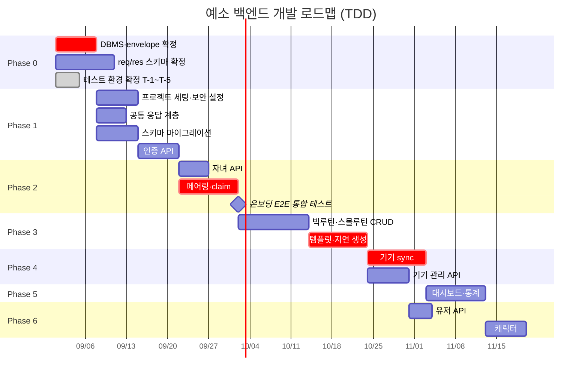

# 예소 백엔드 개발 로드맵 (TDD 버전)

> 출처: Notion `예소 개발자용` 하위 문서 전체 (ERD초안 / API 기본 명세서 / API Req/Res 명세 초안 / 온보딩 & 페어링 전체 흐름 / 백엔드 초기세팅 / 칸반보드 / 타겟 변경 사전조사)
> 최종 수정: 2026-09-04 — 테스트 환경(T-1 ~ T-5) 확정 반영, Testcontainers 이미지를 `postgres:17` 로 고정. 개발 방식은 TDD, 각 작업에 RED/GREEN 표기
>
> **문서 동기화 메모**: 이번 수정은 *개발 방식과 테스트 환경(진행 절차)* 변경입니다. 엔드포인트·스키마·범위 등 **스펙 내용은 하나도 바뀌지 않았으므로 `ERD.md` / `API.md`는 내용 변경 영향 없음**입니다. 다만 세 문서의 `최종 수정` 날짜는 함께 맞춰야 합니다.

## 0. 현재 상태

| 항목 | 상태 |
|---|---|
| ERD 초안 | 핵심 도메인 + 캐릭터·커뮤니티 2장 완료. 5번 이슈 정리 완료 (타임존·enum·진화 규칙 확정, 반복 요일·커뮤니티 제외) |
| API 엔드포인트 정의 | **48개** 완료 (앱 45 / 기기 3). 커뮤니티 11개 제외 시 **구현 대상 37개**. 2026-09-04 Notion 원본과 대조 확인, 이전 "46개" 표기는 오기 |
| API req/res 스키마 | **초안 작성 완료, 미확정** — 엔드포인트 페이지의 Request/Response 템플릿은 아직 비어 있음 |
| 공통 응답 포맷 · 에러 코드 | 초안 작성 완료, 미확정 |
| 온보딩·페어링 흐름 | 0~4단계 시퀀스 확정 |
| 기술 스택 | Spring Boot 4.1.1 / Java 21 / Gradle 9.7.1 / PostgreSQL 17 |
| 칸반보드 9개 프로젝트 | **전부 "시작 전"** — 실제 구현은 아직 착수 전 |
| 테스트 환경 | **확정 완료 (T-1 ~ T-5).** JUnit 5 + Testcontainers(실제 PostgreSQL·Redis 컨테이너) 구성이 코드에 올라가 동작 확인됨. 0-A 참고 |
| 테스트 코드 | **33개** (기반 3 + 공통 응답 계층 13 + 보안 설정 11 + 스키마 6). 전부 통과·skip 0. **도메인 테스트는 아직 없음.** 아래 TDD 규칙에 따라 각 작업의 첫 산출물이 테스트가 됩니다 |
| CI | **작성 완료 (`.github/workflows/ci.yml`).** push·PR 시 `./gradlew test` 실행. 아직 원격에 push 하지 않아 **실제 러너에서의 동작은 미검증** |
| CD (배포) | **미착수·정보 없음.** 배포 대상·환경변수·시크릿이 세 문서 어디에도 없어 작성하지 않았습니다 |
| 커버리지 게이트 | **미확정.** T-4 의 "커버리지 기준" 부분은 아직 정해지지 않았습니다 |

ERD 5번 이슈를 정리하면서 **타임존 정책이 표준 UTC 방식으로 확정**되어 Phase 0 블로커에서 빠졌고, **템플릿 반복 요일**과 **커뮤니티**는 구현 범위에서 제외됐습니다. 남은 Phase 0 착수 전 블로커는 DBMS 확정과 기기 API envelope 2건입니다. **테스트 환경 T-1 ~ T-5는 2026-09-04 자로 전부 확정되어 블로커에서 빠졌습니다.**

칸반보드 상 우선순위는 `인증 관련 API`·`기기 동기화 및 인증 API`가 **높음**, `자녀`·`루틴`·`디바이스`가 **보통**, `USER`·`대시보드`·`캐릭터`가 **낮음**으로 잡혀 있습니다. (`커뮤니티`는 구현 제외.) 아래 로드맵은 이 우선순위와 기술적 의존 관계를 함께 반영했습니다.

---

## 0-A. TDD 진행 규칙

### 사이클 (쉬운 말 풀이 포함)

1. **RED** — 아직 없는 기능에 대한 테스트를 먼저 씁니다. 당연히 실패합니다. **실패하는 걸 눈으로 확인하는 것까지가 RED입니다.** (테스트가 잘못 짜여 항상 통과해버리는 상황을 걸러내기 위함)
2. **GREEN** — 그 테스트를 통과시킬 **최소한의 코드**만 씁니다. 예쁘게 만들 필요 없고, 미래를 대비한 확장 코드도 넣지 않습니다.
3. **REFACTOR** — 테스트가 초록불인 상태를 유지한 채 코드 구조만 정리합니다. 이때 동작이 바뀌면 테스트가 즉시 빨간불로 알려줍니다.

이 문서는 요청에 따라 **GREEN(무엇을 어떻게 구현해서 통과시킬 것인가)** 을 중심으로 적었습니다. RED는 "무엇을 검증하는 테스트를 먼저 쓸지" 목록만 둡니다.

### 테스트 케이스를 뽑아오는 곳

| 무엇을 검증 | 출처 |
|---|---|
| 성공 응답의 필드 구성·HTTP 코드 | `API.md` 각 엔드포인트 Response |
| 실패 케이스와 에러 코드 | `API.md` 3장 에러 코드 + 각 엔드포인트 Error 줄 |
| DB 제약조건 위반 | `ERD.md` 4장 제약조건·인덱스 정리 |
| 상태 전이 (PENDING → ACTIVE 등) | `API.md` 14장 온보딩 호출 순서 |

**문서에 없는 동작은 테스트로 만들지 않습니다.** 필요해 보이면 먼저 질문합니다.

### 테스트 환경 — 확정 (2026-09-04)

Phase 1 착수를 막고 있던 T-1 ~ T-5가 모두 정해졌습니다. 아래는 **실제 코드로 확인한 상태**입니다.

| # | 항목 | 확정 내용 |
|---|---|---|
| T-1 | 테스트 프레임워크·라이브러리 구성 | **JUnit 5** (`useJUnitPlatform()`) + Spring Boot 4.1.1 모듈별 `-test` 스타터 9종 (webmvc / data-jpa / data-redis / security / oauth2-resource-server / validation / restclient / flyway / actuator) + **Testcontainers** |
| T-2 | 통합 테스트용 DB | **실제 PostgreSQL을 Testcontainers 로 띄운다.** 임베디드 DB는 쓰지 않는다. `jsonb`와 부분 유니크 인덱스(`where deleted_at is null`)가 그대로 재현되므로 ERD 제약조건을 테스트로 검증할 수 있다 |
| T-3 | 외부 호출(소셜 `idToken` 검증 등) 대체 | **어디서 도는 테스트인가에 따라 다르다.** 아래 "실행 위치별 정책" 표 참고 |
| T-4 | 커버리지 기준·CI 게이트 | **GitHub Actions 로 구성한다.** CI 는 **외부 네트워크에 의존하지 않는다.** CI 워크플로는 `.github/workflows/ci.yml` 로 작성 완료. **커버리지 기준(측정 도구·임계값)과 CD(배포)는 아직 미확정**이라 워크플로에 넣지 않았다 |
| T-5 | 마이그레이션 도구 | **Flyway.** `spring-boot-starter-flyway` + `flyway-database-postgresql` 의존성이 이미 build.gradle 에 들어가 있다 |

#### 테스트 환경 구성 (파일 기준)

| 파일 | 역할 |
|---|---|
| `src/test/.../TestcontainersConfiguration.java` | PostgreSQL 컨테이너 + Redis 컨테이너를 테스트용 빈으로 등록. `@ServiceConnection`(컨테이너가 뜬 임의 포트를 Spring 이 자동으로 datasource·redis 설정에 꽂아주는 기능)을 써서 접속정보 하드코딩이 없다 |
| `src/test/.../ArtisticSoftwareKhuApplicationTests.java` | 컨텍스트 기동 확인. `@EnabledIfDockerAvailable` 로 Docker 가 없으면 건너뛴다 |
| `src/test/.../DockerAvailabilityTest.java` | 위의 건너뛰기 때문에 **"검증되지 않은 그린"**(통합 테스트가 전부 skip 됐는데 빌드는 초록불인 상태)이 생기는 것을 막는 안전장치. Docker 가 없으면 이 테스트가 대신 실패한다 |
| `compose.yaml` + `spring-boot-docker-compose` | 로컬 개발용 postgres·redis. 앱 실행 시 자동 기동 (테스트 경로와는 별개) |

#### T-3 실행 위치별 정책 (외부 호출을 무엇으로 대체하는가)

| 실행 위치 | 외부 호출(구글 idToken 검증 등) | 이유 |
|---|---|---|
| 단위·슬라이스 테스트 | **Mock**(가짜 구현체 — 정해진 값만 돌려주는 대역) | 검증 대상이 우리 로직이지 외부 서버가 아니다 |
| **GitHub Actions CI** | **Mock** | **CI 는 외부 네트워크에 의존해서는 안 된다.** 구글이 느리거나 죽으면 우리 잘못이 아닌 이유로 빌드가 빨간불이 되고, 테스트 계정·비밀키를 CI 에 넣어야 하는 문제도 생긴다 |
| **로컬 통합 실검증** | **실제 구현 객체 · 실제 데이터** | Mock 만으로는 "우리가 상상한 응답"만 검증된다. 실제 연동이 정말 되는지는 **로컬에서 사람이 한 번 직접 돌려 확인**한다 |

**로컬 통합 실검증**은 CI 에서 매번 도는 테스트가 아니라 **사람이 필요할 때 수동으로 한 번 돌리는 테스트**입니다. 따라서 기본 `./gradlew test` 실행 대상에서 분리해 두고, 실행할 때만 따로 지정해서 돌립니다. 분리 방법(태그·별도 Gradle 태스크 등)은 인증 API(1-4) 구현 시점에 정합니다.

**동작 확인 결과 (2026-09-04, `./gradlew test --rerun-tasks`)** — 테스트 3개 전부 통과, **skip 0**, 컨테이너 로그에 postgres·redis 기동 확인.

#### ✅ 해소된 확인 2건 (2026-09-04)

- **이미지 태그 고정 — 완료.** `postgres:17` 로 고정했습니다. 확인 과정에서 **`postgres:latest` 가 이미 PostgreSQL 18 이었다는 사실**이 드러났습니다. 즉 미래의 위험이 아니라 **이미 문서(17)와 다른 버전에서 테스트가 돌고 있던 상태**였습니다. 재발을 막기 위해 실제로 뜬 DB 에 접속해 메이저 버전을 확인하는 `PostgreSqlVersionIntegrationTest` 를 추가했습니다. 로컬 개발용 `compose.yaml` 도 같은 이유로 `postgres:17` 로 맞췄습니다.
- **T-3 "실검증" 범위 — 확정.** 위 "실행 위치별 정책" 표대로입니다. CI 는 Mock, 로컬 통합 실검증만 실제 구현 객체·실제 데이터.

> Redis 는 세 문서 어디에도 버전이 적혀 있지 않아 **임의로 고정하지 않고** `redis:latest` 를 유지했습니다. 버전이 정해지면 postgres 와 같은 방식으로 고정합니다.

---

## Phase 0 — 착수 전 확정 (블로커)

**이 구간에는 RED/GREEN이 없습니다.** 코드가 아니라 결정이기 때문입니다. 그리고 여기가 안 정해지면 **테스트를 써도 곧 버려야 합니다.**

| # | 항목 | 영향 범위 | 테스트 관점에서의 의미 |
|---|---|---|---|
| 0-1 | **기기 API 공통 envelope 적용 여부** | 디바이스 API 3종, 기기 펌웨어 | 응답 형태가 바뀌면 **디바이스 API 테스트 전부 재작성** |
| 0-2 | 자녀당 최대 기기 수 정책 | DEVICES 검증 로직 | `DEVICE_LIMIT_EXCEEDED` 테스트의 임계값이 없음 → 해당 테스트 작성 보류 |
| 0-3 | 회원 탈퇴 시 자녀·기기·루틴 cascade 정책 | USERS, CHILDREN, DEVICES, 루틴 | `DELETE /users/me` 테스트를 쓸 수 없음 |
| 0-4 | `relationship` enum **값 목록** 확정 | CHILDREN, 자녀 API | 자녀 등록 테스트가 임시값에 묶임 |
| 0-5 | 캐릭터 획득 시나리오, `rarity`/`weight` 사용 여부 | CHARACTERS, 캐릭터 API | 진화 규칙(미션 N개 → 진화, int 고정)만 테스트 가능 |

0-1 ~ 0-2는 **나중에 바꾸면 전 구간 재작업**이 되는 항목이라 착수 전에 결론이 필요합니다. 0-3 이후는 해당 Phase 직전까지 미룰 수 있습니다.

> ✅ **해소됨 (ERD 5번 정리)**
> - **타임존 정책** → 표준 UTC 방식 확정 (서버 UTC 저장, 앱·기기 KST 변환, `time`은 KST 벽시계 시각)
> - **캐릭터 진화 규칙** → 미션 N개 수행 시 진화, 임계값 N을 `int` 상수로 고정
> - **`relationship`** → enum 사용 확정 (값 목록만 회의 대기)
> - **템플릿 반복 요일** → 개발 제외 (매일 반복만 지원)
> - **커뮤니티** → 구현 제외 (스키마는 유지, 실구현 안 함)
> - 기기 `secret` → **필요**로 확정. `/device-api/v1/token/refresh`가 재페어링 없이 복구되는 유일한 경로이기 때문.

---

## Phase 1 — 기반 구축

**목표: 인증이 붙은 빈 서버가 뜨고, 스키마가 올라간다**

### 1-1. 프로젝트 초기 세팅 - 완료 (CI 실행 검증만 남음)

- Spring Boot 4.1.1 / Java 21 / Gradle 9.7.1 / PostgreSQL 17 — 완료
- 로컬 개발환경(Docker Compose + PostgreSQL·Redis) — 완료
- 테스트 환경(JUnit 5 + Testcontainers) — 완료 (0-A 참고)
- 패키지 구조 — **완료 (2026-09-04)**. 아래 표 참고
- **CI 파이프라인 — 작성 완료, 실행 미검증.** `.github/workflows/ci.yml`. 아직 원격에 push 하지 않아 실제 러너에서 도는 것은 확인하지 못했습니다

**패키지 구조**

도메인 패키지는 `API.md` 의 장 구성에서 그대로 도출했습니다. 문서에 없는 패키지는 만들지 않았습니다.

| 패키지 | 담당 | 출처 | 구현 시점 |
|---|---|---|---|
| `common` | 공통 응답 포맷 · 에러 코드 · 전역 예외 처리 | API 2·3장 | 1-2-1 |
| `config` | SecurityFilterChain 2종, 직렬화 포맷 | ROADMAP 1-2 | 1-2 |
| `auth` | 소셜 로그인 · 토큰 재발급 · 로그아웃 (3개) | API 4장 | 1-4 |
| `user` | 내 정보 조회·수정·탈퇴 (3개) | API 5장 | 6-1 |
| `child` | 자녀 CRUD (5개) | API 6장 | 2-1 |
| **`device`** | **앱용** 기기 관리 (5개). `/api/v1/**`, **보호자 JWT** | API 7장 | 2-2 · 4-3 |
| **`deviceapi`** | **기기용** API (3개). `/device-api/v1/**`, **opaque 토큰** | API 8장 | 2-2 · 4-1 · 4-2 |
| `routine` | 루틴 9개 + 고정 루틴 템플릿 4개 | API 9·10장 | 3-1 · 3-2 · 3-3 |
| `dashboard` | 대시보드 · 이행률 통계 (3개) | API 11장 | 5장 |
| `character` | 캐릭터 도감 · 보유 캐릭터 (2개) | API 12장 | 6-2 |

- **`device` 와 `deviceapi` 분리가 이 구조의 핵심**입니다. 인증 방식이 다르기 때문이며, 1-2 의 보안 필터 체인 2개 분리와 짝을 이룹니다.
- **커뮤니티 패키지는 만들지 않았습니다.** 구현 제외이기 때문입니다 (6-3).
- `routine` 은 API 9장·10장을 함께 담습니다. 템플릿이 독립 도메인이 아니라 빅루틴을 만들어내는 원본이고, **지연 생성**이 둘을 강하게 묶고 있어 나누면 서로를 참조하게 됩니다.
- 각 패키지에는 `package-info.java` 를 두어 담당 범위와 인증 방식을 주석으로 남겼습니다. Git 이 빈 디렉터리를 추적하지 않기 때문에 이 파일이 없으면 폴더가 커밋에 남지 않습니다.
- **테스트는 작성하지 않았습니다.** 빈 패키지에는 검증할 동작이 없습니다. 분리가 실제로 지켜지는지는 1-2 의 "기기 토큰으로 `/api/v1/**` 호출 → 실패" 테스트가 확인합니다.

**RED** — 애플리케이션 컨텍스트가 뜨는지 확인하는 테스트 1개. **작성 완료·통과 확인됨.**

**GREEN** — 이미 완료된 세팅이 그대로 통과시킵니다. 추가 구현 없음. CI 워크플로(`.github/workflows/ci.yml`)를 작성했으며, 위의 두 조건을 반영했습니다.

| 워크플로 구성 | 내용 |
|---|---|
| 트리거 | `main` 브랜치 push, `main` 대상 PR |
| 실행 명령 | `./gradlew test` |
| Java | Temurin 21 (`build.gradle` 의 toolchain 과 일치해야 함) |
| Testcontainers | `ubuntu-latest` 러너에 Docker 가 기본 설치되어 그대로 동작. 안 되면 `DockerAvailabilityTest` 가 실패로 알려줌 (조건 1) |
| 외부 네트워크 | 타지 않음. 로컬 전용 실검증 테스트는 CI 대상에서 제외 (조건 2) |
| 부가 | Gradle 래퍼 jar 무결성 검증, 의존성 캐시, 테스트 리포트 보관(14일) |

**아직 남은 일**

- **실제 러너에서의 동작 미검증.** 워크플로는 push 되어야 처음 돌기 때문에, 로컬에서는 `./gradlew clean test` 가 통과하는 것까지만 확인했습니다(2026-09-04, 3개 통과·skip 0). 특히 러너에서 Testcontainers 가 실제로 뜨는지는 **첫 실행 결과를 봐야** 확정할 수 있습니다.
- **커버리지 게이트 미포함.** T-4 의 "커버리지 기준"이 미확정이라 넣지 않았습니다. 측정 도구와 임계값이 정해지면 `테스트 실행` 단계 뒤에 추가합니다.
- **CD(배포) 미포함.** 배포 대상·환경변수·시크릿이 문서에 없습니다.
- 로컬 전용 실검증 테스트를 `./gradlew test` 에서 제외하는 옵션은, 분리 방식이 정해지는 **1-4 시점에** 워크플로에 추가합니다. 워크플로 주석에 위치를 표시해 두었습니다.

### 1-2. 보안 설정 — 부분 완료 (2026-09-04)

**RED — 먼저 쓸 실패 테스트**

- 토큰 없이 `GET /api/v1/users/me` 호출 → 401 `UNAUTHORIZED`
- 화이트리스트 4개 경로(`/auth/social-login`, `/auth/refresh`, `/device-api/v1/claim`, `/device-api/v1/token/refresh`)는 토큰 없이 호출해도 401이 아님
- 보호자 JWT를 들고 `/device-api/v1/sync` 호출 → 통과되지 않음
- 기기 토큰을 들고 `/api/v1/**` 호출 → 통과되지 않음

**GREEN — 이렇게 통과시킨다**

- `SecurityFilterChain` (보안 필터 체인) 을 **Bean 2개로 분리**하고, 각각에 담당 경로를 지정합니다. 앱용은 `/api/v1/**`, 기기용은 `/device-api/v1/**`.
- 앱용 체인에만 JWT(로그인 증표) 검증 필터를 답니다. 기기용 체인에는 **JWT 필터를 아예 달지 않고**, DB의 `token_hash` (기기 토큰 해시값) 와 대조하는 opaque 토큰(내용이 없는 무작위 문자열 토큰) 검증 필터를 답니다.
- 두 체인 모두 화이트리스트 경로는 인증 없이 통과시킵니다.
- 인증 실패 응답도 공통 error 형태로 나가야 하므로, 실패 처리기를 1-2-1의 응답 계층과 연결합니다. → **순서상 1-2-1을 같이 붙잡는 편이 낫습니다.**
- 요청/응답 로깅 필터 추가.

**진행 상황**

| 항목 | 상태 | 산출물 |
|---|---|---|
| SecurityFilterChain 2개 분리 | ✅ 완료 | `config/SecurityConfiguration.java` |
| 화이트리스트 4개 경로 | ✅ 완료 | `API.md` 1-1 의 4개를 상수로 고정 |
| 앱 인증 실패 → 공통 error 형태 401 | ✅ 완료 | `config/CommonAuthenticationEntryPoint.java` |
| 세션 미생성(STATELESS) · CSRF 해제 | ✅ 완료 | 토큰 방식이라 쿠키를 쓰지 않음 |
| **JWT 검증 필터** | ⛔ **보류** | 토큰 만료·rotation·서명 방식 미확정 (`API.md` 15장 #2). **1-4 에서 구현** |
| **기기 opaque 토큰 검증 필터** | ⛔ **보류** | `DEVICES.token_hash` 조회가 필요한데 테이블이 없음. **1-3 이후 구현** |
| 기기 인증 실패 응답 **본문** | ⛔ **보류** | 기기 envelope 미확정(0-1). 현재는 상태 코드 401 만 내보냄 |
| 요청/응답 로깅 필터 | ⛔ **보류** | 무엇을 가리고 무엇을 남길지가 문서에 없음 (`API.md` 15장 #12 로 등록) |

- 두 체인의 "교차 토큰 거부"(보호자 JWT 로 기기 API 호출, 기기 토큰으로 앱 API 호출) 테스트는 **위 두 필터가 생긴 뒤에야** 의미가 있습니다. 지금은 어느 쪽이든 인증 정보가 없어 401 이 나므로, 테스트가 통과해도 분리를 증명하지 못합니다.

> ❓ **질문 필요** — (1) **JWT 서명 알고리즘과 비밀키 관리**(`API.md` 15장 #11). 대칭키(HS256)로 갈지 비대칭키(RS256)로 갈지, 키를 환경변수에 둘지 별도 시크릿 저장소에 둘지가 정해져야 JWT 검증 필터를 만들 수 있습니다. (2) **로깅에서 가릴 항목**(`API.md` 15장 #12). `idToken`·`accessToken`·`refreshToken`·기기 `token`·`secret`·`pairingCode` 는 그대로 로그에 찍히면 안 되는 값입니다. 무엇을 어디까지 가릴지 정하지 않은 채 로깅 필터를 붙이면, 인증 정보가 평문으로 로그에 남는 상태가 됩니다. **로깅 필터를 만들지 않고 두는 편이 지금은 더 안전합니다.**

### 1-2-1. 공통 응답 계층 — 완료 (2026-09-04)

req/res 초안에서 정의한 규약을 코드로 옮기는 작업입니다. **개별 API 구현보다 먼저** 잡아야 나중에 구현 대상 37개를 다시 손대지 않습니다.

**RED — 먼저 쓸 실패 테스트**

- 성공 응답 → `success: true`, `data` 채움, `error: null`
- 삭제·로그아웃 → HTTP 204, 응답 바디 없음
- 도메인 예외 발생 → 해당 `code` + 매핑된 HTTP status + 한국어 `message`
- `@Valid` 검증 실패 → 400 `INVALID_INPUT` + `details`에 `{ field, reason }` 배열 (예: `birthDate` / 미래 날짜)
- 매핑되지 않은 예외 → 500 `INTERNAL_ERROR`
- 직렬화 포맷: date는 `2026-09-01`, time은 `08:30`, timestamp는 `2026-09-01T08:30:00Z`
- 페이지네이션 응답에 `content` / `page` / `size` / `totalElements` / `totalPages` / `hasNext` 6개 필드

**GREEN — 이렇게 통과시킨다**

- `success` / `data` / `error` 세 필드를 가진 **공통 응답 래퍼**를 만들고, 성공은 정적 팩토리 메서드(객체를 만들어 주는 전용 메서드)로 생성합니다.
- `ErrorCode` (에러 코드 열거형) 을 만들어 `API.md` 3장의 표를 그대로 옮깁니다. 각 상수가 **코드 문자열 + HTTP status + 한국어 message**를 함께 들고 있게 해서, 컨트롤러마다 상태코드를 손으로 적지 않도록 합니다.
- 비즈니스 예외 1종을 만들고 그 안에 `ErrorCode`를 담아 던집니다.
- `@RestControllerAdvice` (전역 예외 처리기) 에 핸들러 3개 — 비즈니스 예외 / 검증 실패 / 나머지 전부.
- 날짜·시간은 직렬화 설정에서 포맷을 고정합니다. 저장은 UTC(`timestamptz`), `time`은 KST 벽시계 시각 해석.
- 페이지 응답 공통 클래스 1개. → **만들지 않았습니다.** 아래 참고.

**진행 상황**

| 항목 | 상태 | 산출물 |
|---|---|---|
| 공통 응답 래퍼 (success / data / error) | ✅ 완료 | `common/ApiResponse.java`, `common/ApiError.java`, `common/FieldErrorDetail.java` |
| `ErrorCode` 열거형 | ✅ 완료 | `common/ErrorCode.java` — 32개. `API.md` 3장 표에서 기계적으로 생성 |
| 비즈니스 예외 1종 | ✅ 완료 | `common/BusinessException.java` |
| 전역 예외 처리기 (핸들러 3개) | ✅ 완료 | `common/GlobalExceptionHandler.java` |
| 날짜·시간 직렬화 포맷 고정 | ✅ 완료 | `config/JsonTimeFormatModule.java`, `config/JacksonConfiguration.java` |
| **페이지 응답 공통 클래스** | ❌ **만들지 않음** | 아래 사유 |

**페이지네이션을 만들지 않은 이유.** `API.md` 1-4 가 "목록 조회 중 `GET /posts`만 해당합니다" 라고 명시하는데, `GET /posts` 는 커뮤니티라서 **구현 제외**입니다. 즉 페이지 응답 클래스를 쓸 API 가 하나도 없습니다. 지금 만들면 아무도 호출하지 않는 죽은 코드가 됩니다. 커뮤니티 에러 코드를 `ErrorCode` 에서 뺀 것과 같은 판단입니다.

> **기술 메모 — Spring Boot 4.1 은 Jackson 3 을 씁니다.** 패키지가 `com.fasterxml.jackson` 이 아니라 **`tools.jackson`** 이고, `java.time` 지원이 별도 모듈이 아니라 databind 코어(`tools.jackson.databind.ext.javatime`)에 들어 있습니다. 설정 확장점도 `Jackson2ObjectMapperBuilderCustomizer` 가 아니라 **`JsonMapperBuilderCustomizer`** 입니다. 인터넷의 Jackson 2 예제를 그대로 가져오면 컴파일되지 않습니다.

> ✅ **확정 (2026-09-04)** — `ErrorCode`에 커뮤니티용 코드(`POST_*` / `COMMENT_*` / `LIKE_*`) 7개는 **넣지 않습니다.** 커뮤니티가 구현 제외라 이 코드들을 던질 API 가 만들어지지 않기 때문입니다. 대신 `ErrorCode` 상단에 아래 형태의 주석만 남겨 `API.md` 3-6 과의 차이를 추적할 수 있게 합니다.
>
> ```java
> // "API.md" 3-6 의 커뮤니티 코드 7종("POST_" / "COMMENT_" / "LIKE_" 접두사)은
> // 커뮤니티 도메인이 구현 제외이므로 여기에 넣지 않는다. 향후 구현하게 되면 그 표를 그대로 옮긴다.
> ```
>
> 단 `CHARACTER_NOT_FOUND` 는 3-6 표에 함께 있지만 **캐릭터용이고 캐릭터는 구현 대상**이므로 포함합니다.
> ❓ **질문 필요** — 0-1(기기 envelope)이 "미적용"으로 결정되면 기기용 응답 래퍼가 하나 더 필요합니다. 이 결정 전에는 디바이스 API 테스트를 쓰지 않는 편이 안전합니다.

### 1-3. 스키마 마이그레이션 — 완료 (2026-09-04)

**RED — 먼저 쓸 실패 테스트**

- 마이그레이션 적용 후 ERD 11개 테이블이 모두 존재
- 같은 `device_uid`로 2행 삽입 → 실패. 단 앞 행의 `deleted_at`을 채운 뒤 삽입 → **성공** (재페어링 시나리오)
- `status = 'PENDING'`인 같은 `pairing_code` 2행 삽입 → 실패
- **같은 `child_id`로 기기 2행 삽입 → 성공** (1:N 전환이 실제로 반영됐는지 확인하는 테스트)
- 같은 `(template_id, routine_date)` 2행 삽입 → 실패
- 같은 `(provider, provider_user_id)` 2행 삽입 → 실패

**GREEN — 이렇게 통과시킨다**

- 마이그레이션 스크립트 1개로 11개 테이블 + `ERD.md` 4장의 제약조건·인덱스를 그대로 생성합니다.
- 부분 유니크 인덱스 3종(`device_uid` / `pairing_code` / `(template_id, routine_date)`)은 **`where` 조건이 붙은 형태**로 만듭니다. 이 조건이 빠지면 재페어링이 영구히 막힙니다.
- `child_id` 단독 유니크 제약은 **만들지 않습니다.**

**진행 상황 — 완료**

산출물은 `src/main/resources/db/migration/V1__create_initial_schema.sql` 하나입니다. 검증은 `migration/SchemaMigrationIntegrationTest` 6개가 실제 PostgreSQL 17 컨테이너에서 수행합니다.

| 항목 | 상태 |
|---|---|
| ERD 11개 테이블 생성 (커뮤니티 3개 포함) | ✅ |
| `unique(device_uid) where deleted_at is null` | ✅ 재페어링 시나리오를 테스트로 확인 |
| `unique(pairing_code) where status = 'PENDING'` | ✅ |
| `unique(template_id, routine_date) where deleted_at is null` | ✅ |
| `unique(provider, provider_user_id)` | ✅ |
| `unique(post_id, user_id)` · `unique(characters.code)` | ✅ |
| 인덱스 5종 (`child_id, deleted_at` 등) | ✅ |
| `child_id` 단독 유니크 제약 **미생성** | ✅ 자녀당 기기 2대 삽입 성공으로 확인 |

**문서에 없어서 제가 정한 것 (검토 필요)**

`ERD.md` 는 컬럼 이름과 타입까지만 정의하고 아래는 정하지 않았습니다. 스키마를 만들려면 어떻게든 정해야 하는 값이라 아래처럼 두었으니 확인 부탁드립니다.

| 항목 | 정한 값 | 이유 |
|---|---|---|
| 기본키 생성 방식 | `bigint generated by default as identity` | 표준 SQL 방식. `by default` 라서 테스트에서 id 를 직접 넣을 수도 있음 |
| 문자열 길이 상한 | **걸지 않음** (`varchar` 무제한) | 임의로 정한 상한은 실제 데이터가 넘칠 때 조용히 저장 실패를 냄 |
| `NOT NULL` 범위 | 관계가 필수인 FK, `status`, `title`, `name` 등에만 | `template_id`(직접 만든 루틴), `parent_comment_id`(최상위 댓글)는 비어 있을 수 있어 제외 |
| `relationship` 검사 제약 | **걸지 않음** | enum 값 목록이 미확정(0-4). 확정되면 `check` 제약 추가 |
| 시각 타입 | `timestamptz`, 단 `start_time`/`end_time` 은 `time` | `ERD.md` 5-2 표준 UTC 방식. `time` 은 KST 벽시계 시각 |

> ⚠️ **`created_at` 관련 확인 요청.** `ERD.md` 는 `USERS`·`DEVICES`·`POSTS`·`POST_LIKES` 4개 테이블에만 생성 시각 컬럼을 정의하고, `CHILDREN`·`ROUTINE_TEMPLATES`·`BIG_ROUTINES`·`SMALL_ROUTINES`·`COMMENTS` 5개에는 정의하지 않았습니다. 작업 중 이 5개에도 `created_at` 을 넣었다가 **문서에 없는 컬럼이라 제거**했습니다(history H-004). 현재 마이그레이션은 `ERD.md` 와 컬럼이 완전히 일치합니다. 의도된 누락인지, ERD 에 추가할 것인지 확인이 필요합니다.

> ✅ T-2(테스트 DB = Testcontainers 실 PostgreSQL)와 T-5(마이그레이션 도구 = Flyway)가 확정되어 이 RED를 바로 쓸 수 있습니다. 마이그레이션 SQL 은 `src/main/resources/db/migration` 에 두며, 현재 이 디렉터리가 없어 Flyway 는 아무 일도 하지 않는 상태입니다.

### 1-4. 인증 API (칸반: 우선순위 **높음**) — 일부 완료 (2026-09-04)

`POST /auth/social-login` · `POST /auth/refresh` · `POST /auth/logout`

**RED — 먼저 쓸 실패 테스트**

- 처음 보는 소셜 계정 → `isFirstLogin: true`, `USERS` 1행 생성, `user.name`은 null
- 같은 계정 재로그인 → `isFirstLogin: false`, `USERS` 행이 늘지 않음
- 지원하지 않는 provider → 400 `AUTH_INVALID_PROVIDER`
- idToken 검증 실패 → 401 `AUTH_INVALID_ID_TOKEN`
- 잘못된 refreshToken → 401 `AUTH_REFRESH_TOKEN_INVALID`
- 로그아웃 → 204, 이후 같은 refreshToken 사용 시 401

**GREEN — 이렇게 통과시킨다**

- 소셜 idToken 검증을 **인터페이스로 분리**합니다. 실제 구현체는 구글 공개키로 검증하고, **단위·슬라이스 테스트와 CI 에서는 정해진 값을 돌려주는 Mock(가짜 구현체)** 을 끼웁니다. **실제 구현 객체와 실제 데이터를 쓰는 통합 실검증은 로컬에서 수동으로** 돌립니다 (T-3, 0-A 실행 위치별 정책 표 참고).
- 이때 로컬 전용 실검증 테스트를 기본 `./gradlew test` 대상에서 **분리하는 방법을 여기서 정합니다.** CI 가 외부 네트워크를 타면 안 되기 때문에, 이 분리가 되기 전에는 실검증 테스트를 만들지 않습니다.
- `(provider, provider_user_id)`로 조회 → 없으면 생성. 이 "찾거나 만들거나" 한 번의 흐름이 `isFirstLogin` 값의 근거가 됩니다.
- JWT 발급기와 리프레시 토큰 저장·무효화 저장소.

**진행 상황**

| GREEN 항목 | 상태 |
|---|---|
| 소셜 idToken 검증 인터페이스 + 구글 구현체 | ✅ 완료 — `auth/` 5개 클래스, 테스트 16개 |
| 로컬 실검증 테스트 분리 방법 정하기 | ⬜ 미착수 (막힌 것 없음) |
| `(provider, provider_user_id)` 조회 → 없으면 생성 | ⬜ 미착수 (막힌 것 없음) |
| JWT 발급기 · 리프레시 토큰 저장소 | ⛔ 보류 — 토큰 정책 미확정 |
| 엔드포인트 3개 | ⛔ 보류 — 응답에 토큰이 들어가야 함 |

- **소셜 로그인은 구글로 제한** 확정(2026-09-04). `SocialProvider` 에 `GOOGLE` 하나만 둡니다.
- 구글 client ID 는 `yeso.auth.google.allowed-client-ids` 설정으로 뺐습니다. **값이 비어 있으면 모든 구글 로그인을 거부**합니다(fail closed). 설정을 깜빡했을 때 아무나 통과하는 것보다 아무도 통과 못 하는 편이 빨리 발견되기 때문입니다.

> ❓ **질문 필요** — (1) access/refresh 만료 시간과 rotation(재발급 시 리프레시 토큰도 새로 주고 옛 것을 버리는 방식) 여부가 미확정입니다. 확정 전까지는 만료 시간을 설정값으로 빼두고, 만료 관련 테스트는 그 설정값을 주입해 검증하는 형태로만 씁니다. (2) **구글이 `email` 을 주지 않는 경우**(권한 범위에 따라 생략될 수 있음)를 어떻게 다룰지. 현재는 `sub` 만 있으면 검증을 통과시키고 `email` 은 비워 둡니다. `API.md` 응답 예시에는 `email` 이 들어 있어 확인이 필요합니다.

---

## Phase 1 미구현 정리 (한눈에)

Phase 1(1-1 ~ 1-4)에서 아직 만들지 않은 것 전부입니다. **막힌 이유별로** 묶었습니다.

### 🟢 지금 바로 할 수 있음 — 막힌 것 없음

| 항목 | 절 | 비고 |
|---|---|---|
| 기기 opaque 토큰 검증 필터 | 1-2 | **1-3 완료로 방금 풀림.** `DEVICES.token_hash` 생김 |
| 유저 찾거나 생성 (`isFirstLogin` 판정) | 1-4 | `USERS` 테이블·유니크 제약 준비됨 |
| 로컬 실검증 테스트 분리 방법 정하기 | 1-4 | `@Tag` + 별도 Gradle 태스크 정도 |

### 🔴 결정을 기다림 — 지금 만들면 다시 만들어야 함

| 항목 | 절 | 막고 있는 결정 |
|---|---|---|
| JWT 검증 필터 | 1-2 | `API.md` 15장 **#2** 만료·rotation, **#11** 서명 알고리즘·키 |
| 토큰 발급기 · 리프레시 저장소 | 1-4 | 〃 |
| 인증 엔드포인트 3개 | 1-4 | 〃 (응답에 토큰이 들어감) |
| 요청·응답 로깅 필터 | 1-2 | `API.md` 15장 **#12** 로깅 마스킹 대상 |
| 기기 인증 실패 응답 **본문** | 1-2 | **0-1** 기기 envelope (상태 코드 401 은 나감) |

### 🔵 검증만 남음

| 항목 | 절 | 어떻게 끝나나 |
|---|---|---|
| CI 워크플로 실제 동작 | 1-1 | 원격에 push 하면 첫 실행에서 확인됨 |

### ⚫ 일부러 안 만듦

| 항목 | 절 | 이유 |
|---|---|---|
| 페이지 응답 공통 클래스 | 1-2-1 | 유일한 사용처 `GET /posts` 가 커뮤니티라 구현 제외 |
| 커뮤니티 에러 코드 7종 | 1-2-1 | 던질 API 가 없음 (`API.md` 3-6 에 ❌ 표기) |
| 두 체인 교차 토큰 거부 테스트 | 1-2 | 위 두 필터가 생겨야 의미가 생김 |

### ⚠️ 확인 필요

| 항목 | 절 |
|---|---|
| `CHILDREN` 등 5개 테이블에 `created_at` 이 없는 게 의도인지 | 1-3 |
| 구글이 `email` 을 주지 않는 계정을 어떻게 다룰지 | 1-4 |

---

## Phase 2 — 온보딩 & 페어링 (최우선 기능)

**목표: 앱에서 가입 → 자녀 등록 → 기기 페어링까지 end-to-end가 동작한다**

제품의 첫 관문이자 기기·앱·서버 3자가 모두 얽히는 구간이라 가장 먼저 통합 검증해야 합니다.

| 단계 | 엔드포인트 | 담당 |
|---|---|---|
| 온보딩 1차 | `PATCH /users/me` (보호자 성명) | 앱 |
| 온보딩 2차 | `POST /children`, `POST /devices/pairing` | 앱 |
| 온보딩 3차 | (핫스팟) 와이파이 + pairingCode 전달 | 앱 → 기기 |
| claim | `POST /device-api/v1/claim` | 기기 → 서버 |
| 완료 폴링 | `GET /devices/{deviceId}` (PENDING → ACTIVE) | 앱 |

### 2-1. 자녀 API (칸반: **보통**)

`POST /children` · `GET /children` · `GET /children/{childId}` · `PATCH` · `DELETE`

**RED — 먼저 쓸 실패 테스트**

- 등록 성공 → 201, 응답에 `childId` / `name` / `birthDate` / `relationship` / `createdAt`
- `birthDate`가 미래 → 400 `INVALID_INPUT`, `details`의 `field`가 `birthDate`
- 남의 자녀 조회·수정 → 403 `CHILD_FORBIDDEN`
- 없는 자녀 → 404 `CHILD_NOT_FOUND`
- 목록 응답에 `deviceCount` 포함
- 삭제 → 204, 이후 조회 시 404 (soft delete)
- 삭제 시 연결된 기기의 페어링 해제·토큰 무효화가 함께 일어남

**GREEN — 이렇게 통과시킨다**

- 소유권 검사(요청한 보호자의 자녀가 맞는지)를 **한 곳에 모아** 모든 자녀 관련 API가 같은 함수를 부르게 합니다. 여기가 흩어지면 403 테스트가 엔드포인트마다 통과·실패를 오갑니다.
- 삭제는 `deleted_at`을 채우는 방식이고, 조회 쿼리는 전부 `deleted_at is null` 조건을 답니다.
- 자녀 삭제 시 기기 해제를 같은 트랜잭션 안에서 처리합니다.

> ❓ **질문 필요** — `relationship` enum 값 목록이 미확정입니다(0-4). 값이 확정되기 전에는 등록 테스트가 임시값에 의존하게 되므로, **테스트에서 값을 상수 한 곳에만 두고** 확정 후 한 줄만 고치도록 합니다. `CHILD_LIMIT_EXCEEDED`(자녀 수 상한)도 임계값이 문서에 없어 테스트 작성을 보류합니다.

### 2-2. 페어링 · claim

**RED — 먼저 쓸 실패 테스트**

- `POST /devices/pairing` → 201, `deviceId`·`pairingCode`·`expiresAt`·`status: PENDING`
- 같은 자녀로 2번 호출 → **PENDING 행 2개 생성 성공** (1:N)
- claim 성공 → `status`가 ACTIVE, 응답에 `token`·`secret`·`serverTime`, DB의 `pairing_code`는 NULL
- 같은 코드로 다시 claim → 409 `PAIRING_CODE_ALREADY_USED`
- 발급 10분 경과 후 claim → 410 `PAIRING_CODE_EXPIRED`
- 없는 코드 → 404 `PAIRING_CODE_NOT_FOUND`
- 이미 다른 계정에 물린 `deviceUid` → 409 `DEVICE_UID_ALREADY_PAIRED`
- 폴링용 `GET /devices/{deviceId}` → claim 전 PENDING, claim 후 ACTIVE

**GREEN — 이렇게 통과시킨다**

- 발급 시 코드와 `pairing_code_expires_at`(= 발급 시각 + 10분)을 채운 PENDING 행을 만들고, **응답에 `deviceId`를 반드시 포함**합니다. 자녀당 PENDING이 여러 개일 수 있어 이 값이 없으면 앱이 폴링 대상을 특정할 수 없습니다.
- claim 처리는 `API.md` 8장의 **서버 처리 순서 1~5를 그 순서 그대로** 한 트랜잭션에 넣습니다. 코드 조회 → 만료 검증 → 값 채우고 ACTIVE → `pairing_code` NULL → 평문 반환.
- `token`·`secret`은 **평문을 응답에만 담고 DB에는 해시로 저장**합니다. 평문을 볼 수 있는 유일한 순간이므로, 저장 로직과 응답 로직을 한 메서드에 붙여 순서가 어긋나지 않게 합니다.
- 만료 PENDING 정리 배치. 테스트에서는 시각을 주입해 만료를 흉내 냅니다.

> ❓ **질문 필요** — (1) 자녀당 최대 기기 수(0-2)가 없어 `DEVICE_LIMIT_EXCEEDED` 테스트를 쓸 수 없습니다. (2) `pairingCode` 자릿수·문자 구성이 미정입니다. (3) `token`·`secret` 해시 방식이 문서에 없습니다. (4) **페어링 완료 폴링 주기·타임아웃**이 미정입니다 (`API.md` 15장 #5). 네 가지 모두 임의로 정하지 않고 대기합니다.

**페어링 완료 폴링 주기·타임아웃 (`API.md` 15장 #5, 결정 시한 Phase 2)**

기기가 claim 을 마치면 서버의 `status` 가 PENDING 에서 ACTIVE 로 바뀝니다. 앱은 그걸 알 방법이 없어서 `GET /devices/{deviceId}` 를 **반복 호출하며 기다립니다.** 이것을 폴링(polling — 서버가 알려주지 않으니 클라이언트가 주기적으로 물어보는 방식)이라고 합니다. 여기서 정해야 할 값이 둘입니다.

| 값 | 정하지 않으면 생기는 일 |
|---|---|
| **폴링 주기** (몇 초마다 호출할지) | 너무 짧으면 서버에 불필요한 요청이 쌓이고, 너무 길면 사용자가 페어링이 끝났는데도 기다립니다 |
| **폴링 타임아웃** (언제 포기할지) | 기기 전원이 꺼졌거나 와이파이가 틀렸을 때 앱이 영원히 돌게 됩니다. 사용자에게 "실패했으니 다시 시도하세요" 를 언제 띄울지가 이 값에서 나옵니다 |

**서버 쪽 결론**: 이 둘은 `API.md` 가 "앱·서버 합의 사항" 으로 분류한 항목이며, **주기와 타임아웃 자체는 앱이 지키는 값이라 서버 API 스펙을 바꾸지 않습니다.** 다만 타임아웃이 정해지면 **만료 PENDING 정리 배치의 기준 시각**과 어긋나면 안 됩니다. 앱이 15분을 기다리는데 서버가 10분에 PENDING 행을 지워버리면, 앱은 이유를 알 수 없는 404 를 받습니다.

**따라서 이 절에서 쓸 수 있는 테스트와 쓸 수 없는 테스트를 나눕니다.**

- 쓸 수 있음 — 폴링용 `GET /devices/{deviceId}` 가 claim 전 PENDING, claim 후 ACTIVE 를 돌려주는지 (위 RED 목록에 이미 있음). 이건 주기와 무관합니다.
- **보류** — 폴링 주기·타임아웃 자체를 검증하는 테스트, 그리고 만료 정리 배치의 기준 시각을 못박는 테스트. 값이 정해진 뒤에 씁니다.

### 2-3. 온보딩 E2E 통합 테스트 (마일스톤)

**RED** — `API.md` 14장의 0~5단계를 **하나의 시나리오 테스트**로 작성합니다. 소셜 로그인 → 성명 입력 → 자녀 등록 → 페어링 코드 발급 → claim → 폴링으로 ACTIVE 확인 → 발급받은 토큰으로 sync 호출 성공.

**GREEN** — 새 구현은 없습니다. 앞의 조각들이 실제로 이어지는지 확인하는 것이 목적이며, 여기서 실패하면 조각 단위 테스트가 놓친 연결부가 드러납니다.

**이 시나리오는 두 벌로 만듭니다** (T-3 실행 위치별 정책).

| 버전 | 소셜 idToken 검증 | 어디서 도는가 |
|---|---|---|
| CI 용 | Mock | GitHub Actions 에서 매번. 외부 네트워크를 타지 않는다 |
| 로컬 실검증용 | 실제 구현 객체 + 실제 데이터 | 로컬에서 사람이 수동으로. 기본 `./gradlew test` 대상에서 제외 |

두 벌 모두 DB 는 Testcontainers 의 실제 PostgreSQL 17 을 씁니다. 여기서 갈리는 것은 **외부 호출을 대체하는지 여부 하나뿐**입니다.

---

## Phase 3 — 루틴 도메인 (제품 핵심)

**목표: 보호자가 루틴을 만들고 캘린더에서 확인할 수 있다**

### 3-1. 빅루틴 / 스몰루틴 CRUD

**RED — 먼저 쓸 실패 테스트**

- `endDate` 없이 생성 → 1행, `createdCount: 1`
- 기간 생성 → 날짜 수만큼 행 생성, **모두 같은 `seriesId`**, `createdDates` 반환
- `endTime` < `startTime` → 400 `ROUTINE_INVALID_TIME_RANGE`
- `endDate` < `startDate` → 400 `ROUTINE_INVALID_DATE_RANGE`
- 기간 상한 초과 → 400 `ROUTINE_DATE_RANGE_TOO_LONG`
- 빅루틴 수정 → **해당 날짜만** 바뀌고 같은 시리즈의 다른 날짜는 그대로, `series_id` 유지
- 삭제 `scope=single` → 그 날짜만 / `scope=series` → 같은 시리즈 전체
- 삭제 후에도 통계 집계에서는 해당 기록이 사라지지 않음 (soft delete)
- 스몰루틴 추가 → **새 `series_id` 발급** / 스몰루틴 수정 → `series_id` 유지
- 순서 변경 요청에 스몰루틴이 하나라도 빠짐 → 400 `ROUTINE_ORDER_MISMATCH`

**GREEN — 이렇게 통과시킨다**

- 기간 생성은 UUID를 **한 번만 만들어** 반복문 안의 모든 행에 같은 값을 넣습니다. 반복문 안에서 만들면 시리즈가 날짜마다 쪼개져 미션별 통계가 무너집니다.
- 삭제는 `scope` 값으로 분기합니다. `single`은 해당 행만, `series`는 같은 `series_id` 전체를 soft delete.
- 순서 변경은 요청 배열과 DB의 스몰루틴 목록을 **먼저 대조해 누락을 검사**하고, 통과한 경우에만 `sort_order`를 일괄 UPDATE 합니다.

> ❓ **질문 필요** — 기간 상한값과 `scope` 기본값은 `API.md`에 "제안"으로만 적혀 있습니다(각각 미정, `single` 제안). 확정 전까지 상한값은 설정값으로 빼고, 기본값 테스트는 보류합니다.

### 3-2. 고정 루틴 템플릿 + 지연 생성

가장 설계 난도가 높은 구간입니다. **지연 생성 트리거가 3곳**에 걸쳐 있습니다.

| 트리거 지점 | 엔드포인트 |
|---|---|
| 날짜별 루틴 조회 | `GET /children/{childId}/routines` |
| 캘린더 조회 | `GET /children/{childId}/calendar` |
| 기기 동기화 | `POST /device-api/v1/sync` |

**RED — 먼저 쓸 실패 테스트**

- 템플릿이 있고 해당 날짜 빅루틴이 없을 때 조회 → 생성된 뒤 응답에 포함
- **같은 조회를 두 번** → 빅루틴은 1개 그대로 (멱등성: 여러 번 해도 결과가 한 번 한 것과 같음)
- 트리거 3곳 각각에서 생성이 일어남 — **세 개를 각각 테스트**
- **동시 요청 재현** — 여러 스레드가 같이 조회해도 결과는 1행
- 템플릿 수정 → 이미 만들어진 빅루틴은 그대로, 이후 생성분부터 반영
- 템플릿 비활성화 → 자동 생성만 멈추고 기존 빅루틴은 유지
- 캘린더 `from`~`to` 상한 초과 → 400

**GREEN — 이렇게 통과시킨다**

- 지연 생성 로직을 **딱 한 개의 공용 서비스 메서드**로 만들고, 3개 트리거가 전부 그것을 호출합니다. 세 곳에 각각 구현하면 "조회로는 만들어지는데 sync로는 안 만들어지는" 종류의 버그가 반드시 생깁니다.
- 중복 방지는 애플리케이션의 "있는지 확인하고 없으면 넣기"에 기대지 않고, **DB의 `unique(template_id, routine_date) where deleted_at is null` 제약 + upsert(있으면 무시하고 넘어가는 삽입)** 로 처리합니다. 확인과 삽입 사이에 다른 요청이 끼어드는 순간이 실제로 존재하기 때문입니다.
- 충돌로 삽입이 무시된 경우에는 이미 들어간 행을 다시 조회해 응답에 씁니다.

### 3-3. series_id 규칙 검증

`series_id`는 "이 루틴들이 원래 같은 미션인가"를 표시하는 값이며, 통계의 기준입니다. **규칙 자체를 테스트로 고정**해 둡니다.

**RED** — 빅루틴 수정 시 유지 / 스몰루틴 수정 시 유지(이름 변경으로 간주) / 스몰루틴 추가 시 새 값 발급.

**GREEN** — 수정 경로에서는 `series_id`를 아예 건드리지 않고, 생성 경로에서만 새 값을 부여합니다.

---

## Phase 4 — 기기 동기화 (칸반: 우선순위 **높음**)

**목표: 기기가 하루치 루틴을 받아오고 완료 기록을 올린다**

> ⚠️ **0-1(기기 envelope) 확정 전에는 이 구간의 응답 형태 테스트를 쓰지 않습니다.** 지금 쓰면 결정이 뒤집힐 때 전부 다시 씁니다.

### 4-1. `POST /device-api/v1/sync`

**RED — 먼저 쓸 실패 테스트**

- 유효한 기기 토큰 → 200, `serverTime`·`accepted`·`routines` 반환
- `completions`를 **똑같이 두 번 전송** → 결과가 동일 (멱등성)
- 이미 삭제된 `smallRoutineId`가 섞여 있음 → 나머지는 반영
- `battery`·`firmware`·`last_synced_at`이 갱신됨
- `dates`에 담긴 날짜 중 템플릿 기반 빅루틴이 없는 날 → 이 시점에 생성
- 잘못된 토큰 → 401 `DEVICE_TOKEN_INVALID`

**GREEN — 이렇게 통과시킨다**

- 한 트랜잭션 안에서 **push(완료 기록·배터리·펌웨어 반영) → 지연 생성 → pull(하루치 루틴 조회)** 순서로 처리합니다. 지연 생성이 pull보다 뒤에 있으면 방금 만든 루틴이 응답에서 빠집니다.
- 완료 기록은 INSERT가 아니라 **UPDATE 기반**으로 반영합니다. 같은 요청이 다시 와도 같은 행을 같은 값으로 덮어쓸 뿐이라 멱등성이 자연히 보장됩니다.
- `serverTime`은 응답 생성 시점의 서버 UTC 시각.

> ❓ **질문 필요** — 부분 실패 처리(삭제된 id가 섞였을 때 전체 실패 vs 무시)와 `dates` 최대 길이는 `API.md`에서 **권장·제안 단계**입니다. 확정 전까지 해당 RED는 보류하거나, 확정될 값을 설정값으로 빼두고 테스트에서 주입합니다.

### 4-2. `POST /device-api/v1/token/refresh`

**RED — 먼저 쓸 실패 테스트**

- 올바른 `deviceUid` + `secret` → 새 `token` 발급
- **재발급 직후 이전 토큰으로 sync → 401** (자동 무효화 확인)
- 틀린 secret → 401 `DEVICE_SECRET_INVALID`
- 없는 `deviceUid` → 404 `DEVICE_NOT_FOUND`

**GREEN — 이렇게 통과시킨다**

- 새 토큰을 만들고 `token_hash`를 **덮어씁니다.** 옛 토큰을 따로 폐기 목록에 넣을 필요가 없습니다. 해시가 하나뿐이라 덮어쓰는 순간 이전 토큰은 대조에 실패합니다.
- `secret`은 회전시키지 않는 쪽이 `API.md`의 권장안입니다. (기기가 새 secret 저장에 실패하면 복구 불능이 되기 때문) 🔺 권장 단계이므로 확정 필요.

### 4-3. 기기 관리 API (칸반: **보통**)

`GET /children/{childId}/devices` · `GET /devices/{deviceId}` · `PATCH` · `DELETE`

**RED** — 목록에 PENDING 기기가 섞이면 `battery`·`firmwareVersion`·`lastSyncedAt`이 **null로 내려감** / 남의 기기 접근 → 403 `DEVICE_FORBIDDEN` / 연결 해제 후 같은 기기를 다시 페어링하면 성공.

**GREEN** — 목록 조회는 `index(child_id, deleted_at)`를 타도록 쿼리하고, PENDING 행의 null 필드를 억지로 채우지 않고 그대로 내보냅니다. 해제는 soft delete + 토큰 무효화.

> 🔴 이 시점에 **대시보드 응답 스키마 breaking change**가 확정됩니다. `battery` 단일 필드 → `devices[]` 배열. 앱팀과 동시 배포 일정 조율 필요.

---

## Phase 5 — 대시보드 · 통계 (칸반: **낮음**)

**목표: 보호자가 이행률과 인사이트를 본다**

**RED — 먼저 쓸 실패 테스트**

- 대시보드 응답에 `devices` **배열**이 있고, 단일 `battery` 필드는 **없음** (breaking change를 테스트로 못 박아 되돌아가지 않게 함)
- `thisWeek` / `yesterday` 각각 `completionRate`·`doneCount`·`totalCount`
- `GET /stats` → `summary` + 날짜별 `daily` 배열
- `GET /stats/missions` → `series_id` 기준으로 묶임
- **이름이 바뀐 미션은 한 행으로 집계되고, `title`은 가장 최근 값**

**GREEN — 이렇게 통과시킨다**

- 집계 테이블 없이 `small_routines`를 직접 세는 쿼리로 만듭니다. 미션별 집계는 `series_id`로 묶고 `index(series_id)`를 활용합니다.
- 대시보드는 이행률 집계와 기기 목록을 각각 구한 뒤 하나의 응답으로 합칩니다.

> ❓ **질문 필요** — (1) `insights`의 종류와 생성 규칙이 미확정이라 인사이트 테스트는 보류합니다. (2) **soft delete된 루틴을 이행률의 분모에 넣을지** 가 문서에 명시돼 있지 않습니다. "이행률 통계 보존"이라는 문구는 있지만 계산 규칙까지는 없어서, 이건 반드시 정하고 가야 합니다. 여기서 틀리면 모든 통계 숫자가 조용히 틀립니다.

---

## Phase 6 — 부가 기능

### 6-1. 유저 API (칸반: **낮음**)

`GET /users/me` · `PATCH /users/me` · `DELETE /users/me`

**RED** — 조회 응답 5개 필드 / `PATCH`로 성명 입력 후 조회 시 반영 / 없는 유저 → 404 `USER_NOT_FOUND`.

**GREEN** — 인증 주체에서 userId를 꺼내 조회·수정합니다. `PATCH /users/me`는 온보딩 1차에서도 같은 API를 쓰므로 별도 엔드포인트를 만들지 않습니다.

> ❓ **회원 탈퇴는 RED를 쓸 수 없습니다.** cascade 정책(0-3)이 미확정이라 "무엇이 통과인지"를 정의할 수 없습니다. 정책 확정 후 착수합니다.

### 6-2. 캐릭터 (칸반: **낮음**)

**RED** — `GET /characters`가 `assets`를 **S3 key 그대로** 반환하고 `weight`는 응답에 없음 / 보유 캐릭터 응답 필드 / 누적 미션 완료 수가 임계값 N에 도달하면 진화, N 미만이면 진화하지 않음.

**GREEN** — 조회 API 2개만 먼저 만듭니다. 진화는 임계값 N을 `int` 상수로 두고 누적 완료 수와 비교하는 단순 계산으로 통과시킵니다. URL 조립은 서버가 하지 않습니다.

> ❓ **질문 필요** — 경험치 획득 시점(루틴 완료 시 서버 계산 vs sync 시점), 획득 시나리오, `rarity`/`weight` 사용 여부가 미확정입니다(0-5). 조회 API 외에는 착수하지 않습니다.

### 6-3. 커뮤니티 — ❌ 구현 제외

커뮤니티 도메인(게시글·좋아요·댓글, 11개 엔드포인트)은 **이번 구현 범위에서 제외**합니다(ERD 5-5·5-6). ERD 테이블·스키마(`POSTS`/`COMMENTS`/`POST_LIKES`)는 향후 확장을 위해 정의만 유지하고, **API도 테스트도 작성하지 않습니다.**

---

## 테스트 작성 보류 목록 (결정 대기)

아래는 "무엇이 통과인지"가 문서에 없어 **지금 RED를 쓰면 안 되는** 항목입니다. 결정이 나오는 대로 하나씩 풉니다.

| 보류 중인 테스트 | 막고 있는 결정 |
|---|---|
| 디바이스 API 3종의 응답 형태 전반 | 0-1 기기 envelope |
| `DEVICE_LIMIT_EXCEEDED` | 0-2 자녀당 최대 기기 수 |
| `DELETE /users/me` 전체 | 0-3 탈퇴 cascade |
| 자녀 등록의 `relationship` 값 | 0-4 enum 값 목록 |
| 캐릭터 획득·`rarity`/`weight` | 0-5 획득 시나리오 |
| 토큰 만료·rotation | 인증 토큰 정책 |
| 캘린더 31일 / stats 90일 상한 | 조회 기간 상한 |
| sync 부분 실패·`dates` 길이 | sync 정책 |
| 인사이트 생성 규칙 | 인사이트 정의 |
| 페어링 폴링 주기·타임아웃, 만료 PENDING 정리 기준 시각 | 앱·서버 합의 (`API.md` 15장 #5) |
| 페이지네이션 응답 6개 필드 | 유일한 사용처 `GET /posts` 가 구현 제외라 대상 없음 |
| 두 체인의 교차 토큰 거부 | JWT 필터(1-4) · 기기 토큰 필터(1-3 이후) |
| JWT 검증 필터 전반 | JWT 서명 알고리즘·키 관리 (`API.md` 15장 #11) |
| 요청·응답 로깅 필터 | 로깅 마스킹 대상 (`API.md` 15장 #12) |
| soft delete 루틴의 이행률 분모 포함 여부 | 통계 계산 규칙 (문서에 없음, 신규 질문) |

---

## 일정 개요

각 작업의 기간에는 **테스트 작성 시간이 포함**되어 있습니다. TDD에서 테스트는 별도 공정이 아니라 구현의 앞부분입니다.



> 커뮤니티는 구현 제외로 간트에서 제거했습니다.

> 기간은 의존 관계를 보여주기 위한 상대적 추정치입니다. 칸반보드에 시작일·종료일이 비어 있어, 팀 리소스 확정 후 실제 날짜로 대체해야 합니다.

---

## 리스크 관리

| 리스크 | 영향 | 대응 |
|---|---|---|
| DBMS 미확정 | ERD 전체 재작업 | Phase 0에서 최우선 결정 |
| req/res 스키마 미확정 | 앱·기기와의 인터페이스 재협의 | 초안을 각 엔드포인트 페이지 템플릿으로 옮겨 확정. Phase 1과 병행 |
| **테스트 환경 미확정 (T-1~T-5)** | 첫 RED를 쓸 수 없음 | Phase 0에서 함께 결정 |
| **테스트 DB가 실제 PostgreSQL이 아닐 경우** | 부분 유니크 인덱스·`jsonb`가 재현되지 않아 **제약조건 테스트가 통과해도 운영에서 깨짐** | T-2를 실제 PostgreSQL 기준으로 확정 |
| **미확정 항목에 임시값을 넣고 테스트 작성** | 결정 번복 시 테스트 대량 재작성 | 보류 목록 관리, 임시값은 설정값 한 곳에만 |
| Boot 4 스타터 개명 | 초기 세팅 지연 | 초기세팅 문서 8장 대조표 사용, 블로그 자료 복붙 금지 |
| 핫스팟 단방향 통신 | 페어링 실패 시 원인 파악 어려움 | claim 실패 케이스별 기기 로그·앱 폴링 타임아웃 설계 |
| 지연 생성 동시성 | 루틴 중복 생성 | 유니크 제약 + upsert, **3개 트리거 지점 통합 테스트를 RED로 먼저 작성** |
| 대시보드 breaking change | 앱 배포 충돌 | Phase 4에서 앱팀과 동시 배포 조율, **`devices[]` 형태를 테스트로 고정** |
| 캐릭터 획득 시나리오 미정 | 캐릭터 API 후반부 재작업 | 진화 규칙은 확정. 획득 시나리오·rarity/weight만 회의에서 확정 |

> **해소된 리스크**: 타임존 정책(표준 UTC 확정), 템플릿 반복 요일(개발 제외), 커뮤니티 기획 미정(구현 제외)은 목록에서 제거되었습니다.

---

## 병행 트랙 — 타겟 검증

개발과 별개로 진행 중인 타겟 재정의 결과입니다. **제품 방향이 바뀌면 루틴 도메인의 요구사항이 확장될 수 있으므로**, Phase 3 착수 전까지 결론이 나야 합니다.

| 검증 항목 | 결과 |
|---|---|
| 교사 1인당 학생 수 사각지대 | ⚠️ 부분 검증 — 특수교사 1인당 4.27명(2024)으로 법정 기준 4명 초과. 단 특수학교는 1:2.9로 여유, 일반학교 내 특수학급이 1:4.39로 훨씬 빡빡 → **타겟을 "일반학교 특수학급"으로 이동** |
| 장애 학생별 일일 루틴 존재 | ✅ 검증 — 법정 의무 문서인 IEP에 "생활지원 중심 개별화교육계획" 유형 명시. 특수교사 92%가 행정업무 과다 응답 → 기록 자동화 니즈 확인 |
| 시각적 일과표 사용 | ✅✅ 강하게 검증 — 서울시남부교육지원청 '안녕 하루'(그림상징 40여종 + 일과표·순서표·완료 표시판). 종이 수준이며, 교사가 실제로 장애 학생 일과를 계획한다는 증거 |
| 학생의 기기 사용 가능성 | ✅ 검증 — 발달장애인 스마트기기 자기관리 중재 14편 분석 결과 대부분 PND 70% 이상. 하드웨어는 태블릿PC가 최다 → **웨어러블 영역은 비어 있음** |

**함의**: 교사당 사각지대 + 일일 일과표 존재 ⇒ 장애 학생은 개인 휴대용 다마고치로 주체적 루틴 실행이 가능하고, 교사는 케어 사각지대에 대한 최소한의 방어막과 일일보고서 작성 간편성을 얻습니다.

**개발 관점 체크포인트** — 타겟이 학교로 확장될 경우 다음이 ERD·API 변경으로 이어집니다.

- 보호자 1 : 자녀 N → **교사 1 : 학생 N** (기존 `USERS ||--o{ CHILDREN` 구조로 수용 가능)
- 학급 단위 그룹 개념, 보호자와 교사의 공동 접근 권한 → 신규 테이블 필요
- 일일보고서 출력 기능 → 통계 API 확장
