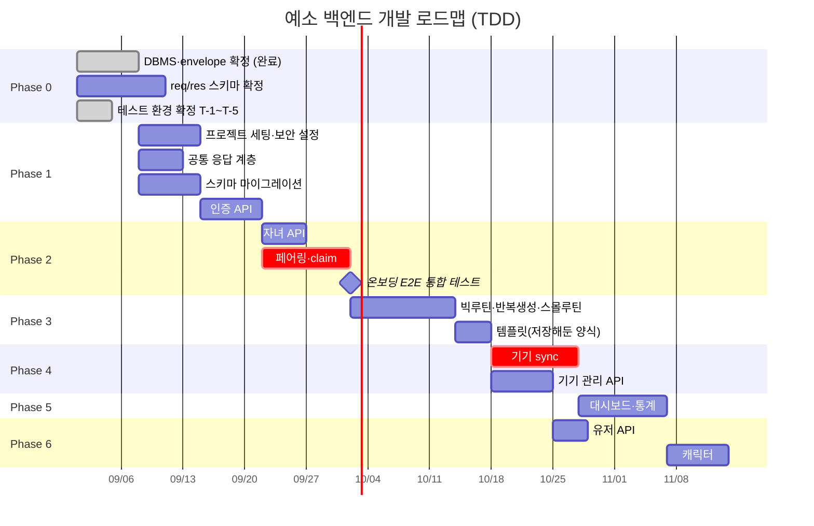

# 예소 백엔드 개발 로드맵 (TDD 버전)

> 출처: Notion `예소 개발자용` 하위 문서 전체 (ERD초안 / API 기본 명세서 / API Req/Res 명세 초안 / 온보딩 & 페어링 전체 흐름 / 백엔드 초기세팅 / 칸반보드 / 타겟 변경 사전조사)
> 최종 수정: 2026-09-10 — **미확정 3건 확정** (회원 탈퇴 cascade, 캐릭터 획득·진화 규칙, 이행률 분모). 이로써 **Phase 0 블로커가 전부 해소되고 Phase 6 이 통째로 착수 가능**해졌습니다. 남은 미구현 엔드포인트는 3개(탈퇴 1 · 캐릭터 2)입니다.
>
> **문서 동기화 메모**: 이번 수정은 **스펙 변경**입니다. `ERD.md`(`USERS`·`DEVICES`·`ROUTINE_TEMPLATES`·`BIG_ROUTINES` 컬럼, 4장 제약조건), `API.md`(엔드포인트 48 → 46개, 인증·루틴·템플릿·기기 전면 수정) **모두 영향 있음**이며 같은 날짜로 함께 갱신했습니다.
>
> **블로커 4건이 소멸했습니다** — JWT 서명 알고리즘·키 관리, 토큰 만료·rotation, 기기 `token`·`secret` 해시 방식, 지연 생성 동시성 방어. 앞의 셋은 JWT 와 기기 토큰을 없애면서, 넷째는 즉시 생성으로 바꾸면서 결정할 대상 자체가 사라졌습니다. 이로써 **Phase 1-2 · 1-4 · 2-2 가 착수 가능해졌습니다.**
>
> (직전 수정: 2026-09-09 — 로그인 방식 전환과 루틴 반복 구조 확정. 그 전: 2026-09-04 — 테스트 환경 T-1 ~ T-5 확정, Testcontainers 이미지 `postgres:17` 고정)

## 0. 현재 상태

| 항목 | 상태 |
|---|---|
| ERD 초안 | 핵심 도메인 + 캐릭터·커뮤니티 2장 완료. 5번 이슈 정리 완료 (타임존·enum·진화 규칙 확정, 반복 요일·커뮤니티 제외) |
| API 엔드포인트 정의 | **48개** 완료 (앱 45 / 기기 3). 커뮤니티 11개 제외 시 **구현 대상 37개**. 2026-09-04 Notion 원본과 대조 확인, 이전 "46개" 표기는 오기 |
| API req/res 스키마 | **초안 작성 완료, 미확정** — 엔드포인트 페이지의 Request/Response 템플릿은 아직 비어 있음 |
| 공통 응답 포맷 · 에러 코드 | 초안 작성 완료, 미확정 |
| 온보딩·페어링 흐름 | 0~4단계 시퀀스 확정 |
| 기술 스택 | Spring Boot 4.1.1 / Java 21 / Gradle 9.7.1 / PostgreSQL 17 |
| 칸반보드 9개 프로젝트 | **구현 대상 엔드포인트를 전부 구현했습니다** (커뮤니티 11개는 구현 제외). 남은 것은 CD · 커버리지 게이트처럼 정보가 없어 착수하지 못한 항목뿐입니다 |
| 테스트 환경 | **확정 완료 (T-1 ~ T-5).** JUnit 5 + Testcontainers(실제 PostgreSQL·Redis 컨테이너) 구성이 코드에 올라가 동작 확인됨. 0-A 참고 |
| 테스트 코드 | **271개.** 전부 통과 · skip 0 (`./gradlew test --rerun-tasks` 로 확인, 2026-09-10). 각 작업의 첫 산출물이 테스트입니다 |
| CI | **작성 완료 (`.github/workflows/ci.yml`).** push·PR 시 `./gradlew test` 실행. 아직 원격에 push 하지 않아 **실제 러너에서의 동작은 미검증** |
| CD (배포) | **미착수·정보 없음.** 배포 대상·환경변수·시크릿이 세 문서 어디에도 없어 작성하지 않았습니다 |
| 커버리지 게이트 | **미확정.** T-4 의 "커버리지 기준" 부분은 아직 정해지지 않았습니다 |

ERD 5번 이슈를 정리하면서 **타임존 정책이 표준 UTC 방식으로 확정**되어 Phase 0 블로커에서 빠졌고, **템플릿 반복 요일**과 **커뮤니티**는 구현 범위에서 제외됐습니다. **기기 API envelope 도 2026-09-09 자로 확정되어(앱과 동일한 공통 envelope) Phase 0 블로커가 전부 해소됐습니다.** **테스트 환경 T-1 ~ T-5는 2026-09-04 자로 전부 확정되어 블로커에서 빠졌습니다.**

칸반보드 상 우선순위는 `인증 관련 API`·`기기 동기화 및 인증 API`가 **높음**, `자녀`·`루틴`·`디바이스`가 **보통**, `USER`·`대시보드`·`캐릭터`가 **낮음**으로 잡혀 있습니다. (`커뮤니티`는 구현 제외.) 아래 로드맵은 이 우선순위와 기술적 의존 관계를 함께 반영했습니다.

---

## 0-A. TDD 진행 규칙

### 사이클 (쉬운 말 풀이 포함)

1. **RED** — 아직 없는 기능에 대한 테스트를 먼저 씁니다. 당연히 실패합니다. **실패하는 걸 눈으로 확인하는 것까지가 RED입니다.** (테스트가 잘못 짜여 항상 통과해버리는 상황을 걸러내기 위함)
2. **GREEN** — 그 테스트를 통과시킬 **최소한의 코드**만 씁니다. 예쁘게 만들 필요 없고, 미래를 대비한 확장 코드도 넣지 않습니다.
3. **REFACTOR** — 테스트가 초록불인 상태를 유지한 채 코드 구조만 정리합니다. 이때 동작이 바뀌면 테스트가 즉시 빨간불로 알려줍니다.

이 문서는 요청에 따라 **GREEN(무엇을 어떻게 구현해서 통과시킬 것인가)** 을 중심으로 적었습니다. RED는 "무엇을 검증하는 테스트를 먼저 쓸지" 목록만 둡니다.

### 테스트 케이스를 뽑아오는 곳

| 무엇을 검증 | 출처 |
|---|---|
| 성공 응답의 필드 구성·HTTP 코드 | `API.md` 각 엔드포인트 Response |
| 실패 케이스와 에러 코드 | `API.md` 3장 에러 코드 + 각 엔드포인트 Error 줄 |
| DB 제약조건 위반 | `ERD.md` 4장 제약조건·인덱스 정리 |
| 상태 전이 (PENDING → ACTIVE 등) | `API.md` 14장 온보딩 호출 순서 |

**문서에 없는 동작은 테스트로 만들지 않습니다.** 필요해 보이면 먼저 질문합니다.

### 테스트 환경 — 확정 (2026-09-04)

Phase 1 착수를 막고 있던 T-1 ~ T-5가 모두 정해졌습니다. 아래는 **실제 코드로 확인한 상태**입니다.

| # | 항목 | 확정 내용 |
|---|---|---|
| T-1 | 테스트 프레임워크·라이브러리 구성 | **JUnit 5** (`useJUnitPlatform()`) + Spring Boot 4.1.1 모듈별 `-test` 스타터 9종 (webmvc / data-jpa / data-redis / security / oauth2-resource-server / validation / restclient / flyway / actuator) + **Testcontainers** |
| T-2 | 통합 테스트용 DB | **실제 PostgreSQL을 Testcontainers 로 띄운다.** 임베디드 DB는 쓰지 않는다. `jsonb`와 부분 유니크 인덱스(`where deleted_at is null`)가 그대로 재현되므로 ERD 제약조건을 테스트로 검증할 수 있다 |
| T-3 | 외부 호출 대체 | **어디서 도는 테스트인가에 따라 다르다.** 아래 "실행 위치별 정책" 표 참고. ⚠️ **2026-09-09 현재 외부 호출이 하나도 없습니다** |
| T-4 | 커버리지 기준·CI 게이트 | **GitHub Actions 로 구성한다.** CI 는 **외부 네트워크에 의존하지 않는다.** CI 워크플로는 `.github/workflows/ci.yml` 로 작성 완료. **커버리지 기준(측정 도구·임계값)과 CD(배포)는 아직 미확정**이라 워크플로에 넣지 않았다 |
| T-5 | 마이그레이션 도구 | **Flyway.** `spring-boot-starter-flyway` + `flyway-database-postgresql` 의존성이 이미 build.gradle 에 들어가 있다 |

#### 테스트 환경 구성 (파일 기준)

| 파일 | 역할 |
|---|---|
| `src/test/.../TestcontainersConfiguration.java` | PostgreSQL 컨테이너 + Redis 컨테이너를 테스트용 빈으로 등록. `@ServiceConnection`(컨테이너가 뜬 임의 포트를 Spring 이 자동으로 datasource·redis 설정에 꽂아주는 기능)을 써서 접속정보 하드코딩이 없다 |
| `src/test/.../ArtisticSoftwareKhuApplicationTests.java` | 컨텍스트 기동 확인. `@EnabledIfDockerAvailable` 로 Docker 가 없으면 건너뛴다 |
| `src/test/.../DockerAvailabilityTest.java` | 위의 건너뛰기 때문에 **"검증되지 않은 그린"**(통합 테스트가 전부 skip 됐는데 빌드는 초록불인 상태)이 생기는 것을 막는 안전장치. Docker 가 없으면 이 테스트가 대신 실패한다 |
| `compose.yaml` + `spring-boot-docker-compose` | 로컬 개발용 postgres·redis. 앱 실행 시 자동 기동 (테스트 경로와는 별개) |

#### T-3 실행 위치별 정책 (외부 호출을 무엇으로 대체하는가)

| 실행 위치 | 외부 호출 | 이유 |
|---|---|---|
| 단위·슬라이스 테스트 | **Mock**(가짜 구현체 — 정해진 값만 돌려주는 대역) | 검증 대상이 우리 로직이지 외부 서버가 아니다 |
| **GitHub Actions CI** | **Mock** | **CI 는 외부 네트워크에 의존해서는 안 된다.** 구글이 느리거나 죽으면 우리 잘못이 아닌 이유로 빌드가 빨간불이 되고, 테스트 계정·비밀키를 CI 에 넣어야 하는 문제도 생긴다 |
| **로컬 통합 실검증** | **실제 구현 객체 · 실제 데이터** | Mock 만으로는 "우리가 상상한 응답"만 검증된다. 실제 연동이 정말 되는지는 **로컬에서 사람이 한 번 직접 돌려 확인**한다 |

> ⚠️ **2026-09-09 — 이 정책의 적용 대상이 현재 없습니다.** 유일한 외부 호출이던 구글 `idToken` 검증이 로그인 방식 변경으로 사라졌습니다. 규칙은 나중에 외부 연동(소셜 로그인 재도입, 메일 발송 등)이 생길 때를 위해 남겨 둡니다. 그때까지 **모든 테스트는 외부 네트워크를 타지 않으며, 기본 `./gradlew test` 대상에서 분리해야 할 테스트도 없습니다.**

**로컬 통합 실검증**은 CI 에서 매번 도는 테스트가 아니라 **사람이 필요할 때 수동으로 한 번 돌리는 테스트**입니다. 따라서 기본 `./gradlew test` 실행 대상에서 분리해 두고, 실행할 때만 따로 지정해서 돌립니다. 분리 방법(태그·별도 Gradle 태스크 등)은 **실제로 외부 연동이 생기는 시점에** 정합니다. 지금은 대상이 없어 미룹니다.

**동작 확인 결과 (2026-09-04, `./gradlew test --rerun-tasks`)** — 테스트 3개 전부 통과, **skip 0**, 컨테이너 로그에 postgres·redis 기동 확인.

#### ✅ 해소된 확인 2건 (2026-09-04)

- **이미지 태그 고정 — 완료.** `postgres:17` 로 고정했습니다. 확인 과정에서 **`postgres:latest` 가 이미 PostgreSQL 18 이었다는 사실**이 드러났습니다. 즉 미래의 위험이 아니라 **이미 문서(17)와 다른 버전에서 테스트가 돌고 있던 상태**였습니다. 재발을 막기 위해 실제로 뜬 DB 에 접속해 메이저 버전을 확인하는 `PostgreSqlVersionIntegrationTest` 를 추가했습니다. 로컬 개발용 `compose.yaml` 도 같은 이유로 `postgres:17` 로 맞췄습니다.
- **T-3 "실검증" 범위 — 확정.** 위 "실행 위치별 정책" 표대로입니다. CI 는 Mock, 로컬 통합 실검증만 실제 구현 객체·실제 데이터.

> Redis 는 세 문서 어디에도 버전이 적혀 있지 않아 **임의로 고정하지 않고** `redis:latest` 를 유지했습니다. 버전이 정해지면 postgres 와 같은 방식으로 고정합니다.

---

## Phase 0 — 착수 전 확정 (블로커) — ✅ **착수를 막던 항목은 전부 해소 (2026-09-09)**

**이 구간에는 RED/GREEN이 없습니다.** 코드가 아니라 결정이기 때문입니다. 그리고 여기가 안 정해지면 **테스트를 써도 곧 버려야 합니다.**

**남아 있는 항목이 없습니다.** 마지막 두 건이 2026-09-10 에 닫혔습니다.

| # | 항목 | 결정 |
|---|---|---|
| 0-3 | 회원 탈퇴 시 자녀·기기·루틴 cascade 정책 | ✅ **함께 soft delete.** 자녀·기기·루틴·양식 전부. 보유 캐릭터는 그대로 (ERD 5-7) |
| 0-5 | 캐릭터 획득 시나리오, `rarity`/`weight` 사용 여부 | ✅ **기기 동기화 시점에 도감 `code` 순서로 한 마리씩.** `rarity`·`weight` 는 안 씀 (ERD 5-4, API 12-1) |

> ✅ **해소된 것 (2026-09-09)** — **0-1 기기 API envelope**(앱과 동일한 공통 envelope 로 확정)와 **0-2 자녀당 최대 기기 수**(10대). 둘 다 "나중에 바꾸면 전 구간 재작업" 이라 착수 전에 결론이 필요했던 항목이었고, 이제 남아 있지 않습니다.
>
> ✅ **0-3 과 0-5 도 2026-09-10 에 닫혔습니다.** 위 표를 봅니다. 이로써 **Phase 6 이 통째로 착수 가능**해졌습니다.

0-1 ~ 0-2는 **나중에 바꾸면 전 구간 재작업**이 되는 항목이라 착수 전에 결론이 필요했습니다. 0-3 이후는 해당 Phase 직전까지 미룰 수 있었고, 실제로 그 직전에 결정됐습니다.

> ✅ **해소됨 (ERD 5번 정리)**
> - **타임존 정책** → 표준 UTC 방식 확정 (서버 UTC 저장, 앱·기기 KST 변환, `time`은 KST 벽시계 시각)
> - **캐릭터 진화 규칙** → 미션 N개 수행 시 진화, 임계값 N을 `int` 상수로 고정
> - **`relationship`** → enum 사용 확정 (값 목록만 회의 대기)
> - **템플릿 반복 요일** → 개발 제외 (매일 반복만 지원)
> - **커뮤니티** → 구현 제외 (스키마는 유지, 실구현 안 함)
> - ~~기기 `secret` → **필요**로 확정.~~ **2026-09-09 철회.** 기기 토큰 체계를 통째로 없애면서 `token` · `secret` · `/device-api/v1/token/refresh` 가 모두 삭제되었습니다. 재페어링 없이 복구하는 경로가 사라진 것이 그 대가입니다.
>
> ✅ **추가 해소 (2026-09-04, 사용자 확정)**
> - **0-2 자녀당 최대 기기 수** → **10대**
> - **0-4 `relationship` 값 목록** → **`PARENT`(부모) · `ADMIN`(관리자) 2개.** 임시 확정이며, 특수학급으로 타겟이 확장되면 교사 관련 값을 늘립니다
> - **보호자당 최대 자녀 수** → **10명** (`CHILD_LIMIT_EXCEEDED` 임계값)
> - **페어링 폴링 타임아웃** → **10분.** 페어링 코드 만료(10분)와 같은 값이라 앱이 포기하는 시점과 코드가 죽는 시점이 일치합니다. 폴링 **주기**(몇 초마다)는 여전히 미정
> - **소셜 로그인 제공자** → **구글로 제한** (카카오 제외)

---

## Phase 1 — 기반 구축

**목표: 인증이 붙은 빈 서버가 뜨고, 스키마가 올라간다**

### 1-1. 프로젝트 초기 세팅 — ✅ 완료 (CI 실행 검증까지 끝남, 2026-09-09)

- Spring Boot 4.1.1 / Java 21 / Gradle 9.7.1 / PostgreSQL 17 — 완료
- 로컬 개발환경(Docker Compose + PostgreSQL·Redis) — 완료
- 테스트 환경(JUnit 5 + Testcontainers) — 완료 (0-A 참고)
- 패키지 구조 — **완료 (2026-09-04)**. 아래 표 참고
- **CI 파이프라인 — 작성 완료, 실행 미검증.** `.github/workflows/ci.yml`. 아직 원격에 push 하지 않아 실제 러너에서 도는 것은 확인하지 못했습니다

**패키지 구조**

도메인 패키지는 `API.md` 의 장 구성에서 그대로 도출했습니다. 문서에 없는 패키지는 만들지 않았습니다.

| 패키지 | 담당 | 출처 | 구현 시점 |
|---|---|---|---|
| `common` | 공통 응답 포맷 · 에러 코드 · 전역 예외 처리 | API 2·3장 | 1-2-1 |
| `config` | SecurityFilterChain 2종, 직렬화 포맷 | ROADMAP 1-2 | 1-2 |
| `auth` | 소셜 로그인 · 토큰 재발급 · 로그아웃 (3개) | API 4장 | 1-4 |
| `user` | 내 정보 조회·수정·탈퇴 (3개) | API 5장 | 6-1 |
| `child` | 자녀 CRUD (5개) | API 6장 | 2-1 |
| **`device`** | **앱용** 기기 관리 (5개). `/api/v1/**`, `X-Access-Uuid` | API 7장 | 2-2 · 4-3 |
| **`deviceapi`** | **기기용** API (3개). `/device-api/v1/**`, **opaque 토큰** | API 8장 | 2-2 · 4-1 · 4-2 |
| `routine` | 루틴 9개 + 고정 루틴 템플릿 4개 | API 9·10장 | 3-1 · 3-2 · 3-3 |
| `dashboard` | 대시보드 · 이행률 통계 (3개) | API 11장 | 5장 |
| `character` | 캐릭터 도감 · 보유 캐릭터 (2개) | API 12장 | 6-2 |

- **`device` 와 `deviceapi` 분리가 이 구조의 핵심**입니다. 인증 방식이 다르기 때문이며, 1-2 의 보안 필터 체인 2개 분리와 짝을 이룹니다.
- **커뮤니티 패키지는 만들지 않았습니다.** 구현 제외이기 때문입니다 (6-3).
- `routine` 은 API 9장·10장을 함께 담습니다. 지연 생성이 없어져 둘의 결합은 약해졌지만, 템플릿을 꺼내 빅루틴을 만드는 경로가 남아 있어 같은 패키지에 둡니다.
- 각 패키지에는 `package-info.java` 를 두어 담당 범위와 인증 방식을 주석으로 남겼습니다. Git 이 빈 디렉터리를 추적하지 않기 때문에 이 파일이 없으면 폴더가 커밋에 남지 않습니다.
- **테스트는 작성하지 않았습니다.** 빈 패키지에는 검증할 동작이 없습니다. 분리가 실제로 지켜지는지는 1-2 의 "기기 토큰으로 `/api/v1/**` 호출 → 실패" 테스트가 확인합니다.

**RED** — 애플리케이션 컨텍스트가 뜨는지 확인하는 테스트 1개. **작성 완료·통과 확인됨.**

**GREEN** — 이미 완료된 세팅이 그대로 통과시킵니다. 추가 구현 없음. CI 워크플로(`.github/workflows/ci.yml`)를 작성했으며, 위의 두 조건을 반영했습니다.

| 워크플로 구성 | 내용 |
|---|---|
| 트리거 | `main` 브랜치 push, `main` 대상 PR |
| 실행 명령 | `./gradlew test` |
| Java | Temurin 21 (`build.gradle` 의 toolchain 과 일치해야 함) |
| Testcontainers | `ubuntu-latest` 러너에 Docker 가 기본 설치되어 그대로 동작. 안 되면 `DockerAvailabilityTest` 가 실패로 알려줌 (조건 1) |
| 외부 네트워크 | 타지 않음. 로컬 전용 실검증 테스트는 CI 대상에서 제외 (조건 2) |
| 부가 | Gradle 래퍼 jar 무결성 검증, 의존성 캐시, 테스트 리포트 보관(14일) |

**아직 남은 일**

- **실제 러너에서의 동작 미검증.** 워크플로는 push 되어야 처음 돌기 때문에, 로컬에서는 `./gradlew clean test` 가 통과하는 것까지만 확인했습니다(2026-09-04, 3개 통과·skip 0). 특히 러너에서 Testcontainers 가 실제로 뜨는지는 **첫 실행 결과를 봐야** 확정할 수 있습니다.
- **커버리지 게이트 미포함.** T-4 의 "커버리지 기준"이 미확정이라 넣지 않았습니다. 측정 도구와 임계값이 정해지면 `테스트 실행` 단계 뒤에 추가합니다.
- **CD(배포) 미포함.** 배포 대상·환경변수·시크릿이 문서에 없습니다.
- 로컬 전용 실검증 테스트를 `./gradlew test` 에서 제외하는 옵션은, 분리 방식이 정해지는 **1-4 시점에** 워크플로에 추가합니다. 워크플로 주석에 위치를 표시해 두었습니다.

### 1-2. 보안 설정 — ✅ 완료 (2026-09-09)

**RED — 먼저 쓸 실패 테스트**

- 토큰 없이 `GET /api/v1/users/me` 호출 → 401 `UNAUTHORIZED`
- 화이트리스트 3개 경로(`/auth/signup`, `/auth/login`, `/device-api/v1/claim`)는 헤더 없이 호출해도 401이 아님
- 앱 `X-Access-Uuid` 를 들고 `/device-api/v1/sync` 호출 → 통과되지 않음
- 기기 `X-Device-Uuid` 를 들고 `/api/v1/**` 호출 → 통과되지 않음

**GREEN — 이렇게 통과시킨다**

- `SecurityFilterChain` (보안 필터 체인) 을 **Bean 2개로 분리**하고, 각각에 담당 경로를 지정합니다. 앱용은 `/api/v1/**`, 기기용은 `/device-api/v1/**`.
- 앱용 체인에는 `X-Access-Uuid` 헤더로 `USERS` 를 조회하는 필터를, 기기용 체인에는 `X-Device-Uuid` 헤더로 `DEVICES` 를 조회하는 필터를 답니다. **읽는 헤더도 조회하는 테이블도 다르므로 서로의 필터가 걸리면 안 됩니다.** 앱용 필터가 기기 경로에 걸리면 기기 요청이 `USERS` 에서 유저를 찾다가 실패합니다.
- 두 필터 모두 하는 일은 "헤더 값으로 행 하나를 찾는다" 가 전부입니다. JWT 를 쓰지 않기로 해 서명 검증도 만료 판정도 없습니다.
- 두 체인 모두 화이트리스트 경로는 인증 없이 통과시킵니다.
- 인증 실패 응답도 공통 error 형태로 나가야 하므로, 실패 처리기를 1-2-1의 응답 계층과 연결합니다. → **순서상 1-2-1을 같이 붙잡는 편이 낫습니다.**
- 요청/응답 로깅 필터 추가.

**진행 상황**

| 항목 | 상태 | 산출물 |
|---|---|---|
| SecurityFilterChain 2개 분리 | ✅ 완료 | `config/SecurityConfiguration.java` |
| 화이트리스트 경로 | ✅ **완료 (2026-09-09)** | 4개 → **3개**. 삭제된 3개 경로가 더 이상 열려 있지 않은 것도 테스트로 고정 |
| 앱 인증 실패 → 공통 error 형태 401 | ✅ 완료 | `config/CommonAuthenticationEntryPoint.java` |
| 세션 미생성(STATELESS) · CSRF 해제 | ✅ 완료 | 토큰 방식이라 쿠키를 쓰지 않음 |
| **앱 인증 필터** (`X-Access-Uuid`) | ✅ **완료 (2026-09-09)** | `AccessUuidAuthenticationFilter`. 1-4 에서 함께 구현 |
| **기기 인증 필터** (`X-Device-Uuid`) | ✅ **완료 (2026-09-09)** | `DeviceAccessUuidAuthenticationFilter` |
| 기기 인증 실패 응답 **본문** | ✅ **완료 (2026-09-09)** | 0-1 해소. 앱과 같은 공통 envelope, 코드는 `DEVICE_UNAUTHORIZED` |
| 요청/응답 로깅 필터 | ✅ **완료 (2026-09-09)** | `SensitiveValueMasker` + `RequestLoggingFilter`. UUID 는 앞뒤 3글자, `password`·`pairingCode` 는 통째로 가림 |

- 두 체인의 "교차 인증 거부"(앱 헤더로 기기 API 호출, 기기 헤더로 앱 API 호출) 테스트는 **위 두 필터가 생긴 뒤에야** 의미가 있습니다. 지금은 어느 쪽이든 인증 정보가 없어 401 이 나므로, 테스트가 통과해도 분리를 증명하지 못합니다.

> ✅ **해소 (2026-09-09)** — JWT 서명 알고리즘 · 키 관리(`API.md` 15장 #11)가 **소멸했습니다.** JWT 를 쓰지 않게 되어 결정할 대상이 없어졌고, 인증 필터 두 개를 막고 있던 유일한 블로커가 풀렸습니다.

> ✅ **확정 (2026-09-09)** — 가리는 방식을 값의 성격에 따라 둘로 나눕니다.
>
> | 값 | 처리 | 이유 |
> |---|---|---|
> | `accessUuid` · `deviceAccessUuid` | **앞뒤 3글자만 남김** (`3f2…c4d`) | 로그에서 "같은 사용자의 연속된 요청" 을 따라갈 수는 있으면서 그 값 자체로는 인증할 수 없게 한다 |
> | `password` | **통째로 가림** | 일부만 알려줘도 나머지를 추측할 여지가 크게 늘어난다. 추적할 이유도 없다 |
> | `pairingCode` | **통째로 가림** | 6자리라 앞뒤 3글자를 남기면 **전부 보인다** |
>
> `accessUuid` 를 완전히 가리지 않고 앞뒤를 남기는 이유는 장애를 쫓을 때 "어느 요청들이 한 사람의 것인가" 를 알아야 하기 때문입니다. 반대로 `accessUuid` 는 **만료가 없어서** 통째로 로그에 남으면 그 값을 본 사람이 계속 그 계정으로 행세할 수 있습니다. 앞뒤 3글자는 그 둘 사이의 절충입니다.

### 1-2-1. 공통 응답 계층 — 완료 (2026-09-04) · 404 · 405 처리 보강 (2026-09-09)

> ⚠️ **2026-09-09 보강** — `GlobalExceptionHandler` 가 **없는 경로와 메서드 불일치를 500 으로 내보내고 있었습니다.** `@ExceptionHandler(Exception.class)` 가 그것들까지 삼켰기 때문입니다. `API.md` 3-1 에 `NOT_FOUND`(404) 와 `METHOD_NOT_ALLOWED`(405) 가 정의돼 있는데 구현이 없었습니다. 핸들러 2개를 더해 고쳤고, 회귀를 막는 테스트도 함께 넣었습니다.

req/res 초안에서 정의한 규약을 코드로 옮기는 작업입니다. **개별 API 구현보다 먼저** 잡아야 나중에 구현 대상 37개를 다시 손대지 않습니다.

**RED — 먼저 쓸 실패 테스트**

- 성공 응답 → `success: true`, `data` 채움, `error: null`
- 삭제·로그아웃 → HTTP 204, 응답 바디 없음
- 도메인 예외 발생 → 해당 `code` + 매핑된 HTTP status + 한국어 `message`
- `@Valid` 검증 실패 → 400 `INVALID_INPUT` + `details`에 `{ field, reason }` 배열 (예: `birthDate` / 미래 날짜)
- 매핑되지 않은 예외 → 500 `INTERNAL_ERROR`
- 직렬화 포맷: date는 `2026-09-01`, time은 `08:30`, timestamp는 `2026-09-01T08:30:00Z`
- 페이지네이션 응답에 `content` / `page` / `size` / `totalElements` / `totalPages` / `hasNext` 6개 필드

**GREEN — 이렇게 통과시킨다**

- `success` / `data` / `error` 세 필드를 가진 **공통 응답 래퍼**를 만들고, 성공은 정적 팩토리 메서드(객체를 만들어 주는 전용 메서드)로 생성합니다.
- `ErrorCode` (에러 코드 열거형) 을 만들어 `API.md` 3장의 표를 그대로 옮깁니다. 각 상수가 **코드 문자열 + HTTP status + 한국어 message**를 함께 들고 있게 해서, 컨트롤러마다 상태코드를 손으로 적지 않도록 합니다.
- 비즈니스 예외 1종을 만들고 그 안에 `ErrorCode`를 담아 던집니다.
- `@RestControllerAdvice` (전역 예외 처리기) 에 핸들러 3개 — 비즈니스 예외 / 검증 실패 / 나머지 전부.
- 날짜·시간은 직렬화 설정에서 포맷을 고정합니다. 저장은 UTC(`timestamptz`), `time`은 KST 벽시계 시각 해석.
- 페이지 응답 공통 클래스 1개. → **만들지 않았습니다.** 아래 참고.

**진행 상황**

| 항목 | 상태 | 산출물 |
|---|---|---|
| 공통 응답 래퍼 (success / data / error) | ✅ 완료 | `common/ApiResponse.java`, `common/ApiError.java`, `common/FieldErrorDetail.java` |
| `ErrorCode` 열거형 | ✅ 완료 | `common/ErrorCode.java` — 32개. `API.md` 3장 표에서 기계적으로 생성 |
| 비즈니스 예외 1종 | ✅ 완료 | `common/BusinessException.java` |
| 전역 예외 처리기 (핸들러 3개) | ✅ 완료 | `common/GlobalExceptionHandler.java` |
| 날짜·시간 직렬화 포맷 고정 | ✅ 완료 | `config/JsonTimeFormatModule.java`, `config/JacksonConfiguration.java` |
| **페이지 응답 공통 클래스** | ❌ **만들지 않음** | 아래 사유 |

**페이지네이션을 만들지 않은 이유.** `API.md` 1-4 가 "목록 조회 중 `GET /posts`만 해당합니다" 라고 명시하는데, `GET /posts` 는 커뮤니티라서 **구현 제외**입니다. 즉 페이지 응답 클래스를 쓸 API 가 하나도 없습니다. 지금 만들면 아무도 호출하지 않는 죽은 코드가 됩니다. 커뮤니티 에러 코드를 `ErrorCode` 에서 뺀 것과 같은 판단입니다.

> **기술 메모 — Spring Boot 4.1 은 Jackson 3 을 씁니다.** 패키지가 `com.fasterxml.jackson` 이 아니라 **`tools.jackson`** 이고, `java.time` 지원이 별도 모듈이 아니라 databind 코어(`tools.jackson.databind.ext.javatime`)에 들어 있습니다. 설정 확장점도 `Jackson2ObjectMapperBuilderCustomizer` 가 아니라 **`JsonMapperBuilderCustomizer`** 입니다. 인터넷의 Jackson 2 예제를 그대로 가져오면 컴파일되지 않습니다.

> ✅ **확정 (2026-09-04)** — `ErrorCode`에 커뮤니티용 코드(`POST_*` / `COMMENT_*` / `LIKE_*`) 7개는 **넣지 않습니다.** 커뮤니티가 구현 제외라 이 코드들을 던질 API 가 만들어지지 않기 때문입니다. 대신 `ErrorCode` 상단에 아래 형태의 주석만 남겨 `API.md` 3-6 과의 차이를 추적할 수 있게 합니다.
>
> ```java
> // "API.md" 3-6 의 커뮤니티 코드 7종("POST_" / "COMMENT_" / "LIKE_" 접두사)은
> // 커뮤니티 도메인이 구현 제외이므로 여기에 넣지 않는다. 향후 구현하게 되면 그 표를 그대로 옮긴다.
> ```
>
> 단 `CHARACTER_NOT_FOUND` 는 3-6 표에 함께 있지만 **캐릭터용이고 캐릭터는 구현 대상**이므로 포함합니다.
> ✅ **해소 (2026-09-09)** — 기기 API 도 **앱과 같은 공통 envelope** 를 씁니다. 기기용 응답 래퍼를 따로 만들 필요가 없어졌고, 디바이스 API 테스트를 지금 써도 됩니다.

### 1-3. 스키마 마이그레이션 — V1 완료 (2026-09-04) · V2 작성 완료 (2026-09-09)

> **V2 `V2__switch_to_email_login_and_immediate_routine_creation.sql` (2026-09-09)**
>
> | 대상 | 변경 |
> |---|---|
> | `users` | `password_hash` · `access_uuid` 추가, `email` 을 `not null` + 부분 유니크로, `provider` · `provider_user_id` 를 nullable 로 완화 |
> | `devices` | `device_access_uuid` 추가 + 부분 유니크, `token_hash` · `secret_hash` 삭제 |
> | `big_routines` | `template_id` 삭제, `unique(template_id, routine_date)` 인덱스 삭제 |
> | `routine_templates` | `is_active` 삭제 |
>
> V1 을 고치지 않고 V2 를 쌓은 이유는 Flyway 가 **이미 적용한 파일의 내용이 바뀌면 체크섬 불일치로 기동을 거부**하기 때문입니다.
>
> ✅ **실제 PostgreSQL 17 에서 검증 완료 (2026-09-09).** `./gradlew test --rerun-tasks` 결과 **55개 전부 통과, skip 0, 실패 0**. Flyway 로그에 V1 과 V2 가 차례로 적용된 것이 찍혔습니다.
>
> 검증 방법을 두 겹으로 두었습니다. 첫째, **ERD mermaid 의 테이블별 컬럼과 V1+V2 적용 결과를 스크립트로 집합 비교**해 11개 테이블 전부 일치를 확인했습니다(`history.md` H-004 가 지시한 대조). 둘째, `SchemaMigrationIntegrationTest` 13개가 실제 DB 에 데이터를 넣어 **제약조건이 정말 거는지**를 확인합니다. 컬럼이 있는 것과 제약이 걸리는 것은 다른 문제이고, 부분 유니크 인덱스의 `where` 절은 빠져도 평소에는 아무 문제가 없다가 재가입 · 재페어링 같은 드문 흐름에서만 터지기 때문입니다.

**RED — 먼저 쓸 실패 테스트**

- 마이그레이션 적용 후 ERD 11개 테이블이 모두 존재
- 같은 `device_uid`로 2행 삽입 → 실패. 단 앞 행의 `deleted_at`을 채운 뒤 삽입 → **성공** (재페어링 시나리오)
- `status = 'PENDING'`인 같은 `pairing_code` 2행 삽입 → 실패
- **같은 `child_id`로 기기 2행 삽입 → 성공** (1:N 전환이 실제로 반영됐는지 확인하는 테스트)
- 같은 `(template_id, routine_date)` 2행 삽입 → 실패
- 같은 `(provider, provider_user_id)` 2행 삽입 → 실패

**GREEN — 이렇게 통과시킨다**

- 마이그레이션 스크립트 1개로 11개 테이블 + `ERD.md` 4장의 제약조건·인덱스를 그대로 생성합니다.
- 부분 유니크 인덱스 3종(`device_uid` / `pairing_code` / `(template_id, routine_date)`)은 **`where` 조건이 붙은 형태**로 만듭니다. 이 조건이 빠지면 재페어링이 영구히 막힙니다.
- `child_id` 단독 유니크 제약은 **만들지 않습니다.**

**진행 상황 — 완료**

산출물은 `src/main/resources/db/migration/V1__create_initial_schema.sql` 하나입니다. 검증은 `migration/SchemaMigrationIntegrationTest` 6개가 실제 PostgreSQL 17 컨테이너에서 수행합니다.

| 항목 | 상태 |
|---|---|
| ERD 11개 테이블 생성 (커뮤니티 3개 포함) | ✅ |
| `unique(device_uid) where deleted_at is null` | ✅ 재페어링 시나리오를 테스트로 확인 |
| `unique(pairing_code) where status = 'PENDING'` | ✅ |
| `unique(template_id, routine_date) where deleted_at is null` | ✅ |
| `unique(provider, provider_user_id)` | ✅ |
| `unique(post_id, user_id)` · `unique(characters.code)` | ✅ |
| 인덱스 5종 (`child_id, deleted_at` 등) | ✅ |
| `child_id` 단독 유니크 제약 **미생성** | ✅ 자녀당 기기 2대 삽입 성공으로 확인 |

**문서에 없어서 제가 정한 것 (검토 필요)**

`ERD.md` 는 컬럼 이름과 타입까지만 정의하고 아래는 정하지 않았습니다. 스키마를 만들려면 어떻게든 정해야 하는 값이라 아래처럼 두었으니 확인 부탁드립니다.

| 항목 | 정한 값 | 이유 |
|---|---|---|
| 기본키 생성 방식 | `bigint generated by default as identity` | 표준 SQL 방식. `by default` 라서 테스트에서 id 를 직접 넣을 수도 있음 |
| 문자열 길이 상한 | **걸지 않음** (`varchar` 무제한) | 임의로 정한 상한은 실제 데이터가 넘칠 때 조용히 저장 실패를 냄 |
| `NOT NULL` 범위 | 관계가 필수인 FK, `status`, `title`, `name` 등에만 | `template_id`(직접 만든 루틴), `parent_comment_id`(최상위 댓글)는 비어 있을 수 있어 제외 |
| `relationship` 검사 제약 | **걸지 않음** | enum 값 목록이 미확정(0-4). 확정되면 `check` 제약 추가 |
| 시각 타입 | `timestamptz`, 단 `start_time`/`end_time` 은 `time` | `ERD.md` 5-2 표준 UTC 방식. `time` 은 KST 벽시계 시각 |

> ⚠️ **`created_at` 관련 확인 요청.** `ERD.md` 는 `USERS`·`DEVICES`·`POSTS`·`POST_LIKES` 4개 테이블에만 생성 시각 컬럼을 정의하고, `CHILDREN`·`ROUTINE_TEMPLATES`·`BIG_ROUTINES`·`SMALL_ROUTINES`·`COMMENTS` 5개에는 정의하지 않았습니다. 작업 중 이 5개에도 `created_at` 을 넣었다가 **문서에 없는 컬럼이라 제거**했습니다(history H-004). 현재 마이그레이션은 `ERD.md` 와 컬럼이 완전히 일치합니다. 의도된 누락인지, ERD 에 추가할 것인지 확인이 필요합니다.

> ✅ T-2(테스트 DB = Testcontainers 실 PostgreSQL)와 T-5(마이그레이션 도구 = Flyway)가 확정되어 이 RED를 바로 쓸 수 있습니다. 마이그레이션 SQL 은 `src/main/resources/db/migration` 에 두며, 현재 이 디렉터리가 없어 Flyway 는 아무 일도 하지 않는 상태입니다.

### 1-4. 인증 API (칸반: 우선순위 **높음**) — ✅ 완료 (2026-09-09, 이메일·비밀번호로 재작성)

`POST /auth/signup` · `POST /auth/login` · `POST /auth/logout`

> ⚠️ **로그인 방식이 바뀌어 기존 작업 일부가 버려집니다.** 소셜 로그인(구글)을 이메일 · 비밀번호로 교체하고 JWT 를 없앴습니다. 공모전 일정에 맞춰 로그인을 최소로 줄인 결정입니다(2026-09-09).
>
> **버려지는 것** — `auth/` 의 소셜 idToken 검증부 5개 클래스와 테스트 16개(커밋 `1e4cd30`), `yeso.auth.google.allowed-client-ids` 설정, 에러코드 `AUTH_INVALID_PROVIDER` · `AUTH_INVALID_ID_TOKEN` · `AUTH_REFRESH_TOKEN_INVALID`.
>
> **지우지 않고 남길 것** — `USERS.provider` · `provider_user_id` 컬럼과 `unique(provider, provider_user_id)` 제약. 나중에 소셜 로그인을 붙일 때 쌓인 데이터를 옮기지 않아도 되게 하기 위해서입니다(ERD 설계 노트).

**RED — 먼저 쓸 실패 테스트**

- 가입 → 201, `USERS` 1행 생성, `accessUuid` 발급됨, `user.name` 은 null
- 같은 이메일로 재가입 → 409 `AUTH_EMAIL_ALREADY_EXISTS`
- 이메일 형식이 아님 → 400 `AUTH_INVALID_EMAIL_FORMAT`
- 가입 시 `password_hash` 에 **평문이 그대로 들어가지 않음** (저장된 값 != 보낸 값)
- 로그인 성공 → 200, `accessUuid` 반환
- **로그인할 때마다 `accessUuid` 가 새 값으로 바뀌고 이전 값은 401**
- 없는 이메일 / 틀린 비밀번호 → **둘 다 똑같이** 401 `AUTH_INVALID_CREDENTIALS`
- 헤더 없이 보호된 엔드포인트 호출 → 401 `UNAUTHORIZED`
- 로그아웃 → 204, 이후 같은 `accessUuid` 로 호출하면 401
- **앱 헤더로 기기 API 호출 / 기기 헤더로 앱 API 호출 → 둘 다 401** (두 체인의 교차 거부)

**GREEN — 이렇게 통과시킨다**

- 비밀번호는 되돌릴 수 없는 형태로 바꿔 `password_hash` 에 저장합니다. 평문은 로그를 포함해 어디에도 남기지 않습니다.
- 로그인 성공 시 UUID 를 새로 만들어 `USERS.access_uuid` 에 **덮어씁니다.** 덮어쓰기 때문에 이전 값이 자동으로 무효가 되고, 한 계정은 항상 한 기기에서만 로그인 상태가 됩니다.
- 인증 필터는 `X-Access-Uuid` 헤더 값으로 `USERS` 를 조회하는 것이 전부입니다. 서명 검증도 만료 판정도 없습니다.
- 없는 이메일과 틀린 비밀번호를 **같은 응답으로** 돌려줍니다. 구분해 알려주면 "이 이메일은 가입되어 있다" 는 사실이 새어 나갑니다.

**진행 상황**

| GREEN 항목 | 상태 |
|---|---|
| 소셜 idToken 검증 인터페이스 + 구글 구현체 | 🗑️ **폐기** — 방식 변경으로 쓰이지 않음 |
| 비밀번호 해시 저장 + 가입 | ✅ **완료** — bcrypt, `PasswordEncoderConfiguration` |
| `access_uuid` 발급 · 덮어쓰기 · 무효화 | ✅ **완료** — `User.issueAccessUuid()` · `clearAccessUuid()` |
| 인증 필터 2개 (앱 `X-Access-Uuid` / 기기 `X-Device-Uuid`) | ✅ **완료** — `AccessUuidAuthenticationFilter` · `DeviceAccessUuidAuthenticationFilter` |
| 엔드포인트 3개 (`signup` / `login` / `logout`) | ✅ **완료** — `AuthenticationController` |
| 두 체인의 교차 인증 거부 | ✅ **완료** — 앱 헤더로 기기 API, 기기 헤더로 앱 API 둘 다 401 |

**산출물** — `user/`(User · UserRepository), `device/`(Device · DeviceRepository), `auth/`(AuthenticationService · Controller · DTO 4개 · principal 2개), `config/`(필터 2개 · PasswordEncoderConfiguration). 테스트는 `AuthenticationApiIntegrationTest` **26개**이며 실제 PostgreSQL 을 띄워 확인합니다.

> ⚠️ **구현 중 드러난 것** — `GlobalExceptionHandler` 에 **없는 경로(404)와 허용되지 않은 메서드(405) 처리가 빠져 있었습니다.** 맨 아래 "나머지 전부" 핸들러가 그것들까지 삼켜 **500 으로 내보내고 있었습니다.** `API.md` 3-1 이 두 코드를 정의해 두었는데 구현이 없던 것으로, 경로 오타 하나가 "서버가 고장났다" 로 보이는 상태였습니다. 1-2-1 에 핸들러 2개를 더해 고쳤습니다.
>
> **`Device` 엔티티는 인증에 필요한 컬럼만 매핑했습니다** (`id` · `child_id` · `device_access_uuid` · `deleted_at`). 배터리 · 펌웨어 · 페어링 코드는 그것을 읽고 쓰는 기능이 Phase 2 · 4 에 있어 그때 더합니다. `ddl-auto=validate` 는 엔티티에 없는 테이블 컬럼을 문제 삼지 않으므로 일부만 매핑해도 기동에 지장이 없습니다.

> ✅ **해소된 블로커 (2026-09-09)** — JWT 서명 알고리즘 · 키 관리, access/refresh 만료 · rotation 정책. **JWT 를 쓰지 않게 되어 결정할 대상 자체가 없어졌습니다.** 이 두 건이 1-4 를 막고 있었으므로 이제 착수 가능합니다.

> ✅ **확정 (2026-09-09)** — 해시는 **bcrypt**(`BCryptPasswordEncoder`, 기본 강도 10), 비밀번호는 **최소 8자**이고 문자 조합 규칙은 두지 않습니다.
>
> bcrypt 를 고른 이유는 `spring-boot-starter-security` 에 이미 들어 있어 **의존성이 하나도 늘지 않기 때문**입니다. 문자 조합 규칙(대문자·특수문자 필수 등)을 두지 않는 이유는 그 규칙이 사용자가 기억하기 어려운 비밀번호를 만들게 해 오히려 다른 곳에서 쓰던 것을 재사용하게 만들기 때문입니다. 길이가 조합보다 효과가 큽니다.

> ⚠️ **알고 받아들인 것** — 비밀번호 찾기와 이메일 인증은 **구현하지 않습니다.** 메일을 보낼 수단이 로드맵에 없기 때문입니다. 그 결과 **비밀번호를 잊은 사용자는 스스로 계정을 되찾을 수 없고**, 이메일은 형식만 맞으면 실제로 도달하지 않는 주소여도 가입됩니다.

---

## Phase 1 정리 (한눈에) — ✅ **전부 완료 (2026-09-09)**

Phase 1(1-1 ~ 1-4)에서 만들어야 했던 것이 모두 끝났습니다.

### ✅ 완료

| 항목 | 절 | 산출물 |
|---|---|---|
| CI 워크플로 실제 동작 검증 | 1-1 | PR #2 에서 첫 실행, 이후 4회 연속 통과 |
| 앱 인증 필터 (`X-Access-Uuid`) | 1-2 | `AccessUuidAuthenticationFilter` |
| 기기 인증 필터 (`X-Device-Uuid`) | 1-2 | `DeviceAccessUuidAuthenticationFilter` |
| 두 체인의 교차 인증 거부 | 1-2 | 앱 헤더로 기기 API, 기기 헤더로 앱 API 둘 다 401 |
| 요청·응답 로깅 필터 | 1-2 | `RequestLoggingFilter` + `SensitiveValueMasker` |
| 404 · 405 처리 | 1-2-1 | `GlobalExceptionHandler` 보강 |
| 스키마 마이그레이션 | 1-3 | V2(로그인 전환·루틴 구조) · V3(`device_uid` nullable) |
| 인증 엔드포인트 3개 | 1-4 | `signup` / `login` / `logout` |

### 🗑️ 방식 변경으로 폐기

| 항목 | 절 | 이유 |
|---|---|---|
| 소셜 idToken 검증부 (`auth/` 5개 클래스, 테스트 16개) | 1-4 | 이메일 · 비밀번호로 전환 (커밋 `1e4cd30`) |
| `yeso.auth.google.allowed-client-ids` 설정 | 1-4 | 〃 |
| 로컬 실검증 테스트 분리 방법 정하기 | 1-4 | 외부 네트워크를 타는 검증 자체가 없어짐 |
| JWT 발급기 · 리프레시 토큰 저장소 | 1-4 | JWT 미사용 |

### ⚫ 일부러 안 만듦

| 항목 | 절 | 이유 |
|---|---|---|
| 페이지 응답 공통 클래스 | 1-2-1 | 유일한 사용처 `GET /posts` 가 커뮤니티라 구현 제외 |
| 커뮤니티 에러 코드 7종 | 1-2-1 | 던질 API 가 없음 (`API.md` 3-6 에 ❌ 표기) |

### ⚠️ 아직 답을 못 들은 것

| 항목 | 절 | 비고 |
|---|---|---|
| `CHILDREN` 등 5개 테이블에 `created_at` 이 없는 게 의도인지 | 1-3 | `ERD.md` 에 없어 넣지 않았습니다(H-004). 필요하면 마이그레이션 한 줄입니다 |

> 구글 `email` 미제공 계정 처리는 **소셜 로그인 폐기로 소멸**했습니다.

---

## Phase 2 — 온보딩 & 페어링 (최우선 기능)

**목표: 앱에서 가입 → 자녀 등록 → 기기 페어링까지 end-to-end가 동작한다**

제품의 첫 관문이자 기기·앱·서버 3자가 모두 얽히는 구간이라 가장 먼저 통합 검증해야 합니다.

| 단계 | 엔드포인트 | 담당 |
|---|---|---|
| 온보딩 1차 | `PATCH /users/me` (보호자 성명) | 앱 |
| 온보딩 2차 | `POST /children`, `POST /devices/pairing` | 앱 |
| 온보딩 3차 | (핫스팟) 와이파이 + pairingCode 전달 | 앱 → 기기 |
| claim | `POST /device-api/v1/claim` | 기기 → 서버 |
| 완료 폴링 | `GET /devices/{deviceId}` (PENDING → ACTIVE) | 앱 |

### 2-1. 자녀 API (칸반: **보통**) — ✅ 완료 (2026-09-09)

**산출물** — `child/`(Child · Relationship · ChildRepository · ChildService · ChildController · DTO 2개), `config/ClockConfiguration`. 테스트는 `ChildApiIntegrationTest` **21개**.

**소유권 검사의 기반이 여기서 만들어졌습니다.** `ChildService.findOwnedChild` 하나가 "없으면 404, 남의 것이면 403" 을 판정하며, Phase 3 루틴 도메인도 이것을 통해 확인합니다. 서비스마다 손으로 `userId` 를 비교하면 한 곳에서 빠뜨렸을 때 그 경로만 남의 자녀가 열립니다.

**시각은 `Clock` 빈으로 주입받습니다.** 코드 안에서 `Instant.now()` 를 직접 부르면 "미래 생년월일 거절" 같은 검증을 테스트로 고정할 수 없습니다.

`POST /children` · `GET /children` · `GET /children/{childId}` · `PATCH` · `DELETE`

**RED — 먼저 쓸 실패 테스트**

- 등록 성공 → 201, 응답에 `childId` / `name` / `birthDate` / `relationship` / `createdAt`
- `birthDate`가 미래 → 400 `INVALID_INPUT`, `details`의 `field`가 `birthDate`
- 남의 자녀 조회·수정 → 403 `CHILD_FORBIDDEN`
- 없는 자녀 → 404 `CHILD_NOT_FOUND`
- 목록 응답에 `deviceCount` 포함
- 삭제 → 204, 이후 조회 시 404 (soft delete)
- 삭제 시 연결된 기기의 페어링 해제·토큰 무효화가 함께 일어남

**GREEN — 이렇게 통과시킨다**

- 소유권 검사(요청한 보호자의 자녀가 맞는지)를 **한 곳에 모아** 모든 자녀 관련 API가 같은 함수를 부르게 합니다. 여기가 흩어지면 403 테스트가 엔드포인트마다 통과·실패를 오갑니다.
- 삭제는 `deleted_at`을 채우는 방식이고, 조회 쿼리는 전부 `deleted_at is null` 조건을 답니다.
- 자녀 삭제 시 기기 해제를 같은 트랜잭션 안에서 처리합니다.

> ✅ **확정 (2026-09-04)** — `relationship` 값은 **`PARENT`(부모) · `ADMIN`(관리자) 2개**, 보호자당 자녀는 **10명**까지입니다. 둘 다 이제 테스트를 쓸 수 있습니다.
>
> 값 목록은 **임시 확정**이라 코드에서 열거형 한 곳에만 두고, 테스트도 그 열거형을 참조하게 씁니다. 특수학급으로 타겟이 확장되면 값이 늘어날 수 있기 때문입니다(ERD 7장). **DB `check` 제약은 걸지 않습니다** — 값이 늘 때마다 마이그레이션이 필요해지는 비용이 더 큽니다.

### 2-2. 페어링 · claim — ✅ 완료 (2026-09-09)

**산출물** — `device/`(Device 확장 · PairingCodeGenerator · DeviceService · DeviceController · DTO 6개), `deviceapi/DeviceApiController`. 테스트는 `DevicePairingIntegrationTest` **19개** + `PairingCodeGeneratorTest` **5개**.

**엔드포인트 6개** — `POST /devices/pairing`, `GET /children/{childId}/devices`, `GET /devices/{deviceId}`, `PATCH /devices/{deviceId}`, `DELETE /devices/{deviceId}`, `POST /device-api/v1/claim`. 이로써 **온보딩 0~5단계가 전 구간 이어집니다**(`API.md` 14장).

> ⚠️ **구현 중 드러난 것 — `device_uid` 가 `not null` 이었습니다.** 페어링은 두 단계라 앱이 코드만 든 PENDING 행을 먼저 만드는데, 그 시점에는 `device_uid` 를 알 수 없습니다(기기가 claim 때 가져옵니다). V1 의 `not null` 은 1기기 시절의 흔적으로 보이며, **V3 마이그레이션으로 풀었습니다.** 유니크 인덱스는 그대로 두었습니다. PostgreSQL 이 NULL 을 서로 다른 값으로 보므로 `device_uid` 가 빈 PENDING 행이 여럿 있어도 충돌하지 않습니다.

> **만료 정리 배치가 없어도 동작합니다.** 만료 판정을 `claim` 시점에 하기 때문입니다. 배치는 오래된 행을 치우는 청소일 뿐이라 주기가 미확정이어도 착수를 막지 않았습니다.

#### (이하 원래 계획)

**RED — 먼저 쓸 실패 테스트**

- `POST /devices/pairing` → 201, `deviceId`·`pairingCode`·`expiresAt`·`status: PENDING`
- 같은 자녀로 2번 호출 → **PENDING 행 2개 생성 성공** (1:N)
- claim 성공 → `status`가 ACTIVE, 응답에 `token`·`secret`·`serverTime`, DB의 `pairing_code`는 NULL
- 같은 코드로 다시 claim → 409 `PAIRING_CODE_ALREADY_USED`
- 발급 10분 경과 후 claim → 410 `PAIRING_CODE_EXPIRED`
- 없는 코드 → 404 `PAIRING_CODE_NOT_FOUND`
- 이미 다른 계정에 물린 `deviceUid` → 409 `DEVICE_UID_ALREADY_PAIRED`
- 폴링용 `GET /devices/{deviceId}` → claim 전 PENDING, claim 후 ACTIVE

**GREEN — 이렇게 통과시킨다**

- 발급 시 코드와 `pairing_code_expires_at`(= 발급 시각 + 10분)을 채운 PENDING 행을 만들고, **응답에 `deviceId`를 반드시 포함**합니다. 자녀당 PENDING이 여러 개일 수 있어 이 값이 없으면 앱이 폴링 대상을 특정할 수 없습니다.
- claim 처리는 `API.md` 8장의 **서버 처리 순서 1~5를 그 순서 그대로** 한 트랜잭션에 넣습니다. 코드 조회 → 만료 검증 → 값 채우고 ACTIVE → `pairing_code` NULL → 평문 반환.
- `token`·`secret`은 **평문을 응답에만 담고 DB에는 해시로 저장**합니다. 평문을 볼 수 있는 유일한 순간이므로, 저장 로직과 응답 로직을 한 메서드에 붙여 순서가 어긋나지 않게 합니다.
- 만료 PENDING 정리 배치. 테스트에서는 시각을 주입해 만료를 흉내 냅니다.

> ✅ **확정 (2026-09-04)** — 자녀당 최대 기기 수는 **10대**, 폴링 **타임아웃**은 **10분**입니다.
>
> ✅ **해소 (2026-09-09)** — `token`·`secret` 해시 방식이 **소멸**했습니다. 기기 토큰 체계를 없애고 서버가 발급하는 `device_access_uuid` 하나로 대체했기 때문에 해시할 대상이 없습니다. 이것이 2-2 를 막고 있던 가장 큰 항목이었습니다.
>
> ✅ **확정 (2026-09-09) — `pairingCode` 는 숫자 10자리**(앞자리 0 유지, `SecureRandom` 생성). **이것으로 2-2 의 마지막 블로커가 풀렸습니다.**
>
> ❓ **아직 대기 중이지만 착수를 막지 않는 것** — 폴링 **주기**(몇 초마다 호출할지)와 만료 PENDING **정리 배치 주기**. 폴링 주기는 앱이 정하는 값이라 서버 구현에 영향이 없고, 정리 배치는 없어도 동작합니다. 만료 검사를 `claim` 시점에 하기 때문입니다. 배치는 오래된 행을 치우는 청소 작업일 뿐입니다.

**페어링 완료 폴링 주기·타임아웃 (`API.md` 15장 #5, 결정 시한 Phase 2)**

기기가 claim 을 마치면 서버의 `status` 가 PENDING 에서 ACTIVE 로 바뀝니다. 앱은 그걸 알 방법이 없어서 `GET /devices/{deviceId}` 를 **반복 호출하며 기다립니다.** 이것을 폴링(polling — 서버가 알려주지 않으니 클라이언트가 주기적으로 물어보는 방식)이라고 합니다. 여기서 정해야 할 값이 둘입니다.

| 값 | 정하지 않으면 생기는 일 |
|---|---|
| **폴링 주기** (몇 초마다 호출할지) | 너무 짧으면 서버에 불필요한 요청이 쌓이고, 너무 길면 사용자가 페어링이 끝났는데도 기다립니다 |
| **폴링 타임아웃** (언제 포기할지) | 기기 전원이 꺼졌거나 와이파이가 틀렸을 때 앱이 영원히 돌게 됩니다. 사용자에게 "실패했으니 다시 시도하세요" 를 언제 띄울지가 이 값에서 나옵니다 |

**서버 쪽 결론**: 이 둘은 `API.md` 가 "앱·서버 합의 사항" 으로 분류한 항목이며, **주기와 타임아웃 자체는 앱이 지키는 값이라 서버 API 스펙을 바꾸지 않습니다.** 다만 타임아웃이 정해지면 **만료 PENDING 정리 배치의 기준 시각**과 어긋나면 안 됩니다. 앱이 15분을 기다리는데 서버가 10분에 PENDING 행을 지워버리면, 앱은 이유를 알 수 없는 404 를 받습니다.

**따라서 이 절에서 쓸 수 있는 테스트와 쓸 수 없는 테스트를 나눕니다.**

- 쓸 수 있음 — 폴링용 `GET /devices/{deviceId}` 가 claim 전 PENDING, claim 후 ACTIVE 를 돌려주는지 (위 RED 목록에 이미 있음). 이건 주기와 무관합니다.
- **보류** — 폴링 주기·타임아웃 자체를 검증하는 테스트, 그리고 만료 정리 배치의 기준 시각을 못박는 테스트. 값이 정해진 뒤에 씁니다.

### 2-3. 온보딩 E2E 통합 테스트 (마일스톤) — ✅ 완료 (2026-09-09)

**산출물** — `OnboardingE2EIntegrationTest` **3개**. 가입 → 성명 입력 → 자녀 등록 → 페어링 발급 → 폴링(PENDING) → claim → 폴링(ACTIVE) → 루틴 생성 → sync 로 받아 감 → 완료 올림 → **보호자 캘린더에 이행률 50% 로 나타남**까지 한 시나리오로 잇습니다.

**한 단계의 응답을 다음 단계의 입력으로 그대로 넘깁니다.** 중간에 DB 를 건드리거나 값을 지어내지 않습니다. 조각 테스트는 저마다 "앞 단계는 됐다고 치고" 시작하기 때문에, 구간과 구간을 잇는 값이 어긋나는 것은 이 테스트만 잡을 수 있습니다.

**4-1 sync 가 선행이었습니다.** 시나리오의 마지막 단계가 sync 라 그것 없이는 완성할 수 없었습니다. 0단계 성명 입력에 필요한 `PATCH /users/me`(6-1)도 함께 만들었습니다.

**RED** — `API.md` 14장의 0~5단계를 **하나의 시나리오 테스트**로 작성합니다. 회원가입 → 성명 입력 → 자녀 등록 → 페어링 코드 발급 → claim → 폴링으로 ACTIVE 확인 → 발급받은 `deviceAccessUuid` 로 sync 호출 성공.

**GREEN** — 새 구현은 없습니다. 앞의 조각들이 실제로 이어지는지 확인하는 것이 목적이며, 여기서 실패하면 조각 단위 테스트가 놓친 연결부가 드러납니다.

> ✅ **한 벌이면 충분합니다 (2026-09-09).** 이전에는 CI 용(Mock)과 로컬 실검증용(실제 구현체) 두 벌로 나눠야 했습니다. 그 이유가 구글 `idToken` 검증이라는 외부 호출이었는데, 로그인 방식이 바뀌면서 사라졌습니다. **이 시나리오에는 이제 외부 네트워크를 타는 구간이 하나도 없어** CI 에서 매번 전 구간을 그대로 돌릴 수 있습니다.

DB 는 Testcontainers 의 실제 PostgreSQL 17 을 씁니다.

---

## Phase 3 — 루틴 도메인 (제품 핵심)

**목표: 보호자가 루틴을 만들고 캘린더에서 확인할 수 있다**

> ✅ **소유권 검사 확정 (2026-09-09)** — 이 구간의 모든 엔드포인트가 `X-Access-Uuid` 로 찾은 유저의 자녀인지 확인합니다(`API.md` 1-1-1). 경로에 `:childId` 가 없는 것(`:bigRoutineId` · `:templateId`)도 대상에서 자녀를 거슬러 올라가 검사합니다. 검사가 없으면 id 를 1, 2, 3 으로 바꿔가며 **남의 아이 루틴을 읽고 고칠 수 있습니다.**
>
> 그래서 **Phase 2-1(자녀 API)이 선행**입니다. `Child` 엔티티와 "이 자녀가 내 자녀인가" 를 판정하는 조각이 거기서 만들어집니다.

> ✅ **구조 확정 (2026-09-09)** — 반복 생성은 **빅루틴이 직접, 전부 즉시** 처리합니다. 조회 시점에 만들어내던 **지연 생성이 통째로 없어졌습니다.** 템플릿은 반복과 무관한 **저장해둔 양식**이 되었습니다.
>
> 이 결정으로 **가장 설계 난도가 높던 구간이 사라졌습니다.** 없어진 것: 지연 생성 트리거 3곳, 동시 생성 방어, `unique(template_id, routine_date)` 제약, 배치 스케줄러, "조회로는 만들어지는데 sync 로는 안 만들어지는" 종류의 버그.

### 3-1. 빅루틴 / 스몰루틴 CRUD + 반복 생성 — ✅ 완료 (2026-09-09)

**RED — 먼저 쓸 실패 테스트**

*반복 모드 — `RANGE` / `WEEKLY` / `DATES` 는 서로 배타적이다*

- `RANGE` 로 시작일 = 종료일 → 1행, `createdCount: 1`
- `RANGE` 기간 → 시작일과 종료일을 **모두 포함**한 날짜 수만큼 행 생성
- `WEEKLY` 월 · 수 · 금 → 기간 안의 해당 요일에만 행 생성
- `WEEKLY` 인데 기간 안에 그 요일이 하나도 없음 → **오류 아님**, `createdCount: 0`
- `DATES` → 지정한 날짜에만 행 생성, 순서가 뒤섞여 들어와도 결과 동일
- **모든 모드에서 만들어진 행은 전부 같은 `seriesId`** 를 가진다
- 두 번 따로 만들면 **서로 다른 `seriesId`** 를 받는다

*거절해야 하는 요청*

- `endTime` <= `startTime` → 400 `ROUTINE_INVALID_TIME_RANGE` (같은 값도 거절)
- `endDate` < `startDate` → 400 `ROUTINE_INVALID_DATE_RANGE`
- `RANGE` 기간 상한 초과 → 400 `ROUTINE_DATE_RANGE_TOO_LONG`
- `WEEKLY` 인데 `repeatDays` 가 빈 배열 → 400 `ROUTINE_INVALID_REPEAT_RULE`
- 모드에 필요한 필드가 없음 → 400 `ROUTINE_INVALID_REPEAT_RULE`
- `DATES` 13개 → 400 `ROUTINE_TOO_MANY_DATES` / **정확히 12개는 통과** (경계)

*수정 · 삭제 전파*

- 수정 기본값(`scope=series`) → **같은 시리즈의 다른 날짜도 함께** 바뀜
- **오늘보다 이전 날짜는 `scope=series` 여도 바뀌지 않음**
- `scope=single` → 그 날짜만 바뀜
- 삭제 기본값(`scope=single`) → 그 날짜만 / `scope=series` → 오늘 이후 시리즈 전체
- 삭제 후에도 통계 집계에서 기록이 사라지지 않음 (soft delete)
- 스몰루틴 추가 → 오늘 이후 시리즈 전체에 추가, **과거 날짜에는 추가되지 않음**
- 순서 변경 요청에 스몰루틴이 하나라도 빠짐 → 400 `ROUTINE_ORDER_MISMATCH`

**GREEN — 이렇게 통과시킨다**

- 날짜를 펼치는 규칙과 저장을 **분리**합니다. 규칙만 담은 조각을 DB 없이 단위 테스트로 검증하면 요일 계산과 월말 경계를 빠르게 확인할 수 있습니다. `BigRoutineCreationPlan` (빅루틴 생성 계획) 이 그 조각이며 `RANGE` 는 이미 구현·통과했습니다. 여기에 `WEEKLY` · `DATES` 를 더합니다.
- UUID 를 **한 번만 만들어** 모든 행에 같은 값을 넣습니다. 반복문 안에서 만들면 시리즈가 날짜마다 쪼개져 미션별 통계가 조용히 무너집니다. 오류가 나지 않아 알아차리기 어렵습니다.
- **반복 모드는 저장하지 않습니다.** 날짜를 펼치는 데에만 쓰고 행에는 남기지 않습니다. 파생 가능한 값을 따로 저장하면 두 값이 어긋나는 순간이 반드시 옵니다.
- 전파 범위는 `scope` 와 **"오늘 이후" 조건을 함께** 겁니다. "오늘" 은 KST 기준 날짜입니다. 과거를 건드리지 않는 이유는 지난 기록이 그때 실제로 무엇을 하기로 했었는지를 담아야 하기 때문이고, 특히 스몰루틴을 과거에 추가하면 **이미 지나간 날의 이행률이 떨어집니다.**
- 순서 변경은 요청 배열과 DB 목록을 **먼저 대조해 누락을 검사**하고, 통과한 경우에만 `sort_order` 를 일괄 UPDATE 합니다.

**진행 상황**

| 항목 | 상태 |
|---|---|
| `BigRoutineCreationPlan` — `RANGE` · `WEEKLY` · `DATES` 3종 | ✅ **완료** — 단위 테스트 22개 |
| 엔드포인트 8개 · 저장 · 전파 규칙 | ✅ **완료** — `RoutineController` · `RoutineService` |
| 소유권 검사 (`:bigRoutineId` · `:smallRoutineId` 포함) | ✅ **완료** |

**산출물** — `routine/` 에 엔티티 3개(`BigRoutine` · `SmallRoutine` · `RoutineTemplate`), 리포지토리 3개, 서비스 2개, 컨트롤러 2개, DTO 10개. 통합 테스트 `RoutineApiIntegrationTest` **25개**.

> ⚠️ **구현 중 드러난 것** — `jsonb` 컬럼에 `String` 필드를 매핑할 때 `@JdbcTypeCode(SqlTypes.JSON)` 이 반드시 필요합니다. 없으면 하이버네이트가 평범한 `varchar` 로 보내고 PostgreSQL 이 `column is of type jsonb but expression is of type character varying` 로 거절합니다. 자바 쪽 타입이 `String` 이어도 DB 에는 JSON 으로 보내야 한다는 것을 따로 알려주어야 합니다.

> ❓ **질문 필요** — `RANGE` 의 **기간 길이 상한**이 미확정입니다. 확정 전까지 설정값으로 주입합니다. `DATES` 의 12개와는 별개 값입니다.

### 3-2. 루틴 템플릿 (저장해둔 양식) — ✅ 완료 (2026-09-09)

지연 생성이 없어지면서 **가장 단순한 구간이 되었습니다.** 값을 저장하고 꺼내 쓰는 것이 전부입니다.

**RED — 먼저 쓸 실패 테스트**

- 양식 저장 → 201, 목록 조회에 나타남
- 양식을 꺼내 빅루틴 생성(`templateId` 지정) → 양식의 `title` · 시각 · 스몰루틴이 **복사되어** 들어감
- **양식을 수정해도 이미 만들어진 빅루틴은 그대로** — 꺼내 쓰는 순간 연결이 끊기기 때문
- 양식 삭제 → 204, 그 양식으로 만든 빅루틴은 **그대로 남음**
- 삭제된 양식은 목록에 나오지 않음

**GREEN — 이렇게 통과시킨다**

- 꺼내 쓸 때 값을 **복사**하고 원본을 가리키는 값은 남기지 않습니다. `BIG_ROUTINES.template_id` 를 삭제한 것이 이 규칙을 코드가 아니라 스키마로 강제합니다. 컬럼이 없으면 전파를 구현할 자리 자체가 없습니다.
- 삭제는 `deleted_at` 을 채우는 soft delete 이며 목록 조회는 `deleted_at is null` 로 거릅니다.

**진행 상황** — ✅ **완료.** `RoutineTemplateService` · `RoutineTemplateController`, 엔드포인트 4개.

### 3-3. series_id 규칙 검증 — ✅ 완료 (2026-09-09)

`series_id` 는 반복으로 만든 루틴을 하나로 묶는 값이고, **통계의 기준이자 수정 · 삭제 범위의 기준**입니다. **규칙 자체를 테스트로 고정**해 둡니다.

**RED** — 빅루틴 수정 시 유지 / 스몰루틴 수정 시 유지(이름 변경으로 간주) / 스몰루틴 추가 시 새 값 발급 / 반복 생성한 행 전체가 같은 값 / 따로 만든 두 루틴은 다른 값.

**GREEN** — 수정 경로에서는 `series_id` 를 아예 건드리지 않고, 생성 경로에서만 새 값을 부여합니다.

**진행 상황** — ✅ **완료.** 스몰루틴의 `series_id` 는 무작위로 만들지 않고 **빅루틴 시리즈와 순서를 섞어 만듭니다**(`deriveSmallRoutineSeriesId`). 무작위로 만들면 9월 1일의 "양치하기" 와 9월 2일의 "양치하기" 가 서로 다른 미션이 되어, 미션별 이행률을 날짜에 걸쳐 모을 수 없습니다. 같은 입력이면 항상 같은 값이 나오므로 저장해 두고 찾아 쓸 필요도 없습니다.

> 🐛 **2026-09-10 수정 — 순서 번호를 다시 쓰면서 미션이 합쳐지던 문제.** 할 일을 더할 때 다음 번호를 "살아 있는 할 일 개수 + 1" 로 정하고 있었습니다. 할 일 하나를 지우고 새로 더하면 지운 자리의 번호가 다시 나오고, `series_id` 가 순서에서 계산되므로 **살아 있는 다른 할 일과 같은 미션 식별자**가 만들어졌습니다. 미션별 통계에서 할 일 하나가 사라지고 다른 할 일의 숫자가 부풀어 보였습니다(E2E 로 재현). 이제 **시리즈 전체에서 지운 행까지 포함해 가장 큰 순서 + 1** 을 씁니다(`nextSmallRoutineOrder`). 한 날짜만 보면 안 되는 이유는 할 일 삭제가 그 날짜 하나만 지우기 때문입니다.

---

## Phase 4 — 기기 동기화 (칸반: 우선순위 **높음**)

**목표: 기기가 하루치 루틴을 받아오고 완료 기록을 올린다**

> ✅ **0-1 이 해소되어(2026-09-09, 앱과 동일한 공통 envelope) 이 구간의 응답 형태 테스트를 지금 써도 됩니다.**

### 4-1. `POST /device-api/v1/sync` — ✅ 완료 (2026-09-09)

**산출물** — `deviceapi/`(DeviceSyncService · DTO 3개), `Device` 에 배터리 · 펌웨어 · `last_synced_at` 매핑 추가, `routine/`(RoutineDayResponse · `findRoutinesOn` · `applyCompletions`). 테스트 **11개**.

> **미확정 2건(15장 #8)은 설정값으로 뺐습니다.** `dates` 최대 길이는 `yeso.device.max-sync-date-count`(기본 3, 문서 제안값)입니다. 부분 실패는 문서 권장대로 **건너뛰고 진행**합니다. 전체를 실패시키면 기기는 재시도밖에 할 수 없는데 다시 보내도 똑같이 실패해, 그 뒤의 완료가 영원히 올라가지 못합니다.

> **push 를 pull 보다 먼저 합니다.** 반대로 하면 방금 올린 완료가 같은 응답의 루틴 목록에 빠져, 기기가 "올렸는데 반영이 안 됐네" 하고 다시 올립니다.

**RED — 먼저 쓸 실패 테스트**

- 유효한 기기 토큰 → 200, `serverTime`·`accepted`·`routines` 반환
- `completions`를 **똑같이 두 번 전송** → 결과가 동일 (멱등성)
- 이미 삭제된 `smallRoutineId`가 섞여 있음 → 나머지는 반영
- `battery`·`firmware`·`last_synced_at`이 갱신됨
- **없는 날짜를 요청해도 루틴을 만들지 않는다** — 빈 목록을 돌려줄 뿐
- 잘못된 헤더 → 401 `DEVICE_UNAUTHORIZED`

**GREEN — 이렇게 통과시킨다**

- 한 트랜잭션 안에서 **push(완료 기록·배터리·펌웨어 반영) → pull(하루치 루틴 조회)** 순서로 처리합니다. 지연 생성 단계가 사라져 순서가 단순해졌습니다. 기기에서는 루틴 생성이 불가능하므로 pull 은 **순수 읽기**입니다.
- 완료 기록은 INSERT가 아니라 **UPDATE 기반**으로 반영합니다. 같은 요청이 다시 와도 같은 행을 같은 값으로 덮어쓸 뿐이라 멱등성이 자연히 보장됩니다.
- `serverTime`은 응답 생성 시점의 서버 UTC 시각.

> ❓ **질문 필요** — 부분 실패 처리(삭제된 id가 섞였을 때 전체 실패 vs 무시)와 `dates` 최대 길이는 `API.md`에서 **권장·제안 단계**입니다. 확정 전까지 해당 RED는 보류하거나, 확정될 값을 설정값으로 빼두고 테스트에서 주입합니다.

### 4-2. ~~`POST /device-api/v1/token/refresh`~~ — ❌ 삭제 (2026-09-09)

기기 토큰 체계를 없애면서 재발급할 대상이 사라졌습니다. `token` · `secret` · `token_hash` · `secret_hash` 가 모두 없어지고 `device_access_uuid` 하나로 대체되었습니다.

**대가** — 기기가 `deviceAccessUuid` 를 잃으면 **재페어링 외에 복구 경로가 없습니다.** 기기 펌웨어가 이 값을 지워지지 않는 저장소에 넣는 것이 그만큼 중요해졌습니다. 이 항목의 RED/GREEN 은 전부 폐기합니다.

### 4-3. 기기 관리 API (칸반: **보통**) — ✅ 완료 (2026-09-09, 2-2 에서 함께 구현)

> 페어링과 같은 `DeviceService` · `DeviceController` 안에서 자연히 함께 만들어졌습니다. 온보딩 4단계의 상태 폴링(`GET /devices/{deviceId}`)이 페어링 흐름의 일부라 나눌 수가 없었습니다.
>
> **`DEVICE_FORBIDDEN` 대신 `CHILD_FORBIDDEN` 이 나갑니다.** 기기 소유권을 "그 기기가 붙은 자녀가 내 자녀인가" 로 판정하기 때문입니다. 판정 주체가 자녀이므로 코드도 자녀 쪽이 맞습니다.
>
> ⚠️ **아래 RED 중 배터리 · 펌웨어 · `lastSyncedAt` 관련 항목은 아직입니다.** 그 컬럼들을 `Device` 엔티티에 매핑하는 것이 4-1 sync 의 몫이라 그때 함께 확인합니다.

`GET /children/{childId}/devices` · `GET /devices/{deviceId}` · `PATCH` · `DELETE`

**RED** — 목록에 PENDING 기기가 섞이면 `battery`·`firmwareVersion`·`lastSyncedAt`이 **null로 내려감** / 남의 기기 접근 → 403 `DEVICE_FORBIDDEN` / 연결 해제 후 같은 기기를 다시 페어링하면 성공.

**GREEN** — 목록 조회는 `index(child_id, deleted_at)`를 타도록 쿼리하고, PENDING 행의 null 필드를 억지로 채우지 않고 그대로 내보냅니다. 해제는 soft delete + 토큰 무효화.

> 🔴 이 시점에 **대시보드 응답 스키마 breaking change**가 확정됩니다. `battery` 단일 필드 → `devices[]` 배열. 앱팀과 동시 배포 일정 조율 필요.

---

## Phase 5 — 대시보드 · 통계 (칸반: **낮음**) — ✅ 완료 (2026-09-09)

**목표: 보호자가 하루 · 일주일 · 한달 성취도를 본다**

**산출물** — `dashboard/`(StatsPeriod · StatsRepository · StatsService · StatsController · DTO 5개). 테스트는 `StatsPeriodTest` **13개**(DB 없이) + `StatsApiIntegrationTest` **18개**.

**엔드포인트 3개** — `GET /children/{childId}/stats`, `.../stats/missions`, `.../dashboard`.

> **함께 채운 것** — `DeviceResponse` 에 `battery` · `firmwareVersion` · `lastSyncedAt` 을 더했습니다. 4-3 의 RED 에 있었지만 그 컬럼들이 `Device` 엔티티에 매핑되지 않아 빠져 있던 항목입니다(4-1 에서 매핑됨). 이로써 **4-3 의 남은 RED 가 전부 닫혔습니다.**

> ✅ **범위 확정 (2026-09-09)** — 통계는 **세 구간(`DAY` / `WEEK` / `MONTH`)만** 봅니다. 자유 기간 조회를 없앴고, 문구형 인사이트 대신 그 세 구간 이행률을 대시보드에 담습니다. **이것으로 Phase 5 를 막고 있던 블로커 2건이 모두 해소됐습니다** — 인사이트 종류·생성 규칙(15장 #9)과 이행률 분모 규칙.

**RED — 먼저 쓸 실패 테스트**

- `period=DAY` / `WEEK` / `MONTH` 각각 `from`·`to`·`doneCount`·`totalCount`·`completionRate`
- **지운 할 일은 분모에서 빠진다** — 4개 중 2개 완료 후 1개 삭제 → `2/3`
- 할 일이 하나도 없는 기간 → `completionRate: 0` (100 이 아니다)
- 기간 밖의 할 일은 세지 않는다
- 남의 자녀 통계 → 403 `CHILD_FORBIDDEN`
- 알 수 없는 `period` → 400 `INVALID_INPUT`
- `stats/missions` 는 `series_id` 로 묶이고 **이름이 바뀌어도 한 행**이며 `title` 은 가장 최근 값
- `stats/missions` 는 **이행률이 낮은 순**으로 정렬된다
- 대시보드 응답에 `devices` **배열**이 있고 단일 `battery` 필드는 **없다**
- 대시보드의 `insights` 에 `day` · `week` · `month` 셋이 모두 있다
- 아직 sync 하지 않은 기기의 `battery` · `lastSyncedAt` 은 **null 그대로** 나간다

**GREEN — 이렇게 통과시킨다**

- 집계 테이블 없이 `SMALL_ROUTINES` 를 직접 세는 쿼리로 만듭니다. 미션별 집계는 `series_id` 로 묶고 `index(series_id)` 를 활용합니다.
- 기간 계산을 한 곳(`StatsPeriod`)에 몰아넣습니다. 세 엔드포인트가 같은 규칙을 써야 하는데, 각자 날짜를 계산하면 대시보드의 주간 수치와 `stats?period=WEEK` 가 다르게 나올 수 있습니다.
- 대시보드는 이행률 집계 세 번과 기기 목록을 각각 구한 뒤 하나의 응답으로 합칩니다. 새로 계산하는 것은 없습니다.

> **"최근 N일" 이지 달력 기준이 아닙니다.** 달력 주(월요일 시작)로 하면 월요일 아침에 이행률이 0% 로 보여 사용자가 실패한 것처럼 느낍니다. 주의 시작이 월요일인지 일요일인지를 정해야 하는 문제도 사라집니다.

---

## Phase 6 — 부가 기능

### 6-1. 유저 API (칸반: **낮음**) — ✅ 완료 (조회 · 수정 2026-09-09, 탈퇴 2026-09-10)

**산출물** — `user/`(UserService · UserController · DTO 2개). 테스트는 `UserApiIntegrationTest` **5개** + `UserWithdrawalIntegrationTest` **7개**. `GET /users/me` · `PATCH /users/me` · `DELETE /users/me` 세 개가 모두 있습니다.

> **탈퇴가 다섯 종류를 건드리므로 `UserService` 가 여러 도메인의 저장소를 함께 듭니다.** 자녀 · 기기 · 빅루틴 · 스몰루틴 · 양식입니다. 저장소마다 `softDeleteAllBy...` 를 한 개씩 더했고, 기기는 자녀 삭제가 이미 쓰던 `releaseAllByChildId` 를 그대로 재사용합니다. 따로 만들면 "자녀 삭제 때는 되는데 탈퇴 때는 안 되는" 차이가 생깁니다.

> ⚠️ **벌크 UPDATE 뒤에 엔티티를 다시 읽어야 했습니다.** `@Modifying(clearAutomatically = true)` 가 영속성 컨텍스트(하이버네이트가 들고 있는 객체 보관함)를 비우기 때문에, 자녀·루틴을 지우기 전에 계정 객체를 먼저 바꿔 두면 그 변경이 DB 로 내려가기 전에 사라집니다. 그래서 계정은 **맨 마지막에** 다시 읽어 지웁니다.

> **응답에서 `provider` 를 뺐습니다.** 소셜 로그인을 없애면서 값이 항상 비게 되었습니다. `password_hash` 와 `access_uuid` 도 당연히 담지 않습니다. `access_uuid` 는 만료가 없어 한 번 새어 나가면 회수할 방법이 로그아웃뿐입니다.

> ⚠️ **`created_at` 에 `@Generated(event = INSERT)` 가 필요했습니다.** 값을 DB 기본값(`now()`)이 채우는데, 이것이 없으면 저장 뒤에도 객체의 값이 null 로 남습니다. 하이버네이트가 INSERT 만 하고 결과를 다시 읽지 않기 때문입니다. DB 에는 값이 멀쩡히 들어 있어 원인을 찾기가 헷갈립니다.

`GET /users/me` · `PATCH /users/me` · `DELETE /users/me`

**RED** — 조회 응답 5개 필드 / `PATCH`로 성명 입력 후 조회 시 반영 / 없는 유저 → 404 `USER_NOT_FOUND`.

**GREEN** — 인증 주체에서 userId를 꺼내 조회·수정합니다. `PATCH /users/me`는 온보딩 1차에서도 같은 API를 쓰므로 별도 엔드포인트를 만들지 않습니다.

> ✅ **회원 탈퇴 cascade 확정 (2026-09-10).** 보호자에게 딸린 것을 **전부 함께 soft delete** 합니다 — 자녀 · 기기 · 빅루틴 · 스몰루틴 · 양식. 보유 캐릭터는 `deleted_at` 컬럼이 없어 그대로 두고, 커뮤니티는 구현 제외라 대상이 없습니다(ERD 5-7, API 4장).

**RED — 회원 탈퇴에 먼저 쓸 실패 테스트**

- `DELETE /users/me` → 204, 본문 없음
- 탈퇴 후 같은 `accessUuid` 로 아무 API 나 호출 → 401 `UNAUTHORIZED`
- 탈퇴 후 자녀·빅루틴·스몰루틴·양식이 전부 `deleted_at` 이 채워져 있다
- 탈퇴 후 기기가 페어링 해제되고 `deviceAccessUuid` 로 sync 하면 401 `DEVICE_UNAUTHORIZED`
- 탈퇴한 이메일로 **다시 가입할 수 있다** (`unique(email) where deleted_at is null`)
- 다시 가입한 계정의 자녀 목록은 **비어 있다** (예전 자녀가 딸려오지 않는다)
- 남의 데이터는 지워지지 않는다 — 다른 보호자의 자녀·루틴은 그대로

**GREEN — 이렇게 통과시킨다**

- 자녀 삭제가 이미 하는 일(기기 페어링 해제)을 재사용하고, 그 위에 루틴·양식 삭제를 얹습니다. 자녀를 하나씩 돌며 같은 경로를 타면 "자녀 삭제 때는 되는데 탈퇴 때는 안 되는" 차이가 생기지 않습니다.
- 전부 **한 트랜잭션**(하나의 작업 단위. 중간에 끊기면 통째로 되돌아감) 안에서 처리합니다. 계정만 지워지고 기기가 살아남으면 주인 없는 기기가 계속 인증에 성공합니다.

### 6-2. 캐릭터 (칸반: **낮음**) — ✅ 완료 (2026-09-10)

**산출물** — `character/`(Character · ChildCharacter · 저장소 2개 · CharacterService · CharacterController · DTO 2개). 테스트는 `CharacterApiIntegrationTest` **14개**.

`GET /characters` · `GET /children/{childId}/characters` **조회 2개**와, **기기 동기화 시점의 획득·진화**를 함께 만들었습니다.

> **성장 규칙을 `ChildCharacter` 엔티티 안에 두었습니다.** 경험치와 레벨이 항상 같이 움직여야 하는데, 밖에서 각각 고치게 두면 "경험치는 올랐는데 레벨은 그대로" 인 행이 생깁니다. 그런 행은 화면에서만 이상해 보일 뿐 오류로 잡히지 않습니다.

> **`applyCompletions` 가 숫자 두 개를 돌려주도록 바꿨습니다.** 반영한 기록 수(`accepted`, 기기 응답용)와 이번에 처음 완료된 수(`newlyCompleted`, 경험치용)입니다. 하나로 두면 기기가 같은 요청을 재전송할 때마다 캐릭터가 자라서, 아이의 성장이 네트워크 상태에 좌우됩니다.

> **`assets` 는 JSON 문자열 그대로 들고 있다가 응답을 만들 때 한 번 해석합니다.** 키 구성(`thumbnail`·`idle` 등)이 디자인에 따라 바뀔 수 있어 형태를 코드로 고정하지 않았습니다. `weight` 컬럼은 아예 매핑하지 않았습니다.

> ✅ **확정 (2026-09-10)** — 경험치는 `POST /device-api/v1/sync` 로 **새로 완료된** 할 일 1개당 `exp` +1 입니다. `level` 은 `exp` / 10 + 1 이고 최대 3, `exp` 는 30에서 멈춥니다. 한 마리를 다 키우는 데 미션 30개가 들고, 다 큰 뒤 경험치가 더 들어오면 도감 `code` 오름차순으로 다음 1마리를 지급합니다. `rarity`·`weight` 는 쓰지 않습니다(ERD 5-4, API 12-1). **이것으로 0-5 가 닫혔습니다.**

**RED — 먼저 쓸 실패 테스트**

- `GET /characters` 가 `assets` 를 **S3 key 그대로** 반환하고 `weight` 는 응답에 **없다**
- 도감이 비어 있으면 `GET /characters` 는 **빈 배열** (오류가 아니다)
- 보유 캐릭터 응답 필드 7개 (`childCharacterId`·`characterId`·`code`·`name`·`level`·`exp`·`acquiredAt`)
- 남의 자녀 보유 캐릭터 조회 → 403 `CHILD_FORBIDDEN`, 없는 자녀 → 404 `CHILD_NOT_FOUND`
- 보유 0마리인 자녀가 첫 sync 로 완료 1개를 올리면 **도감 첫 캐릭터**를 `level` 1 · `exp` 1 로 받는다
- 완료 10개 → `level` 2, 완료 20개 → `level` 3
- 완료 30개를 채운 뒤 완료가 더 들어오면 **도감 두 번째 캐릭터**가 생기고 첫 캐릭터는 `level` 3 · `exp` 30 에 멈춘다
- 완료를 취소해도(`PENDING` 재전송) `exp` 는 줄지 않는다
- **같은 `completions` 를 다시 보내면 `exp` 가 오르지 않는다** (멱등성)
- 도감이 비어 있으면 sync 는 성공하고 보유 캐릭터는 0마리 그대로 (오류가 아니다)
- 도감을 다 모은 뒤 완료가 더 들어와도 새 캐릭터가 생기지 않는다

**GREEN — 이렇게 통과시킨다**

- 진화 임계값·최대 레벨을 `int` 상수 한 곳에 둡니다. 숫자가 코드 여기저기 흩어지면 "10 은 고쳤는데 30 은 안 고친" 상태가 생깁니다.
- 경험치를 줄 양은 sync 가 **실제로 상태를 바꾼 행 수**에서 가져옵니다. 요청에 실린 `completions` 길이를 쓰면 재전송 때마다 캐릭터가 자랍니다.
- URL 조립은 서버가 하지 않습니다. `assets` 는 S3 key 문자열 그대로 내보냅니다.

> ⚠️ **`characters`(도감 원본) 테이블은 비워 둡니다.** 캐릭터 이름·이미지 디자인이 아직 없어 마이그레이션으로 넣지 않기로 했습니다(2026-09-10). 그래서 **실행 중인 서버에서는 획득이 아무 일도 하지 않고**, 획득·진화는 테스트가 도감을 채워 검증합니다. 디자인이 나오면 `insert` 마이그레이션 한 개만 추가하면 됩니다.

### 6-3. 커뮤니티 — ❌ 구현 제외

커뮤니티 도메인(게시글·좋아요·댓글, 11개 엔드포인트)은 **이번 구현 범위에서 제외**합니다(ERD 5-5·5-6). ERD 테이블·스키마(`POSTS`/`COMMENTS`/`POST_LIKES`)는 향후 확장을 위해 정의만 유지하고, **API도 테스트도 작성하지 않습니다.**

---

## 테스트 작성 보류 목록 (결정 대기)

아래는 "무엇이 통과인지"가 문서에 없어 **지금 RED를 쓰면 안 되는** 항목입니다. 결정이 나오는 대로 하나씩 풉니다.

| 보류 중인 테스트 | 막고 있는 결정 |
|---|---|
| 캘린더 31일 / stats 90일 / `RANGE` 반복 기간 상한 | 조회·생성 기간 상한 (`API.md` 15장 #7) |
| sync 부분 실패·`dates` 길이 | sync 정책 |
| 인사이트 생성 규칙 | 인사이트 정의 |
| 페어링 폴링 **주기**, 만료 PENDING 정리 배치 주기 | 앱·서버 합의 (`API.md` 15장 #5). 타임아웃 10분은 확정 |
| 페이지네이션 응답 6개 필드 | 유일한 사용처 `GET /posts` 가 구현 제외라 대상 없음 |

> ✅ **2026-09-10 으로 해소되어 목록에서 빠진 것** — `DELETE /users/me`(탈퇴 cascade 확정), 캐릭터 획득·`rarity`/`weight`(도감 순서 지급 · 둘 다 사용 안 함), soft delete 루틴의 이행률 분모(**빼는 것으로 확정**. `ERD.md` 1장 설계 노트와 `API.md` 15장 종료 목록에 이미 적혀 있었고 코드도 `deleted_at is null` 로 구현돼 있었는데, 이 표만 갱신되지 않은 상태였습니다).
>
> ✅ **2026-09-09 로 해소되어 목록에서 빠진 것** — 토큰 만료 · rotation, JWT 검증 필터 전반, 두 체인의 교차 토큰 거부, `DEVICE_LIMIT_EXCEEDED`, 자녀 등록 `relationship` 값. 앞의 셋은 JWT 소멸로, 뒤의 둘은 2026-09-04 값 확정으로 풀렸습니다.

---

## 일정 개요

각 작업의 기간에는 **테스트 작성 시간이 포함**되어 있습니다. TDD에서 테스트는 별도 공정이 아니라 구현의 앞부분입니다.



> 커뮤니티는 구현 제외로 간트에서 제거했습니다.
>
> **2026-09-09** — Phase 3 의 템플릿 구간이 10일 → 4일로 줄고 `crit`(임계 경로) 표시가 빠졌습니다. 지연 생성이 없어져 저장하고 꺼내 쓰는 것이 전부가 되었기 때문입니다. Phase 4 의 `token/refresh` 도 삭제되었습니다.

> 기간은 의존 관계를 보여주기 위한 상대적 추정치입니다. 칸반보드에 시작일·종료일이 비어 있어, 팀 리소스 확정 후 실제 날짜로 대체해야 합니다.

---

## 리스크 관리

| 리스크 | 영향 | 대응 |
|---|---|---|
| DBMS 미확정 | ERD 전체 재작업 | Phase 0에서 최우선 결정 |
| req/res 스키마 미확정 | 앱·기기와의 인터페이스 재협의 | 초안을 각 엔드포인트 페이지 템플릿으로 옮겨 확정. Phase 1과 병행 |
| **테스트 환경 미확정 (T-1~T-5)** | 첫 RED를 쓸 수 없음 | Phase 0에서 함께 결정 |
| **테스트 DB가 실제 PostgreSQL이 아닐 경우** | 부분 유니크 인덱스·`jsonb`가 재현되지 않아 **제약조건 테스트가 통과해도 운영에서 깨짐** | T-2를 실제 PostgreSQL 기준으로 확정 |
| **미확정 항목에 임시값을 넣고 테스트 작성** | 결정 번복 시 테스트 대량 재작성 | 보류 목록 관리, 임시값은 설정값 한 곳에만 |
| Boot 4 스타터 개명 | 초기 세팅 지연 | 초기세팅 문서 8장 대조표 사용, 블로그 자료 복붙 금지 |
| 핫스팟 단방향 통신 | 페어링 실패 시 원인 파악 어려움 | claim 실패 케이스별 기기 로그·앱 폴링 타임아웃 설계 |
| **`accessUuid` 에 만료가 없음** | 값이 새어 나가면 그 계정으로 계속 행세 가능. 로그에 한 번 찍히면 회수 불가 | 로깅 마스킹 대상에 반드시 포함(15장 #12). 로그아웃이 유일한 무효화 수단임을 앱팀과 공유 |
| **비밀번호 찾기 없음** | 비번을 잊은 사용자는 계정 영구 잠김 | 알고 받아들인 결정. 시연 계정은 별도 관리 |
| **기기 복구 경로 없음** | `deviceAccessUuid` 분실 시 재페어링만이 답 | 기기 펌웨어가 지워지지 않는 저장소에 보관하도록 하드웨어팀과 합의 |
| 대시보드 breaking change | 앱 배포 충돌 | Phase 4에서 앱팀과 동시 배포 조율, **`devices[]` 형태를 테스트로 고정** |
| 캐릭터 획득 시나리오 미정 | 캐릭터 API 후반부 재작업 | 진화 규칙은 확정. 획득 시나리오·rarity/weight만 회의에서 확정 |

> **해소된 리스크**: 타임존 정책(표준 UTC 확정), 커뮤니티 기획 미정(구현 제외)은 목록에서 제거되었습니다.
>
> **2026-09-09 해소** — "지연 생성 동시성"(루틴 중복 생성). 빅루틴 즉시 생성으로 바뀌어 **동시에 같은 행을 만들 자리 자체가 없어졌습니다.** 대신 위 세 줄이 새 리스크로 들어왔습니다. 셋 다 로그인·기기 인증을 최소화한 대가이며 알고 받아들인 것입니다.

---

## 병행 트랙 — 타겟 검증

개발과 별개로 진행 중인 타겟 재정의 결과입니다. **제품 방향이 바뀌면 루틴 도메인의 요구사항이 확장될 수 있으므로**, Phase 3 착수 전까지 결론이 나야 합니다.

| 검증 항목 | 결과 |
|---|---|
| 교사 1인당 학생 수 사각지대 | ⚠️ 부분 검증 — 특수교사 1인당 4.27명(2024)으로 법정 기준 4명 초과. 단 특수학교는 1:2.9로 여유, 일반학교 내 특수학급이 1:4.39로 훨씬 빡빡 → **타겟을 "일반학교 특수학급"으로 이동** |
| 장애 학생별 일일 루틴 존재 | ✅ 검증 — 법정 의무 문서인 IEP에 "생활지원 중심 개별화교육계획" 유형 명시. 특수교사 92%가 행정업무 과다 응답 → 기록 자동화 니즈 확인 |
| 시각적 일과표 사용 | ✅✅ 강하게 검증 — 서울시남부교육지원청 '안녕 하루'(그림상징 40여종 + 일과표·순서표·완료 표시판). 종이 수준이며, 교사가 실제로 장애 학생 일과를 계획한다는 증거 |
| 학생의 기기 사용 가능성 | ✅ 검증 — 발달장애인 스마트기기 자기관리 중재 14편 분석 결과 대부분 PND 70% 이상. 하드웨어는 태블릿PC가 최다 → **웨어러블 영역은 비어 있음** |

**함의**: 교사당 사각지대 + 일일 일과표 존재 ⇒ 장애 학생은 개인 휴대용 다마고치로 주체적 루틴 실행이 가능하고, 교사는 케어 사각지대에 대한 최소한의 방어막과 일일보고서 작성 간편성을 얻습니다.

**개발 관점 체크포인트** — 타겟이 학교로 확장될 경우 다음이 ERD·API 변경으로 이어집니다.

- 보호자 1 : 자녀 N → **교사 1 : 학생 N** (기존 `USERS ||--o{ CHILDREN` 구조로 수용 가능)
- 학급 단위 그룹 개념, 보호자와 교사의 공동 접근 권한 → 신규 테이블 필요
- 일일보고서 출력 기능 → 통계 API 확장
